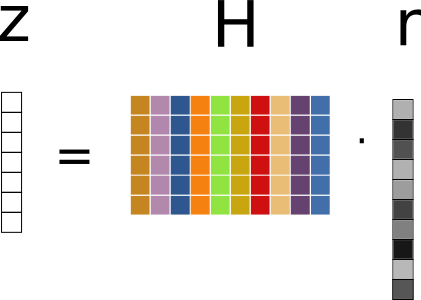

# Error control coding

## Introduction

Remember the block scheme of a communication system:

```{figure} img/CommBlockDiagram.png
---
width: 40%
name: fig-CommBlockDiagram
---
Communication system
```

Error control coding is the second task of coding in a communication system,
and refers to the protection of information against channel errors.

During any transmission, the data (symbols, bits) go through a transmission channel,
The transmission channel is not ideal, and in particular it introduces errors.
For example, some bit values may be changed due to electrical noise:
a bit is sent as 0, but received as 1, or viceversa.
This is a problem in all communication systems, and to some degree it is unavoidable,
in general, because electrical noise is unavoidable.

However, we usually require that all data is received correctly.
For example, when you download a file from the internet, you want to be sure that the file is exactly the same as the original.
For example, a single erroneous bit can make a zip file unreadable.

Error control coding refers to all the algorithms which have been developed
with th purpose of protecting against errors in the data.

### Error model

We first need to clarify the assumptions and the scope of the current discussion.

First, we consider only binary codes and binary channels,
i.e. all the data is represented using binary symbols $\left\lbrace 0,1 \right\rbrace$.

An **error** is defined as bit that has changed from 0 to 1 or from 1 to 0 while going through channel.
In these lectures we consider only these types of errors, and not,
for example, situations where bits are lost.

Errors can appear in different ways:

- **independent** errors are sporadic, independent of all the others.
  We consider each bit as having a random chance $p$ of undergoing an error,
  without any relation to the surrounding bits.

  For example, if $p = 10^{-6}$, its means that each bit has a chance of
  1 in a million of being changed.
  This means an average of 1 error in a million bits.
  A file of 100 MB will have around 800 bit errors (100 MB = 100 megabytes = 800 million bits).

- **burst** or **packets** of errors are groups of consecutive errors.
  This can happen in some channels, for example in wireless transmissions,
  where a sudden millisecond drop in in signal quality can affect
  a whole sequence of bits.

Packets of errors are much harder to correct than independent errors,
because the whole context in that region of the bitstream is lost.

When considering that a bit changes its value due to an error, it is
very helpful to treat this as a mathematical operation.
This will allow us to use mathematical tools to design error control mechanisms.

We introduce therefore the **modulo-2 sum** operation, denoted $\oplus$,
with the following properties:

- It operates only on individual bits (0 or 1)
- It is defined by the following table:

  $$\begin{array}{c|cc}
  \oplus & 0 & 1 \\
  \hline
  0 & 0 & 1 \\
  1 & 1 & 0
  \end{array}$$

  This means:

  $$0 \oplus 0 = 0$$
  $$0 \oplus 1 = 1$$
  $$1 \oplus 0 = 1$$
  $$1 \oplus 1 = 0$$

- It is also known as the **exclusive OR** operation (XOR).

Besides the module-2 sum, we can also have the normal product operation
between bits (i.e. $0 \times 1 = 0$, $1 \times 1 = 1$).
Together, they form a modulo-2 arithmetic system known as **Galois field** GF(2),
which supports operations with bits in a way similar to normal arithmetic:

- We can sum bits (with modulo-2 sum)
- We can multiply bits (with normal product)
- We can subtract bits, also with modulo-2 sum.
  Subtraction is the same as addition, since $a - b = a + b$ in modulo-2 arithmetic.
  There are no negative numbers, each number is its own negative, since $a + a = 0$.
- We can use parantheses as usual, i.e.:

  $$
  a(b \oplus c) = ab \oplus ac
  $$

- We can define equation systems, with all coefficients and variables being bits
- We can define polynomials which have bits as coefficients, e.g.

  $$
  p(x) = x^3 \oplus x \oplus 1
  $$


When a bit changes its value, we may think that it undergoes
modulo-2 sum with 1. Given a bit $b$ and its complement $\overline{b}$,
we have:

$$
b \oplus 1 = \overline{b}
$$

irrespective of the value of $b$ (0 or 1)

When a bit remains the same, we may think that it undergoes
modulo-2 sum with 0, since:

$$
b \oplus 0 = b
$$

for any bit $b$.

We can extend this to a sequence of bits, by performing the modulo-2 sum
bit by bit. Suppose we transmit a bit sequence $\mathbf{c}$:

$$
\mathbf{c} = 0100100111
$$

which is received, with errors on the 2nd, 3rd, 4th and 9th positions, as
the sequence $\mathbf{r}$:

$$
\mathbf{r} = 0011100101
$$

we can consider $\mathbf{r}$ as being obtained by the modulo-2 sum of $\mathbf{c}$ with an **error sequence** $\mathbf{e}$:

$$
\mathbf{r} = \mathbf{c} \oplus \mathbf{e}
$$

The error sequence $\mathbf{e}$ has values of $1$ wherever there is an error, and $0$ otherwise:

$$
\mathbf{e} = 0111000010
$$


```{figure} img/ChannelErrorModel.png
---
width: 50%
name: fig-ChannelErrorModel
---
Channel error model
```

Therefore, we **model** the effect of the channel as
this modulo-2 sum with the error sequence.
This constitutes our model for the transmission channel,
for the purpose of error control coding.

### Error detection vs error correction

What can we do about errors? In general there are two approaches

1. **Error detection** means finding out if there is any error in the received sequence,
   but not exactly which bits have the errors.

   Since we don't know exactly where are the errors, we cannot correct the bits.
   Instead, the whole sequence is discarded, and the sender is asked to retransmit it.

   This is possible in live communication systems, where the sender can retransmit the data,
   as for example in the TCP/IP protocol used on the internet.

2. **Error correction** means finding out if there is any error in the received sequence
   and find out exactly which bits have errors.
   Once we locate the errors, we can correct them, by inverting the bits,
   and obtain the original data back.

   This is especially useful when we cannot retransmit the data, for example when the data is stored
   on a physical medium (e.g. on a disk).

Error detections is easier to achieve than error correction,
because it doesn't require to know exactly where the errors are.
However, there exist situations where error correction is necessary,

### Definitions and overview of error control coding

We first give a general schematic of the error control process, with
the purpose of fixing general definitions and notation.
The process is tailored to block codes, which are the most common type of error control codes.

1. The sender needs to send a sequence of $k$ bits, which is the **information word**:

   $$\mathbf{i} = i_1i_2...i_k$$

2. For each possible information word $\mathbf{i}$, the coder assigns a **codeword** $\mathbf{c}$ of length $n > k$:

   $$\mathbf{c} = c_1c_2...c_n$$

3. The codeword is sent on the channel instead of the original information word

4. The receiver receives a sequence $\mathbf{r} \approx \mathbf{c}$, known ad the **received word**,
   with possible errors:

   $$\mathbf{r} = r_1 r_2 ... r_n$$

6. The decoding algorithm detects and/or corrects thformse errors.

   - If it performs only detection, it reports whether there
   are errors or not in $\mathbf{r}$

   - If it performs correction, it tries to find the correct codeword $\hat{\mathbf{c}}$
   and information word $\hat{\mathbf{i}}$ from $\mathbf{r}$.

   Both detection and correction may fail, if the errors are too numerous.
   This is why we denote the output of the decoding algorithm as $\hat{\mathbf{c}}$ and $\hat{\mathbf{i}}$,
   to indicate that they are not necessarily the same as the original $\mathbf{c}$ and $\mathbf{i}$.

We provide below a list of definitions.

- An **error correcting code** is an association between the set of all possible information words to a set of codewords.

  It can be represented as a table in which each possible information word $\mathbf{i}$
  has a certain codeword $\mathbf{c}$.

  The association can be done in many ways:

  - randomly: codewords are selected and associated randomly to the information words
  - based on a certain rule: the codeword is computed with some algorithm from the information word

- A code is a **block code** if it operates with words of fixed size. Otherwise it is a **non-block code**

  For a block code, the size of information word $\mathbf{i}$ is typically denoted as $k$,
  and the size of codeword $\mathbf{c}$ by $n$, with $n > k$.

- A code is **linear** if any linear combination of codewords is also a codeword.

- A code is called **systematic** if the codeword contains all the information bits explicitly, unaltered,
  usually at the beginning or at the end of the codeword.

  This means that the coding process merely adds supplementary bits besides the information bits,
  and the codeword has two parts: the information bits and the parity bits.

  Example: adding a parity bit after the information bits

  Otherwise the code is called **non-systematic**. In this case,
  the information bits are not explicitly visible in the codeword.

- The **coding rate** of a block-code is:

  $$R = k/n$$

- A code $C$ is an **$t$-error-detecting** code if it is able to **detect** $t$ or less errors

- A code $C$ is an **$t$-error-correcting** code if it is able to **correct** $t$ or less errors

Further examples: at blackboard

### Naive examples

#### A first example: parity bit

One of the simplest ways to do error control coding is to add a **parity bit** to the information word.

The parity bit is defined as the module-2 sum of all the bits in the information word,
i.e. it is 0 if there are an even number of 1's in the information word, and 1 if there are an odd number of 1's.

The codeword is obtained by appending the parity bit at the end of the information word.

Consider an information word of length $k = 8$ bits, to which we append
a parity bit, resulting in a codeword of length $n = 9$ bits.

The receiver checks if the parity bit is still equal to the modulo-2 sum of the information bits.

What can we say about this coding procedure:

- It can detect 1 error in a 9-bit codeword, because if there is 1 error in the codeword,
  the parity bit will not anymore match the information bits,
  and the receiver will understand that an error must have happened.

- It is not able to detect 2 errors because if there are 2 errors in the codeword,
  the parity bit will still match the information bits,
  and the receiver will not know that there are errors.

- Therefore this procedure is a **1-error-detecting**

- Even for 1 error, The receiver cannot correct the error,
  because it doesn't know where the error is located.
  Therefore this is a **0-error-correcting** code.

- The coding rate is $R = 8/9$

The coding algorithm could be improved by adding more parity bits,
(see example at blackboard)

#### A second example: repetition code

Let's discuss another basic way of doing error control coding, the **repetition code**.

The codeword is created by repeating the information word $N$ times in a row.
As an example, for $N=5$, to transmit $\mathbf{i} = 100$
we actually send $\mathbf{c} = 100100100100100$ on the channel

The receiver uses a **majority rule** for decoding:
knowing that each bit is repeated $n$ times on certain locations,
it decides that the correct value of each bit is the one that appears most often
among those locations.

For example, if it receives $\mathbf{r} = 101100100110000$, the decoder
views the sequence as 5 groups of 3 bits, and takes the majority value
in each column:

$$\begin{aligned}
\mathbf{r} =
&101 \\
&100 \\
&100 \\
&110 \\
&000 \\
\hline
\hat{\mathbf{i}} = &100
\end{aligned}$$

Let's analyze this code:

- It can detect up to 4 errors, because for 4 or fewer errors
  the decoder will understand some errors must be in the codeword,
  since the 5 groups are not all the same.

- It cannot detect 5 errors everytime, because if the 5 errors affect
  the same column, all the resulting bits will be the same,
  and the decoder is fooled into believing everything is correct.

- Therefore the code is 4-error-detecting (in general, $(N-1)$-error-detecting).

- It can correct up to 2 errors, because even if 2 errors affect the same column,
  the correct value will still appear more often than the wrong value, and
  the majority rule will identify the errors correctly.

- It is not able to correct 3 errors everytime, because if 3 errors affect the same column,
  the wrong value will appear more often than the correct value, and the majority rule will
  produce the wrong result.

- Therefore the code is 2-error-correcting (in general, $\left\lfloor \frac{N-1}{2} \right\rfloor$-error-correcting)$.

- The coding rate $R = k/n = 1/5 = 1/N$

- If the number of repetitions $N$ is increased, the code becomes more robust to errors,
  but the coding rate decreases, i.e. more redundancy is added.

#### Redundancy

We can see in these examples that error control coding works by adding **redundancy** to the data,
i.e. adding additional bits, artificially created according to some rule.

The decoding algorithm will then check if the rule still holds:

- if yes, it will decide that there are no errors
- if not, it will decide that there are errors

Note that error control coding adds redundancy to the data,
while source coding aims to reduce redundancy. Is there a contradiction?

Well, no, because the two types of redundancy are different.
Source coding reduces existing redundancy from the data, which served no purpose.
Error control coding adds redundancy **in a controlled way**, with a purpose.
The purpose is for the decoder to be able to check if the data is correct or not.

In practice, source coding and error control coding are done sequentially, in an independent manner.

1. First perform source coding, eliminating redundancy in representation of data
2. Then perform error control coding, adding redundancy for protection

### Coding rate and channel capacity

This is a preview of something which will be discussed in the next chapters,
but relates to the coding rate of a code, so we can introduce it here.

In Chapter IV we will study transmission channels,
which are mathematical model of how information is handled from the sender to the receiver.
In that chapter we will find that each channel has a certain **capacity** value.

The **channel capacity** is the maximum amount of information than can be sent over the channel
with one symbol, on average.

For example, a binary channel (working with bits 0 and 1) may have capacity $C = 0.8$ bits,
i.e. for each physical bit delivered, the mathematical information
actually transmitted is 0.8.

The channel capacity is related to the coding rate of error control codes via
Shannon's noisy channel coding theorem.

```{prf:definition} Achievable coding rate
A coding rate is called **achievable** for a channel if, for that rate, there exists a coding and decoding
algorithm guaranteed to correct all possible errors on the channel
```


```{prf:theorem} Shannon's noisy channel coding theorem  (Shannon's second theorem, channel coding theorem)
For a given channel, all rates below capacity $R < C$ are achievable. All rates
above capacity, $R > C$, are not achievable.
```

The rigorous proof of the theorem is too complex to present here. Some key ideas of the proof are:

- Use very long information words, $k \to \infty$
- Use random codes, and compute the probability of having error after decoding
- If $R < C$, *in average for all possible codes*, the probability of error after decoding goes to 0.
  This means that there exists at least one code better than the average, therefore
  this code can correct all errors, and it is the code which we should use.
  Thus, the coding rate is achievable.

In layman terms, the theorem says that:

- For all coding rates $R<C$, **there is a way** to recover the transmitted data perfectly (decoding algorithm will detect and correct
all errors)
- For all coding rates $R>C$, **there is no way** to recover the transmitted data perfectly

As a numerical example, suppose we send bits on a binary channel with capacity 0.7 bits/message.

- For any coding rate $R < 0.7$ the theorem states that there exists an error correction code that allows fixing of all errors.
  Coding rate $R < 0.7$ means we send more than 10 bits for every 7 information bits, on average.

- With less than 10 bits for every 7 information bits, i.e. $R > 0.7$, no code exists that can fix all errors.

The theorem makes it clear when it is possible to fix all errors,
giving a clear limit to the coding rate required for this to happen.
Moreover, it guarantees that such a code exists, but it **doesn't tell us how to find it**.
It gives no clue of how to actually find the code in practice, only some
general principles derived from the proof:

- using longer information words is better
- random codewords are generally good (though in practice they are not efficient to use, because thet don't have a simple implementation)

In practice, we cannot use infinitely long codewords, and random codewords are no efficient to implement,
so we will only get a *good enough* code.

## Analyzing linear block codes with the Hamming distance

### The Hamming distance

We start from a practical idea which we can deduce from what we discussed until now.

If a codeword $\mathbf{c_1}$ has errors and, as a consequence, it becomes identical to another codeword $\mathbf{c_2}$,
any decoder will be fooled into thinking everything is correct, and it has received a correct codeword $\mathbf{c_2}$.
Thus the errors go undetected.

Therefore, we want the codewords to be as different as possible from each other.
The Hamming distance is a way of computing how different two codewords are.

The **Hamming distance** of two binary sequences **a** and **b** having the same length $n$,
$d_H(\mathbf{a}, \mathbf{b})$, is the total number of bit differences between them

$$d_H(\mathbf{a}, \mathbf{b}) = \sum_{i=1}^N a_i \oplus b_i$$

The Hamming distance shows how many bit changes are needed to convert one sequence into the other one.

The Hamming distance satisfies the 3 properties of a metric function:

1. $d_H(\mathbf{a},\mathbf{b}) \geq 0 \;\;\; \forall \mathbf{a},\mathbf{b}$, with $d_H(\mathbf{a},\mathbf{b}) = 0 \Leftrightarrow \mathbf{a} = \mathbf{b}$
2. $d_H(\mathbf{a},\mathbf{b}) = d_H(\mathbf{b},\mathbf{a}), \forall \mathbf{a},\mathbf{b}$
3. $d_H(\mathbf{a},\mathbf{c}) \leq d_H(\mathbf{a},\mathbf{b}) + d_H(\mathbf{b},\mathbf{c}), \forall \mathbf{a},\mathbf{b},\mathbf{c}$

The **minimum Hamming distance of a code**, denoted as ${d_H}_{min}$,
is the minimum Hamming distance between any two codewords $\mathbf{c_1}$ and $\mathbf{c_2}$.
We find it by taking all the pairs of codewords, computing the Hamming distance between them,
and taking the minimum value.

The minimum Hamming distance of a code guarantees that all codewords
are at least ${d_H}_{min}$ bits apart from each other.

### Nearest-neighbor decoding scheme

We introduce a simple decoding scheme, called **nearest-neighbor decoding**,
which serves as the underlying approach for many error control codes.

**Coding**

- We use a code $C$ with large ${d_H}_{min}$, to make the codewords as different as possible.
  The code (i.e. all the possible codewords) is known to both the sender and the receiver.
- One of the codewords $\mathbf{c}$ is sent.

**Decoding**

- Receive a word $\mathbf{r}$, that may have errors.

- Error detecting:
  - check if $\mathbf{r}$ is among the codewords of the code $C$
  - if $\mathbf{r}$ is among the codewords, decide that there have been no errors
  - if $\mathbf{r}$ is not among the list of codewords, decide that there have been errors

- Error correcting:
  - if $\mathbf{r}$ is among the codewords, decide there are no errors
  - else, choose the codeword from $C$ which is **nearest** to the received $\mathbf{r}$, in terms of Hamming distance.
    Decide that the correct codeword is this one.
    This is known as **nearest-neighbor decoding**

The performance of this scheme, in terms of how many errors it can detect and correct,
is related to the minimum Hamming distance of the code.
As the next theorem shows, a larger ${d_H}_{min}$ means better performance.
Note, however, that increasing the ${d_H}_{min}$
usually means longer codewords, i.e. smaller coding rate, i.e. more redundancy,
so there is a price to pay for better performance.

```{prf:theorem} Performance of nearest neighbor decoding
If the minimum Hamming distance of a code is ${d_H}_{min}$, then:

1. The code can *detect* up to **${d_H}_{min} - 1$** errors
2. The code can *correct* up to **$\left\lfloor \frac{{d_H}_{min} - 1}{2} \right\rfloor$** errors using nearest-neighbor decoding
```

```{prf:proof}
:nonumber:

To prove the first assertion, observe that at least ${d_H}_{min}$ binary changes
are needed to change one codeword into another.
Therefore, if a codeword undergoes a number of errors up to ${d_H}_{min} - 1$,
is not enough to obtain a new codeword, so the result will not be in the list
of allowed codewords of the code. Thus, errors are detected.

For the second assertion, observe that as long as the number of errors is
strictly less than half of the distance to another codeword, the received word $\mathbf{r}$
is closer to the original codeword than to any other.
The condition of being strictly less than half of ${d_H}_{min}$ is expressed
as $\left\lfloor \frac{{d_H}_{min} - 1}{2} \right\rfloor$.

You can think in terms of geometry:
the original codeword $\mathbf{c}$ is a point in space,
separated by a distance of at least ${d_H}_{min}$ from any other codeword.
The received word $\mathbf{r}$ is somewhere around $\mathbf{c}$.
If the distance between $\mathbf{r}$ and $\mathbf{c}$ is less than half of ${d_H}_{min}$,
i.e. less than half of the distance to any other codeword,
then $\mathbf{c}$ is still closer to $\mathbf{r}$ than to any other codeword.
In this case, the nearest-neighbor algorithm will find $\mathbf{c}$ as the correct codeword.

All this geometrical intuition is possible because the Hamming distance
satisfies the properties of a distance function, and thus it behaves
like the geometrical distance in a space.

```

The theorem gives the maximum number of errors for which
the decoding scheme is **guaranteed** to work.
If the number of errors is higher than these limits, the decoding
scheme may or may not work, depending on the specific errors.
We may have:

- Detection failure: decide that there were no errors, even if they were (more than ${d_H}_{min} - 1$)
- Correction failure: choose a wrong codeword as original

### Computational complexity

The nearest-neighbor decoding scheme is simple to understand and implement,
and it underpins many error control codes (if not all).
However, it in not always used in practice, because of a fundamental
problem: it requires a lot of computational resources, especially for large codes
(e.g. in practice).

To understand this, we need to use the concept of **computational complexity**
of an algorithm, coming from computer science.

The computational complexity of an algorithm is the amount of computational resources required
by the algorithm, expressed as a function of the size of the input data.
In general, we are interested in the **order of magnitude** of the computational complexity,
i.e. the dominant term in the expression, neglecting the other terms and the coefficients.

The computational complexity of an algorithm is expressed using the **big-O notation**,
for example $\mathcal{O}(n^2)$, which means that the computational complexity is proportional to $n^2$,
or $\mathcal{O}(n \log n)$, which means that the computational complexity is proportional to $n \log n$.
This gives an idea about how the computational complexity grows with the size of the input data, $n$.

For the nearest-neighbor decoding scheme, if the number of information bits
is $k$, the computational complexity is $\mathcal{O}(2^k)$,
which is absolutely huge for large $k$.

$$\mathcal{O}(k) = 2^k$$

This is because both error detection and correction require comparing the received word
with all the possible codewords, and there are $2^k$ codewords in total,
one for each possible information word. Thus, the algorithm needs to go
through an array of size $2^k$ to find the correct codeword.

A computation complexity of $\mathcal{O}(2^k)$ means that the algorithm
is very inefficient, and is not feasible in practice:

- when $k$ doubles, the amount of computations is squared
- when $k$ increases 10 times, the amount of computations is raised to a power of 10
- when $k$ increases 100 times, the amount of computations is raised to a power of 1000
- for $k = 256$ bits, you'd need more than all the energy of the Sun (not a joke, it can be calculated)
  to go through a list of size $2^{256}$ codewords.

Therefore, we need ways to make decoding simpler and more efficient.

## Analyzing linear block codes with matrix algebra

### Vector algebra in a binary world

#### A short review of basic vector algebra

A **vector space** is a set with two operations, sum and multiplication by a constant,
having the following properties:

- an element + another element = still an element from the set
- an element $\times$ a constant = still an element from the set

In other words, we cannot escape from the set by summing or multiplying by a constant.

The elements of a vector space are called "vectors".

Intuitive examples of vector spaces are Euclidian (geometrical) vector spaces: a line, points in 2D, 3D.
For example, adding two vectors in a 2D plane gives another vector in the same 2D plane,
and multiplying a vector by a constant gives another vector in the same 2D plane.

A **basis** of a vector space $V$ is a set of $n$ independent vectors $\mathbf{e_1}, ...\mathbf{e_n}$,
such that any vector $\mathbf{v}$ can be expressed as a linear combination of the basis elements

$$\mathbf{v} = \mathbf{e_1} \cdot \alpha_1 +  ... + \mathbf{e_n} \cdot \alpha_n$$

A **subspace** is a smaller dimensional vector space embedded inside a larger vector space.

For example, a line in a 2D plane is a subspace of the 2D plane:

- sum of two vectors on the line is still on the same line
- the size of the line subspace is 1, and the embedding plane has size 2

Another example is a 2D plane in 3D space:

- sum of two vectors from the plane is still on the plane
- size of subspace is 2, size of the larger space is 3

#### How to look at matrix-vector multiplications

When we multiply a matrix with a vector (in this order),
the output is a column vector which is a linear combination of the columns of the matrix.
The multiplicating vector gives the coefficients of the linear combination.

When we multiply a vector with a matrix (in this order),
the output is a row vector which is a linear combination of the rows of the matrix.
The multiplicating vector gives the coefficients of the linear combination.

TODO: Explain with draw picture

Vector spaces can be perfectly described with matrix-vector multiplications

- Matrix columns/rows = elements of the basis
- The output vector = the vector
- The multiplicated vector = the coefficients of the linear combination

Any vector $\mathbf{v}$ can be expressed as a linear combination of
the basis elements:

$$\mathbf{v} = \mathbf{e_1} \cdot \alpha_1 +  ... + \mathbf{e_n} \cdot \alpha_n$$

$$\mathbf{v} =
\begin{bmatrix}
\mathbf{e_1}  & \mathbf{e_2} & ... & \mathbf{e_n}
\end{bmatrix}
\begin{bmatrix}
\alpha_1  \\ \alpha_2 \\ ... \\ \alpha_n
\end{bmatrix}
$$

where $\mathbf{e_1}, ... \mathbf{e_n}$ are **column vectors**.

The equation can be transposed, which would mean that all vectors become row vectors,
but the usual mathematical convention is to use column vectors wherever possible.

#### Vector spaces of binary codewords

```{prf:theorem} Vector space of binary sequences
The set of all binary sequences of size $n$ is a vector space of size $n$,
when considering the sum operation as modulo-2 sum $\oplus$ between sequences,
and the multiplication with a constant as multiplication with 0 or 1 as in usual arithmetic.
```

```{prf:proof}
:nonumber:

The two properties defining a vector space are satisfied:

- the sum of two sequences of size $n$ is still a sequence of size $n$,
  when using modulo-2 sum $\oplus$

- the multiplication of a sequence with a constant is still a sequence of size $n$:
  when multiplying with 0, the sequence becomes all 0's, and when multiplying with 1,
  it stays the same. Eiher way, it is still a binary sequence of size $n$.
```

Furthermore the codewords of a linear block code
with code length $n$ and information length $k$
is a vector subspace of the larger vector space of all binary sequences of size $n$.

```{prf:theorem} Codewords of a linear block code form a subspace
The codewords of a linear block code with code length $n$ and information length $k$
form a vector subspace of the larger vector space of all binary sequences of size $n$.
```

```{prf:proof}
:nonumber:

Again, the set of codewords of a linear block code satisfies the two properties of a vector space:

- the sum of two codewords is still a codeword, because the code is linear
  (this is what the linearity property of a code means)

- a codeword multiplied by 0 or 1 is still a codeword, either all 0's or the same codeword.
  Note that the all-0 sequence must be a codeword, because it is the sum of any
  codeword with itself, so it is the sum of two codewords.

The codewords are binary sequences of size $n$,
so they are part of the larger vector space of all binary sequences of size $n$.
But the size of this codeword vector space itself is $k$, because the total number of codewords is $2^k$,
so any codeword can be expressed with just $k$ coefficients (i.e. the information bits,
since every codeword is associated with one information word).

We thus have a vector subspace of size $k$ embedded in a larger vector space of size $n$.
Not all sequences of size $n$ from the larger space are codewords.
```

You can imagine the set of codewords as forming a 2D plane embedded in a 3D space.
All codewords live in this plane, and all point on this plane are codewords.
The larger space contains lots of other points which are not on the plane, so are not codewords,
just like there are many sequences of size $n$ which are not codewords.

Since all codewords of a linear block code form a subspace,
it follows that all codewords can be expressed as matrix-vector multiplications.

### The generator matrix

All codewords for a linear block code can be generated via a **vector-matrix multiplication**
as follows:

$$\mathbf{i} \cdot [G] = \mathbf{c}$$

```{figure} img/GeneratorMatrix.png
---
width: 50%
name: GeneratorMatrix
---
Codeword construction with generator matrix
```

The matrix $[G]$ is known as the **generator matrix** of the code.
Its size of size $k \times n$, and it is a "wide" matrix since we have $k < n$.
The generator matrix fully defines the code, i.e. if we know the generator matrix,
we know everything about the code.

The vector $\mathbf{i}$ is the information word, of size $k$.

Such a vector-matrix multiplication can be interpreted as follows:
the resulting codeword $\mathbf{c}$
is a linear combination of the rows in the matrix $[G]$,
with the coefficients given by the information word $\mathbf{i}$.
This means the rows of $[G]$ are a *basis* for the linear block code.
All the vector space theory we discussed before applies here:

- the rows of the generator matrix are a basis for the codewords
- all codewords are obtained by linear combinations of the rows of the generator matrix, i.e.
  by multiplcation with $[G]$
- the information word $\mathbf{i}$ gives the coefficients of the linear combination
- for each information word $\mathbf{i}$, there is a corresponding codeword $\mathbf{c}$
  obtained by multiplying with $[G]$

Note that the equation could also be transposed, i.e. use column vectors instead of row vectors,
but it is more customary to use row vectors here.

This way of generating codewords guarantees that the code is linear.
Indeed, we can show that the sum of two codewords is also a codeword, by construction.
If we have two codewords $\mathbf{c_1}$ and $\mathbf{c_2}$,
corresponding to two information words $\mathbf{i_1}$ and $\mathbf{i_2}$,
then the sum of the two codewords is still something multiplied with $[G]$,
so it is still a codeword.

$$\mathbf{i_1} \cdot [G] = \mathbf{c_1}$$
$$\mathbf{i_2} \cdot [G] = \mathbf{c_2}$$
$$\mathbf{c_1} \oplus \mathbf{c_2} = (\mathbf{i_1} \oplus \mathbf{i_2}) \cdot [G] = codeword$$

### The control (parity-check) matrix

Every generator matrix $[G]$ has a related **control matrix** $[H]$ (also known as **parity-check matrix**)
such that

$$\mathbf{0} = [H] \cdot [G]^T$$

The size of $[H]$ is $(n-k) \times n$.

The two matrices $[G]$ and $[H]$ are related, and one can always be deduced from the other.

The control matrix $[H]$ is very useful to check if a binary word is a codeword or not
(i.e. for nearest neighbor error detection), based on the following theorem.

```{prf:theorem} Codeword checking with parity-check matrix
Consider a code with generator matrix $[G]$ and control matrix $[H]$.

Every codeword $\mathbf{c}$ multiplied with $[H]$ will produce the zero vector:

$$\mathbf{0} = [H] \cdot \mathbf{c}^T$$

```

```{prf:proof}
:nonumber:

The proof is straightforward, based on the fact that $\mathbf{0} = [H] \cdot [G]^T$.

$$\mathbf{i} \cdot [G] = \mathbf{c}$$
$$[G]^T \cdot \mathbf{i}^T = \mathbf{c}^T$$
$$[H] \cdot \mathbf{c}^T = [H] \cdot [G]^T \cdot \mathbf{i}^T = \mathbf{0}$$
```

The theorem shows that all codewords generated with $[G]$ will produce $0$ when multiplied with $[H]$.
On the other hand, all binary sequences that are not codewords will produce something
different from $0$ when multiplied with $[H]$. In this way, multiplcation with
$[H]$ can be used as a quick way to check if a binary sequence is a codeword or not.
This is what error detection is all about.

The generator matrix $[G]$ and $[H]$ are related.
In linear algebra terminology, $[G]$ is the matrix which generates the $k$-dimensional subspace of the codewords,
and the rows of $[H]$ are the "missing" dimensions of the subspace (the "orthogonal complement")

In terms of matrix shape, $[G]$ and $[H]$ together form a full square matrix $n \times n$:

- size of $[G]$ is $k \times n$
- size of $[H]$ is $(n-k) \times n$

### Matrices [G] and [H] for systematic codes

For systematic codes, $[G]$ and $[H]$ have special forms (known as **"standard"** forms)

The generator matrix can be decomposed into two parts:

- First part is the **identity matrix**. This copies the information bits in the resulting codeword.
- Second part is some matrix $Q$, which generates the control bits
$$[G]_{k \times n} = [I_{k \times k} \;\; Q_{k \times (n-k)}]$$

The control matrix $[H]$ is related to $[G]$ as follows:

- First part is $Q^T$ (the same $Q$ as in $[G]$, but **transposed**)
- Second part is an identity matrix of corresponding size
$$[H]_{(n-k) \times n} = [Q^T_{(n-k) \times k} \;\; I_{(n-k) \times (n-k)}]$$

Thus, one matrix can be derived from the other.

### Interpretation as parity bits

Multiplication with $[G]$ in standard form produces the codeword composed of two parts:

- the information bits themselves (since the first part of $[G]$ is an identity matrix)
- some additional control bits, which are linear combinations of the information bits, i.e. *parity bits*

Each column of $[G]$ corresponds to one parity bit in the codeword,
and the values in the column define which bits are combined to create the parity bit.

The control matrix in standard form $[H]$ checks if parity bits correspond to information bits

- Proof: write down the parity check equation (see example)

\smallskip

If all parity bits match the data, the result of multiplying with $[H]$ is 0.
Otherwise it is $\neq 0$, signaling that at least one parity bit does not check out.

Therefore, the generator & control matrices are just mathematical tools
for easy computation and checking of parity bits.
We're still just computing and checking parity bits, but we do it easier with matrices.

### Syndrome-based error detection and correction

When considering error detection and correction,
we multiply the received word $\mathbf{r}$ with the control matrix $[H]$.

$$\mathbf{z} = [H] \cdot \mathbf{r}^T$$

The vector $\mathbf{z}$ is called the **syndrome** of the received word $\mathbf{r}$.

The syndrome is a linear combination of the columns of $H$,
according to the column-wise interpretation of the multiplication.

{width=30%}

The process of **error detection** with matrices is therefore as follows:

1. generate codewords with generator matrix:
$$\mathbf{i} \cdot [G] = \mathbf{c}$$

2. send codeword $\mathbf{c}$ on the channel
3. a random error word $\mathbf{e}$ is applied on the channel
4. receive word $\mathbf{r} = \mathbf{c} \oplus \mathbf{e}$

5. compute **syndrome** of $\mathbf{r}$:
$$\mathbf{z} = [H] \cdot \mathbf{r}^T$$

6. Decide:
    * If $\mathbf{z} = 0$ => $\mathbf{r}$ has no errors
    * If $\mathbf{z} \neq 0$ => $\mathbf{r}$ has errors

For **error correction**, we need to locate the errors.
For this, observe that the syndrome $\mathbf{z}$ is the effect only of the error word $\mathbf{e}$,
and not of the codeword $\mathbf{c}$ (considering that $\mathbf{r}$ is the sum of $\mathbf{c}$ and $\mathbf{e}$):
$$\mathbf{z} = [H] \cdot \mathbf{r}^T = [H] \cdot (\mathbf{c}^T \oplus \mathbf{e}^T) = [H] \cdot \mathbf{e}^T$$

We identify the error word $\mathbf{e}$ by searching exhaustively through all possible error words $\mathbf{e}$,
until we find the first one that produces the same syndrome $\mathbf{z}$.
Once we find it, we know where the errors are, and we can correct them.

The process is summarized as follows:

7. Create a **syndrome table**:
    * for every possible error word $\mathbf{e}$, compute the syndrome $\mathbf{z} = [H] \cdot \mathbf{e}^T$
    * start with error words with 1 error (most likely), then with 2 errors (less likely), and so on

8. Locate the syndrome $\mathbf{z}$ in the table, read the corresponding error word $\mathbf{\hat{e}}$

9. Find the correct word:
    * adding the error word again will invert the errored bits back to the originals
$$\mathbf{\hat{c}} = \mathbf{r}  \oplus \mathbf{\hat{e}}$$

Example: at blackboard

### Computational complexity

When using matrices, the computational complexity is much lower
than the scheme based on codeword tables.

Error detection requires a multiplication with $[H]$,
so the complexity is $\mathcal{O}(n^2)$ (size of $[H]$ is $(n-k) \times n$).

Error correction still needs to check all possible error words,
which means bad performance, but at least we don't need to check all codewords.
In practice, other tricks are used to make it much faster (see Hamming codes for example)

### Conditions on [H] for error detection and correction

The performance of the error detection and correction scheme,
i.e. how many errors can be detected and corrected,
can be deduced from the properties of the control matrix $[H]$.

For error detection, we can detect errors if the syndrome is **non-zero**.
Whenever an error word $\mathbf{e}$, when multiplied with $[H]$,
produces a zero syndrome, the algorithm is fooled into thinking
there are no errors. Therefore, we need to make sure that the syndrome is non-zero.
Considering that the syndrome is a linear combination of the columns of $[H]$,
with only the columns corresponding to values of $1$ in the error word $\mathbf{e}$,
we can say:

- To detect a single error, every column of $[H]$ must be non-zero,
  such that the syndrome is non-zero whenever the error word has a single $1$,
  no matter where it is located.
- To detect two error, sum of any two columns of $[H]$ cannot be zero, i.e. all columns are different.
- In general, to detect $n$ errors, we need that the sum of any $n$ or less columns of $[H]$ is non-zero.

For error correction, we use the syndrome table to identify the error word.
When two different error words produce the same syndrome,
the algorithm is unable to identify which is the true one.
Therefore, error correction works only if the syndrome is **unique**:

- To correct a single error, all columns of $[H]$ must be different,
  such that the syndrome is unique for all error words with a single $1$.
- To correct two errors, the sum of any two columns of $[H]$ must be different,
  such that the syndrome is unique for all error words with two $1$s.
  We also

- To correct $n$ errors: sum of any $n$ or less columns of $[H]$ are all different
        * much more difficult to obtain than for decoding

* Conditions for error correction are more demanding than for detection

* Note: Rearranging the columns of $[H]$ (the order of bits in the codeword) does not affect performance


## Hamming codes

:::{prf:definition} Hamming codes
**Hamming codes** are a particular family of linear block codes where the columns of $[H]$
are *the binary representation of all numbers from 1 to $2^r-1$*, $\forall r \geq 2$

Example: the (7,4) Hamming code has the following $[H]$ matrix:

$$
[H] =
\begin{bmatrix}
0 & 0 & 0 & 1 & 1 & 1 & 1 \\
0 & 1 & 1 & 0 & 0 & 1 & 1 \\
1 & 0 & 1 & 0 & 1 & 0 & 1
\end{bmatrix}
$$

Note that every column is the binary representation of a number from $1$ to $7$, using 3 bits (since $r=3$, 7 = $2^3-1$).
For example the third column is $0 1 1$, which is number 3 in binary.
:::


### Structure of a Hamming codeword

From the structure of $[H]$, we observe that Hamming codes are almost-systematic: they are **systematic up to a rearrangement of bits**.

   $[H]$ is not systematic according to our previous definition,
but we can make it systematic by simply rearranging the columns in a different order.
All the columns of the identity matrix $I$ are among
the columns of $[H]$, just not in the correct locations as to form
the identity matrix at the beginning or at the end.
However, we could obtain a systematic code by a simple rearranging
of the columns in $[H]$, which corresponds to rearranging the bits in the codeword,
which is a fairly benign operation.

For Hamming codes we use the notation **(n,k) Hamming code**, where:

- n = codeword length = $2^r-1$,
- k = number of information bits  = $2^r - r - 1$

Examples:

- $(7,4)$ Hamming code: $n=7$ bits in a codeword, 4 information bits, 3 control bits
- $(15,11)$ Hamming code: $n=15$ bits in a codeword, 11 information bits, 4 control bits
- $(31,26)$ Hamming code: $n=31$ bits in a codeword, 26 information bits, 5 control bits
- $(127,120)$ Hamming code: $n=127$ bits in a codeword, 120 information bits, 7 control bits

Just like for any linear block code,
a Hamming codeword has length $n$ equal to the width of $[H]$ ($n = 2^r - 1$),
and consists of information bits and control bits (also known as "parity bits").

- in the codeword, $r$ bits are control bits, and they
   correspond to the locations of the columns of $[H]$ that are identical to the columns of an identity matrix $I_r$ (having only a single 1 in each column)

- the remaining $k = 2^r-r-1$ bits are information bits

For example, the codeword of the Hamming(7,4) code, with the $[H]$ matrix
above, consists of three control bits ($c_x$) and four information bits ($i_x$),
with the subscript indicating the position:
$$c_1 \; c_2 \; i_3 \; c_4 \; i_5 \; i_6 \; i_7$$

Similarly, the codeword for Hamming(15,11) has the following structure:
$$c_1 \; c_2 \; i_3 \; c_4 \; i_5 \; i_6 \; i_7 \; c_8 \; i_9 \; i_{10} \; i_{11} \; i_{12} \; i_{13} \; i_{14} \; i_{15}$$


### Construction of Hamming codewords

Every Hamming code has a generator matrix $[G]$, just like any other linear
block code, but we don't provide it explicitly, because it is hard to remember.
(we could deduce it by rearranging the columns of $[H]$ to make it systematic first)

Instead, we can deduce the values from the equation system of the parity-check matrix $[H]$,
We know that every codeword satisfies the relation:

$$\mathbf{0} = [H] \cdot \mathbf{c}^T$$

Writing this as an equation system we obtain, for example for Hamming(7,4):

$$
\begin{cases}
0 = c_4 \oplus i_5 \oplus i_6 \oplus i_7 \\
0 = c_2 \oplus i_3 \oplus i_5 \oplus i_6 \\
0 = c_1 \oplus i_3 \oplus i_5 \oplus i_7
\end{cases}
$$

Observe that in every equation there is a single control bit appearing,
which means that it must be equal to the sum of the information bits in that equation:

$$
\begin{cases}
c_4 = i_5 \oplus i_6 \oplus i_7 \\
c_2 = i_3 \oplus i_5 \oplus i_6 \\
c_1 = i_3 \oplus i_5 \oplus i_7
\end{cases}
$$

We can apply the same process for other Hamming codes.

### Error detection and correction with Hamming codes

As for any linear block code, by analyzing the columns of $[H]$
we can deduce how many errors can be detected or corrected.

```{prf:theorem} Codeword checking with parity-check matrix
Hamming codes can detect up to two errors in a codeword,
or can correct one error in a codeword,
but not both simultaneously.

When there is one error detected,
the syndrome gives directly the position of the error,
since the syndrome is equal to the column of $[H]$ corresponding to the error position.

```

```{prf:proof}
:nonumber:

We use the general rules for all linear block codes, based on analyzing the columns of $[H]$.

Detection:

- All columns of $[H]$ are different => can detect up to 2 errors
- Sum of two columns is equal to a third => cannot detect 3

Correction:
- All columns are different => can correct 1 error
- Sum of two columns equal to a third => cannot correct 2

```

The detection and correction process is the same as with all
linear block codes. Having received a word $\mathbf{r}$, we compute the syndrome:

$$\mathbf{z} = [H] \cdot \mathbf{r}^T$$

If $\mathbf{z}$ is non-zero, then there are errors.
If there is a single error, $\mathbf{z}$ is equal to the column of $[H]$ corresponding to the error position,
which is exactly the position of the error, written in binary.
Therefore, keep in mind:

**For error correction with Hamming codes,
the position of the error is given by reading the
binary value of the syndrome.**

```{prf:example}
:nonumber:

Consider the received word $\mathbf{r} = [1 0 1 1 0 1 0]$ or a Hamming (7,4) code.
The syndrome is computed as:

$$
\mathbf{z} = [H] \cdot \mathbf{r}^T =
\begin{bmatrix}
0 & 0 & 0 & 1 & 1 & 1 & 1\\
0 & 1 & 1 & 0 & 0 & 1 & 1\\
1 & 0 & 1 & 0 & 1 & 0 & 1
\end{bmatrix}
\cdot
\begin{bmatrix}
1\\0\\1\\0\\0\\1\\0
\end{bmatrix}
= \begin{bmatrix}1\\0\\0\end{bmatrix}
$$

The syndrome $\mathbf{z} = \begin{bmatrix}1\\0\\0\end{bmatrix}$ means
the error is on bit number $4 = (1 0 0)_2$,
which is the fourth column of $[H]$.

This easy conversion from syndrome to bit position is the reason Hamming codes are constructed in this way,
with each column of $[H]$ being the binary representation of its position.
```

It is important to note that the code **cannot do both detection
and correction simultaneously**:
when we obtain a non-zero syndrome, we cannot tell if it is a single error or two errors, so there is no way to know if we should attempt to fix the error (if it's a single error)
or just detect (if they are two errors).
This must be decided beforehand, at the design stage.

For example, the syndrome $\mathbf{z} = \begin{bmatrix}1\\0\\0\end{bmatrix}$ in the previous example could also have come from two errors located on positions 1 and 5,
and in this case fixing the error would have been incorrect.
The system designer must decide at the design stage how to handle such cases:

- either the code is used for detection only, and it never attempts to correct errors
- or the code is used for correction only, and it assumes there is at most one error, and always attempts to correct it

The coding rate of a Hamming code is given by:

$$R = \frac{k}{n} = \frac{2^r - r - 1}{2^r-1}$$

Since Hamming codes detect 2 and fix 1 error in codeword,
longer Hamming codes are progressively weaker:

- they have weaker error correction capability
- better efficiency (higher coding rate $R$)
- more appropriate for transmissions with error probabilities

The choice of which code to use is ultimately based on the
expected bit error probabilities during the transmission.


### Encoding & decoding example for Hamming(7,4)

See whiteboard.

In this example, encoding is done without the generator matrix $G$, directly with the matrix $H$, by finding the values of the parity bits $c_1$, $c_2$, $c_4$ such that
$$\begin{bmatrix}0\\0\\0\end{bmatrix} = [H] \begin{bmatrix}c_1\\c_2\\i_3\\c_4\\i_5\\i_6\\i_7\end{bmatrix}$$

For a single error, the syndrome **is the binary representation of the location of the error**.


### Hardware circuits for Hamming(7,4)

Due to their simplicity, Hamming coding and decoding can
easily be done with logic gates.

The Hamming encoder consists of:

- A **shift register** to hold the codeword
- Logic OR gates to compute the parity bits

The four information bits are loaded in the shift register, and the logic gates automatically compute the parity bits.

```{figure} img/HammingCoder.png
:width: 40%
:align: center

Hamming encoder circuit with logic gates
```

The Hamming decoder consists of:

- A **shift register** to hold the received word
- Logic OR gates to compute the bits of the syndrome ($z_i$)
- A **binary decoder** ("descifrator): is a base-2 to base-10 converter, activates the output corresponding to the binary input value, in this way fixing the error at the correct position

```{figure} img/HammingDecoder.png
:width: 40%
:align: center

Hamming decoder circuit with logic gates
```

### SECDED Hamming codes

A normal Hamming code can correct 1 error or it can detect 2 errors, but we cannot differentiate between the two cases at runtime.

A solution to this is to add an additional parity bit, which helps identify the correct situation.

```{prf:definition} SECDED Hamming codes

**S**ingle **E**rror **C**orrection - **D**ouble **E**rror **D**etection (SECDED) Hamming codes
are an extension of Hamming codes which have an additional parity bit $c_0$ prepended at the front of the codeword,
in order to differentiate a single error from two errors.

$c_0$ is defined s the sum of all the other bits of the codeword.
```

For example, the (8,4) SECDED Hamming code is based in the normal (7,4) Hamming code, with the additional bit in front:

$$\mathbf{c_0} \; c_1 \; c_2 \; i_3 \; c_4 \; i_5 \; i_6 \; i_7$$

where $c_0$ is defined as:

$$c_0 = c_1 \oplus c_2 \oplus i_3 \oplus c_4 \oplus i_5 \oplus i_6 \oplus i_7$$

The parity check matrix of a SECDED Hamming code, $\tilde{H}$, is based on the matrix of the normal code, extended by one row and one column:

$$\tilde{H} =
\begin{bmatrix}
1 &...1 \\
0 &\mathbf{H} \\
\end{bmatrix}$$

### Encoding and decoding of SECDED Hamming codes

The encoding of SECDED Hamming codes can be done in two ways:

1. Compute the codeword directly using $\tilde{H}$, as we did for normal Hamming codes,

   or

2. Alternatively, compute the normal Hamming code first, and then prepend the additional bit $\mathbf{c_0}$ = sum of all other bits

Decoding of SECDED Hamming codes makes use of the additional parity bit to decide whether there is a single error,
which can be fixed,
or there are two errors, when no fix is attempted.

The decoding process is as follows:

1. Compute the syndrome of the received word using $\tilde{H}$:

   $$\tilde{\mathbf{z}} = \begin{bmatrix}z_0\\\mathbf{z}\end{bmatrix} = [\tilde{H}] \cdot \mathbf{r}^T$$

   The syndrome $\mathbf{\tilde{z}}$ has one additional bit in front, $z_0$, which
   corresponds to the extra line added on top of $[\tilde{H}]$.

   The new bit $z_0$ tells us whether the received $c_0$ matches the parity of the received word

   - if $z_0 = 0$: the additional parity bit $c_0$ matches the parity of the received word, so there is an even number of errors (0 or 2)
   - $z_0 = 1$: the additional parity bit $c_0$ does not match the parity of the received word, so there is an odd number of errors (1)

2. Decide which of the following cases happened:

   1. If no error happened: $z_1 = z_2 = z_3 = 0, z_0 = \forall$
   2. If 1 error happened: $z_0 = 1$ (does not match), the remaining part $\mathbf{z}$ is non-zero.

      In this case there is 1 error on position given by $\mathbf{z}$, and we can fix it.

   3. If 2 errors happened: $z_0 = 0$ (does match, because the two errors cancel each other out), the remaining part $\mathbf{z}$ is non-zero.

      In this case we can just report that errors are detected, but we cannot fix them, since it is more than 1 error

   4. If 3 errors happened: same as case 1, but we can't differentiate it from the case of a single error.

With the help of the additional parity bit, we can now simultaneously differentiate between 1 error (perform correction) and 2 errors (can detect, but do not perform correction).

Also, if the design decision is made that error correction is never attempted, the code can detect up to 3 errors, but this cannot be differentiated from the case of 1 error. This can be verified from the columns of $[\tilde{H}]$: the sum of any three columns is non-zero (because of the top row of 1's), so we know that the code can detect up to three errors.


## Cyclic codes

```{prf:definition}
**Cyclic codes** are a particular class of linear block codes
for which *every cyclic shift of a codeword is also a codeword*
```

A "cyclic shift" means a circular (cyclic) rotation of a sequence of bits, in any direction,
as illustrated below. Note that the ending bits are rotated to the start positions.

```{figure} img/ErrorControlCoding_CyclicShift.png
:width: 40%

A cyclic shift of two positions to the right
```

Cyclic codes are a particular class of linear block codes, so all the theory up to now still applies: they have a generator matrix, parity check matrix etc.
However, they can be implemented more efficient than general linear block codes (e.g. Hamming), using their special properties.

Cyclic codes are **widely used in practice** under the name **CRC** (**C**yclic **R**edundancy **C**heck),
for example in network communications (Ethernet protocol), data storage (Flash memory) etc.

As an example, Ethernet frames (i.e., data packets on normal Internet connections) use CRC codes to check data integrity.

```{figure} img/EthernetFrame.png
:width: 90%

Structure of an Etherner frame, including a CRC field for error detection ("*Frame check sequence (32-bit CRC)*")
```

### Binary polynomials

Working with cyclic codes relies heavily on binary polynomials.

Every binary sequence $\mathbf{a}$ corresponds to a polynomial $\mathbf{a(x)}$ with binary coefficients:
$$a_0 \; a_1  \; ... \; a_{n-1} \rightarrow \mathbf{a(x)} = a_0 \oplus a_1x \oplus ... \oplus a_{n-1}x^{n-1}$$

for example:
$$10010111 \rightarrow 1 \oplus x^3 \oplus x^5 \oplus x^6 \oplus x^7$$

From now on, when we refer to a "word" or "codeword" we also mean the corresponding polynomial.

We can perform all mathematical operations with these polynomials (addition, multiplication, division etc.), just like we do with normal polynomials, but considering the fact that we are in a binary world where $1 \oplus 1 = 0$.
Cyclic coding relies on these operations with polynomials,
and there exist efficient circuits for performing such operations (multiplications and divisions).

### Generator polynomial

```{prf:theorem}

All the codewords of a cyclic code are multiples of a certain polynomial $g(x)$,
known as the **generator polynomial**.
```

No proof given.

This is fundamental property that codewords have, which is checked when performing error detection.

The generator polynomial $g(x)$ must satisfy the following properties:

- $g(x)$ must have first and last coefficient equal to 1
- $g(x)$ must be a factor of $X^n \oplus 1$
- The *degree* of $g(x)$ is $n-k$, where:
    * n = the size of codeword (codeword polynomial has degree $n-1$, which means $n$ bits)
    * k = the size of the information word (information polynomial has degree $k-1$)

Since $n$ is the size of the codeword, and $k$ is the size of the information word, it follows that $n-k$ is the number of control bits added by the code:

**The degree of $g(x)$ is the number of control bits added by the code.**

To give some examples of generator polynomials matching these properties, consider the following relation. We can write $1 \oplus x^7$ as a product of three polynomials (do the calculations and check this):

$$1 \oplus x^7 = (1 \oplus x)(1 \oplus x + \oplus x^3)(1 \oplus x^2 \oplus x^3)$$

$1 \oplus X^7$ is the $X^n \oplus 1$ mentioned in the properties, so we have $n=7$. Each of the three factors have first and last coefficient equal to 1. Therefore each factor
can generate a different cyclic code, the degree of each factor being the number of control bits added by the code.

- $1 \oplus x$ generates a (7,6) cyclic code ($n=7$, degree=1 so there is $1$ control bit, therefore $k=6$ information bits)
- $1 \oplus x \oplus x^3$ generates a (7,4) cyclic code ($n=7$, degree=3, $k=4$ information bits)
- $1 \oplus x^2 \oplus x^3$ generates another (7,4) cyclic code ($n=7$, degree=3, $k=4$ information bits)

Several polynomials are standardized in various protocols:

```{figure} img/PopularPolys.png
:width: 80%

Popular generator polynomials (image from *http://www.ross.net/crc/download/crc_v3.txt)
```

Your turn: write the polynomials in mathematical form.

### Proving the cyclic property

```{prf:theorem}

If the generator polynomial $g(x)$ satisfies the properties above,
and any codeword is a multiple of $g(x)$,

then any cyclic shift of a codeword is also a codeword.
```

```{prf:proof}
:nonumber:

It is enough to prove only for a cyclic shift by 1 position to the right, since we can obtain any shift in any direction with several such consecutive shifts.

Consider the original codeword:
$$c_0 \; c_1 \; c_2 \; ... \; c_{n-1} \rightarrow \mathbf{c(x)} = c_0 \oplus c_1x \oplus ... \oplus c_{n-1}x^{n-1}$$

and its cyclic shift to the right by 1 position:
$$c_{n-1} \; c_0 \; c_1 \; ... \; c_{n-2} \rightarrow \mathbf{c'(x)} = c_{n-1} \oplus c_0x \oplus ... \oplus c_{n-2}x^{n-1}$$

We want to show that if $\mathbf{c(x)}$ is a multiple of $g(x)$, then $\mathbf{c'(x)}$ is also a multiple of $g(x)$.

We can rewrite:
$$\begin{split}
\mathbf{c'(x)}
=& x \cdot \mathbf{c(x)} \oplus c_{n-1}x^n \oplus c_{n-1}\\
=& x \cdot \mathbf{c(x)} \oplus c_{n-1}(x^n \oplus 1)\\
\end{split}$$

Now, if $\mathbf{c(x)}$ is a multiple of $g(x)$, so is $x \cdot \mathbf{c(x)}$. Also $(x^n \oplus 1)$ is always a multiple of $g(x)$, due to the properties of $g(x)$, and therefore so is $c_{n-1}(x^n \oplus 1)$. It follows that their sum:

$$\mathbf{c'(x)} = x \cdot \mathbf{c(x)} \oplus c_{n-1}(x^n \oplus 1)$$

is a multiple of $g(x)$, which means it is a codeword.
```

Note that the proof relied on two properties mentioned before:

- that a codeword $\mathbf{c(x)}$ is always a multiple of $g(x)$
- that $g(x)$ is a factor of $(x^n \oplus 1)$

### Coding and decoding of cyclic codes

Cyclic codes can be used for detection or correction.
In practice, they are used mostly for **detection only** (e.g. in Ethernet protocol),
because there are other codes with better performance for correction.

Cyclic codes can be designed to be either systematic or non-systematic.
but in practice the systematic variant is much preferred.

We will show the coding and decoding from 3 perspectives, all equivalent to each other:

- "The mathematical way", with polynomials
- "The programming way", as a programming algorithm
- "The hardware way", via circuit schematics

#### The mathematical way

First, a reminder on polynomial multiplication and division.

Two polynomials $a(x)$ and $b(x)$ can be multiplied,
and their result has degree equal to the degree of $a(x)$ + degree of $b(x)$.

A polynomials $a(x)$ can be divided to another polynomial $b(x)$, producing
a quotient and a remainder (which may be zero):

$$a(x) = b(x) q(x) \oplus r(x)$$

where:

- $q(x)$ is the the quotient ("câtul");
- $r(x)$ is the remainder ("restul");
- the degree of $r(x)$ is strictly smaller than the degree of $b(x)$.


**Coding**. We want to encode an information word with $k$ bits:
$$i_0 \; i_1 \; i_2 \; ... \; i_{k-1} \rightarrow i(x) = i_0 \oplus i_1x \oplus ... \oplus i_{k-1}x^{k-1}$$

The **non-systematic** codeword generation relies simply on polynomial multiplication of $i(x)$ with $g(x)$:

$$c(x) = i(x) \cdot g(x)$$

Note that the degrees in the equation match:

- $i(x)$ has degree $k-1$ ($k$ bits)
- $g(x)$ has degree $n-k$ ($n-k+1$ bits)
- $c(x)$ has degree $n-1 = (n-k) + (k-1)$ ($n$ bits)

However, this is non-systematic because we have no guarantee
that the information bits are preserved in the codeword.

The **systematic** codeword generation is achieved using:

$$c(x) = x^{n-k} \cdot i(x) \oplus b(x)$$

where $b(x)$ is the remainder of dividing $x^{n-k} i(x)$ to $g(x)$:

$$x^{n-k} i(x) = g(x) a(x) \oplus b(x)$$

In normal parlance, the remainder $b(x)$ is also known as "**the CRC value**".

Let us consider more closely the systematic codeword generation formula.
First, is the resulting $c(x)$ really a multiple of $g(x)$?
It is, because we have:
$$\begin{aligned}
c(x) &= x^{n-k} \cdot i(x) \oplus b(x) \\
&= a(x) g(x) \oplus b(x) \oplus b(x) \\
&= a(x) g(x)
\end{aligned}$$

Second, why is the code systematic? Let's analyze the systematic codeword generation step by step. We start from the information word:

$$\mathbf{i} = [\underbrace{i_0 \; i_1 \; ... \; i_{k-1}}_k] \rightarrow i(x) = i_0 \oplus i_1 x \oplus ... \oplus i_{k-1} x^{k-1}.$$

Multiplying it with $x^{n-k}$ to obtain $x^{n-k} \cdot i(x)$
just shifts all bits to the right with $(n-k)$ positions:
$$[\underbrace{0 \; 0 \; ... \; 0}_{n-k} \underbrace{i_0 \; i_1 \; ... \; i_{k-1}}_k] \rightarrow i(x) = i_0 x^{n-k} \oplus i_1 x^{n-k+1} \oplus ... \oplus i_{k-1} x^{n-1}$$

Now, the remainder $b(x)$ has degree strictly less than the degree of $g(x)$,
which is $n-k$, so it at most $n-k$ bits.

Therefore adding $b(x)$ to $x^{n-k} \cdot i(x)$ to construct the codeword

$$c(x) = x^{n-k} \cdot i(x) \oplus b(x)$$

means the two terms **do not overlap**, because
$x^{n-k} \cdot i(x)$ has powers starting from $x^{n-k}$ upwards,
whereas $b(x)$ has powers strictly less than $x^{n-k}$.

Alternatively, $x^{n-k} \cdot i(x)$ has $n-k$ zeros in front,
whereas $b(x)$ has at most $n-k$ bits, so they will not overlap when adding.

$$\begin{aligned}
&\mathbf{c} =  [\underbrace{b_0b_1...b_{n-k}}_{n-k} \underbrace{i_0i_1...i_{k-1}}] \rightarrow \\
&\rightarrow c(x) = b_0 \oplus b_1 x \oplus ... \oplus b_{n-k-1} x^{n-k-1} \oplus i_0 x^{n-k} \oplus i_1 x^{n-k+1} \oplus ... \oplus i_{k-1} x^{n-1}
\end{aligned}$$

Therefore the code is systematic: the information bits are in the codeword,
unchanged, in the positions corresponding to the higher powers of $x$ (towards the MSB), whereas the CRC value (i.e., $b(x)$) occupies the first $n-k$ positions
 (towards the LSB).

We see now that a systematic cyclic codeword can be interpreted as
computing a CRC value and appending it to the data.
The CRC value $b(x)$ represents the control bits added by the code.

Even though in our analysis and equations we always write it at the start of the codeword,
in practice there exist different conventions for writing the codeword:

- when writing the codewords from LSB to MSB (increasing order of degrees), the CRC appears in front (like here);
- when writing the codewords from MSB to LSB (decreasing order of degrees), the CRC appears at the end (like in laboratory); it is same thing, just bit ordering is reversed
- in practice, the CRC just needs to be appended somewhere; for example in an Ethernet frame there is a special field for it.


**Decoding**. Assume we receive a word

$$\mathbf{r} = r_0 \; r_1 \; r_2 \; ... \; r_{n-1} \rightarrow \mathbf{r(x)} = r_0 \oplus r_1x \oplus ... \oplus r_{n-1}x^{n-1}$$

For error **detection**, we just want to see if $r(x)$ is a codeword or not.
For this, we check if the received $\mathbf{r(x)}$ still is a multiple of $g(x)$,
by dividing $\mathbf{r(x)}$ to $g(x)$ and checking the remainder:

- if remainder of $r(x) : g(x)$ is $0$, then it is a codeword, no errors present;
- if remainder is non-zero, then it's not a true codeword, **errors detected**.

Note that computing the remainder is the same to computing the CRC of the received data (including the CRC bits in the received word).

For error **correction**, ww need to use a syndrome table, just like with any
linear block code, using the same general procedure:

- build a table for all possible error words;
- for each error code, divide by $g(x)$ and compute the remainder
- when the remainder is identical to the remainder obtained from our $\mathbf{r(x)}$, we found the error word, so we can go on and correct the errors.

Example: at blackboard


#### The programming way

We show this method only for systematic codes, which is the mostly used variant.

A good reference for the procedure is found here:
["A Painless Guide to CRC Error Detection Algorithms"*, Ross N. Williams](http://www.ross.net/crc/download/crc_v3.txt)


The key fact is that mathematical polynomial division algorithm
is identical to XOR-ing the binary sequence succesively with $g(x)$:

- align the binary sequence of $g(x)$ under the leftmost 1
- XOR the sequences
- repeat
- (just like in the lab)

See example at blackboard / lab.

In other words, we don't have to think of binary polynomial division as a complicated mathematical operation.
It is a simple, recursive bitwise XOR operation,
easy to implement algorithmically in code.
Polynomial division is the foundation of both (systematic) coding and decoding,
so we just replace the mathematical computations with the equivalent binary algorithm.

```{figure} img/CRCAlgoXORing.png
:height: 60%

Polynomial division = XORing succesively with $g(x)$
```

**Coding**. We have to perform the two steps:

1. Compute the CRC value $b(x)$, which is the remainder of $x^{n-k} i(x)$ divided to $g(x)$, using the binary algorithm above;
2. Put the CRC in front of the information word (mirrored, from LSB to MSB).


**Decoding**. We receive $\mathbf{r} = r_0 \; r_1 \; r_2 \; ... \; r_{n-1} \rightarrow \mathbf{r(x)} = r_0 \oplus r_1x \oplus ... \oplus r_{n-1}x^{n-1}$

Steps:

1. Mirror the sequence $\mathbf{r}$, so it is aligned MSB to LSB (CRC must be at the end)

2. For error detection:

   - compute the CRC of all sequence $\mathbf{r}$
   - if the remainder is 0 => no errors
   - if the remainder is non-zero => errors detected

3. Error correction:

   - use a syndrome table
   - build a table for all possible error words (same as with matrix codes)
   - for each error word, compute the CRC
   - when the resulting remainder is identical to the remainder obtained with $\mathbf{r}$, we found the error word => correct errors


#### The hardware way

There exist efficient circuits for polynomial multiplication and division,
which can be used for systematic or non-systematic codeword generation.

Two schematics for polynomial multiplication are presented below.

```{figure} img/MultiplicationCircuits.png

Circuits for polynomial multiplication
```

Operation of the multiplication circuits:

- The circuits multiply an input polynomial $a(x)$ with a polynomial $g(x)$
defined by their structure
- The input polynomial is applied at the input, 1 bit at a time, starting from highest degree
- The output polynomial is obtained at the output, 1 bit at a time, starting from highest degree
- Because output polynomial has larger degree, the circuit needs to operate a few more samples until the final result is obtained. During this time the input is 0.
- Examples: at the whiteboard


Two schematics for division of binary polynomials are presented below.


```{figure} img/DivisionCircuits.png

Circuits for polynomial division
```

Operation of polynomial division circuits:

- The circuits divide an input polynomial $a(x)$ to a polynomial $g(x)$
defined by their structure
- The input polynomial is applied at the input, 1 bit at a time, starting from highest degree
- The output polynomial is obtained at the output, 1 bit at a time, starting from highest degree
- Because output polynomial has smaller degree, the circuit first outputs some zero values, until starting to output the result.
- If the remainder is 0, all the cells remain with 0 at the end
- Examples: at the whiteboard


A non-systematic cyclic encoder circuit relies simply on polynomial multiplication,
without any other modifications,
where the input is $i(x)$ and the resulting output is the codeword $c(x)$.

```{figure} img/MultiplicationCircuits.png
:height: 40%

Circuits for polynomial multiplication
```

A systematic cyclic encoder circuit relies instead on a division circuit,
which computes the CRC value which is appended:

```{figure} img/CyclicCoder.png
:width: 80%

Systematic cyclic encoder circuit
```

This schematic contains a division circuit (upper right part),
and operates as follows:

- Initially all cells are 0

- First, the switch is in position I:

  - information bits are applied to the output and to the division circuit
  - first bits of the output are the information bits, so the codeword is indeed systematic
  - the input bits are also applied to the division circuit

- Switch in position II:

  - some output bits are put at the output
  - the same output bits are also applied to the input of the division circuit
  - **In the end all cells end up with value 0**, because in phase II we add the input (A) with itself (B) at the input of the division circuit, so they cancel each other

Why is the output $c(x)$ the desired codeword? Because:

1. has the information bits in the first part (systematic)
2. is a multiple of $g(x)$

Why is it a multiple of $g(x)$? Because:

- the output $c(x)$ is always applied also to the input of the division circuit, in both phases of operation
-  after division, the cells end up in 0, which means there is no remainder of division

Side note: we haven't really explained *why* the output $c(x)$ is a codeword,
we just showed that it is so, but this is enough.
