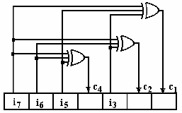

```{math}
\newcommand{\snII}[5]{#1: \left( \begin{matrix} {#2} & {#4} \\ #3 & #5 \end{matrix} \right)}
\newcommand{\snIII}[7]{#1: \left( \begin{matrix} {#2} & {#4} & {#6} \\ #3 & #5 & #7 \end{matrix} \right)}
\newcommand{\snIV}[9]{#1:  \left( \begin{matrix} {#2} & {#4} & {#6} & {#8} \\ #3 & #5 & #7 & #9 \end{matrix} \right)}

\newcommand{\sII}[3] {#1: \left( \begin{matrix} s_1 & s_2 \\ #2 & #3 \end{matrix} \right)}
\newcommand{\sIII}[4] {#1: \left( \begin{matrix} s_1 & s_2 & s_3 \\ #2 & #3 & #4 \end{matrix} \right)}
\newcommand{\sIV}[5] {#1: \left( \begin{matrix} s_1 & s_2 & s_3 & s_4 \\ #2 & #3 & #4  & #5 \end{matrix} \right)}
\newcommand{\sVI}[7] {#1: \left( \begin{matrix} s_1 & s_2 & s_3 & s_4 & s_5 & s_6 \\ #2 & #3 & #4 & #5 & #6 & #7\end{matrix} \right)}
\newcommand{\sVIII}[9] {#1: \left( \begin{matrix} s_1 & s_2 & s_3 & s_4 & s_5 & s_6 & s_7 & s_8\\ #2 & #3 & #4 & #5 & #6 & #7 & #8 & #9 \end{matrix} \right)}
\newcommand{\fIoII}{\frac{1}{2}}
\newcommand{\fIoIII}{\frac{1}{3}}
\newcommand{\fIoIV}{\frac{1}{4}}
\newcommand{\fIoV}{\frac{1}{5}}
\newcommand{\fIoVI}{\frac{1}{6}}
\newcommand{\fIoVII}{\frac{1}{7}}
\newcommand{\fIoVIII}{\frac{1}{8}}
```

# Error control coding

## Introduction

Remember the block scheme of a communication system:

```{figure} img/CommBlockDiagram.png
---
width: 40%
name: fig-CommBlockDiagram
---
Communication system
```

Error control coding is the second task of coding in a communication system,
and refers to the protection of information against channel errors.

During any transmission, the data (symbols, bits) go through a transmission channel,
The transmission channel is not ideal, and in particular it introduces errors.
For example, some bit values may be changed due to electrical noise:
a bit is sent as 0, but received as 1, or viceversa.
This is a problem in all communication systems, and to some degree it is unavoidable,
in general, because electrical noise is unavoidable.

However, we usually require that all data is received correctly.
For example, when you download a file from the internet, you want to be sure that the file is exactly the same as the original.
For example, a single erroneous bit can make a zip file unreadable.

Error control coding refers to all the algorithms which have been developed
with th purpose of protecting against errors in the data.

### Error model

We first need to clarify the assumptions and the scope of the current discussion.

First, we consider only binary codes and binary channels,
i.e. all the data is represented using binary symbols $\left\lbrace 0,1 \right\rbrace$.

An **error** is defined as bit that has changed from 0 to 1 or from 1 to 0 while going through channel.
In these lectures we consider only these types of errors, and not,
for example, situations where bits are lost.

Errors can appear in different ways:

- **independent** errors are sporadic, independent of all the others.
  We consider each bit as having a random chance $p$ of undergoing an error,
  without any relation to the surrounding bits.

  For example, if $p = 10^{-6}$, its means that each bit has a chance of
  1 in a million of being changed.
  This means an average of 1 error in a million bits.
  A file of 100 MB will have around 800 bit errors (100 MB = 100 megabytes = 800 million bits).

- **burst** or **packets** of errors are groups of consecutive errors.
  This can happen in some channels, for example in wireless transmissions,
  where a sudden millisecond drop in in signal quality can affect
  a whole sequence of bits.

Packets of errors are much harder to correct than independent errors,
because the whole context in that region of the bitstream is lost.

When considering that a bit changes its value due to an error, it is
very helpful to treat this as a mathematical operation.
This will allow us to use mathematical tools to design error control mechanisms.

We introduce therefore the **modulo-2 sum** operation, denoted $\oplus$,
with the following properties:

- It operates only on individual bits (0 or 1)
- It is defined by the following table:

  $$\begin{array}{c|cc}
  \oplus & 0 & 1 \\
  \hline
  0 & 0 & 1 \\
  1 & 1 & 0
  \end{array}$$

  This means:

  $$0 \oplus 0 = 0$$
  $$0 \oplus 1 = 1$$
  $$1 \oplus 0 = 1$$
  $$1 \oplus 1 = 0$$

- It is also known as the **exclusive OR** operation (XOR).

Besides the module-2 sum, we can also have the normal product operation
between bits (i.e. $0 \times 1 = 0$, $1 \times 1 = 1$).
Together, they form a modulo-2 arithmetic system known as **Galois field** GF(2),
which supports operations with bits in a way similar to normal arithmetic:

- We can sum bits (with modulo-2 sum)
- We can multiply bits (with normal product)
- We can subtract bits, also with modulo-2 sum.
  Subtraction is the same as addition, since $a - b = a + b$ in modulo-2 arithmetic.
  There are no negative numbers, each number is its own negative, since $a + a = 0$.
- We can use parantheses as usual, i.e.:

  $$
  a(b \oplus c) = ab \oplus ac
  $$

- We can define equation systems, with all coefficients and variables being bits
- We can define polynomials which have bits as coefficients, e.g.

  $$
  p(x) = x^3 \oplus x \oplus 1
  $$


When a bit changes its value, we may think that it undergoes
modulo-2 sum with 1. Given a bit $b$ and its complement $\overline{b}$,
we have:

$$
b \oplus 1 = \overline{b}
$$

irrespective of the value of $b$ (0 or 1)

When a bit remains the same, we may think that it undergoes
modulo-2 sum with 0, since:

$$
b \oplus 0 = b
$$

for any bit $b$.

We can extend this to a sequence of bits, by performing the modulo-2 sum
bit by bit. Suppose we transmit a bit sequence $\mathbf{c}$:

$$
\mathbf{c} = 0100100111
$$

which is received, with errors on the 2nd, 3rd, 4th and 9th positions, as
the sequence $\mathbf{r}$:

$$
\mathbf{r} = 0011100101
$$

we can consider $\mathbf{r}$ as being obtained by the modulo-2 sum of $\mathbf{c}$ with an **error sequence** $\mathbf{e}$:

$$
\mathbf{r} = \mathbf{c} \oplus \mathbf{e}
$$

The error sequence $\mathbf{e}$ has values of $1$ wherever there is an error, and $0$ otherwise:

$$
\mathbf{e} = 0111000010
$$


```{figure} img/ChannelErrorModel.png
---
width: 50%
name: fig-ChannelErrorModel
---
Channel error model
```

Therefore, we **model** the effect of the channel as
this modulo-2 sum with the error sequence.
This constitutes our model for the transmission channel,
for the purpose of error control coding.

### Error detection vs error correction

What can we do about errors? In general there are two approaches

1. **Error detection** means finding out if there is any error in the received sequence,
   but not exactly which bits have the errors.

   Since we don't know exactly where are the errors, we cannot correct the bits.
   Instead, the whole sequence is discarded, and the sender is asked to retransmit it.

   This is possible in live communication systems, where the sender can retransmit the data,
   as for example in the TCP/IP protocol used on the internet.

2. **Error correction** means finding out if there is any error in the received sequence
   and find out exactly which bits have errors.
   Once we locate the errors, we can correct them, by inverting the bits,
   and obtain the original data back.

   This is especially useful when we cannot retransmit the data, for example when the data is stored
   on a physical medium (e.g. on a disk).

Error detections is easier to achieve than error correction,
because it doesn't require to know exactly where the errors are.
However, there exist situations where error correction is necessary,

### Definitions and overview of error control coding

We first give a general schematic of the error control process, with
the purpose of fixing general definitions and notation.
The process is tailored to block codes, which are the most common type of error control codes.

1. The sender needs to send a sequence of $k$ bits, which is the **information word**:

   $$\mathbf{i} = i_1i_2...i_k$$

2. For each possible information word $\mathbf{i}$, the coder assigns a **codeword** $\mathbf{c}$ of length $n > k$:

   $$\mathbf{c} = c_1c_2...c_n$$

3. The codeword is sent on the channel instead of the original information word

4. The receiver receives a sequence $\mathbf{r} \approx \mathbf{c}$, known ad the **received word**,
   with possible errors:

   $$\mathbf{r} = r_1 r_2 ... r_n$$

6. The decoding algorithm detects and/or corrects thformse errors.

   - If it performs only detection, it reports whether there
   are errors or not in $\mathbf{r}$

   - If it performs correction, it tries to find the correct codeword $\hat{\mathbf{c}}$
   and information word $\hat{\mathbf{i}}$ from $\mathbf{r}$.

   Both detection and correction may fail, if the errors are too numerous.
   This is why we denote the output of the decoding algorithm as $\hat{\mathbf{c}}$ and $\hat{\mathbf{i}}$,
   to indicate that they are not necessarily the same as the original $\mathbf{c}$ and $\mathbf{i}$.

We provide below a list of definitions.

- An **error correcting code** is an association between the set of all possible information words to a set of codewords.

  It can be represented as a table in which each possible information word $\mathbf{i}$
  has a certain codeword $\mathbf{c}$.

  The association can be done in many ways:

  - randomly: codewords are selected and associated randomly to the information words
  - based on a certain rule: the codeword is computed with some algorithm from the information word

- A code is a **block code** if it operates with words of fixed size. Otherwise it is a **non-block code**

  For a block code, the size of information word $\mathbf{i}$ is typically denoted as $k$,
  and the size of codeword $\mathbf{c}$ by $n$, with $n > k$.

- A code is **linear** if any linear combination of codewords is also a codeword.

- A code is called **systematic** if the codeword contains all the information bits explicitly, unaltered,
  usually at the beginning or at the end of the codeword.

  This means that the coding process merely adds supplementary bits besides the information bits,
  and the codeword has two parts: the information bits and the parity bits.

  Example: adding a parity bit after the information bits

  Otherwise the code is called **non-systematic**. In this case,
  the information bits are not explicitly visible in the codeword.

- The **coding rate** of a block-code is:

  $$R = k/n$$

- A code $C$ is an **$t$-error-detecting** code if it is able to **detect** $t$ or less errors

- A code $C$ is an **$t$-error-correcting** code if it is able to **correct** $t$ or less errors

Further examples: at blackboard

### Naive examples

#### A first example: parity bit

One of the simplest ways to do error control coding is to add a **parity bit** to the information word.

The parity bit is defined as the module-2 sum of all the bits in the information word,
i.e. it is 0 if there are an even number of 1's in the information word, and 1 if there are an odd number of 1's.

The codeword is obtained by appending the parity bit at the end of the information word.

Consider an information word of length $k = 8$ bits, to which we append
a parity bit, resulting in a codeword of length $n = 9$ bits.

The receiver checks if the parity bit is still equal to the modulo-2 sum of the information bits.

What can we say about this coding procedure:

- It can detect 1 error in a 9-bit codeword, because if there is 1 error in the codeword,
  the parity bit will not anymore match the information bits,
  and the receiver will understand that an error must have happened.

- It is not able to detect 2 errors because if there are 2 errors in the codeword,
  the parity bit will still match the information bits,
  and the receiver will not know that there are errors.

- Therefore this procedure is a **1-error-detecting**

- Even for 1 error, The receiver cannot correct the error,
  because it doesn't know where the error is located.
  Therefore this is a **0-error-correcting** code.

- The coding rate is $R = 8/9$

The coding algorithm could be improved by adding more parity bits,
(see example at blackboard)

#### A second example: repetition code

Let's discuss another basic way of doing error control coding, the **repetition code**.

The codeword is created by repeating the information word $N$ times in a row.
As an example, for $N=5$, to transmit $\mathbf{i} = 100$
we actually send $\mathbf{c} = 100100100100100$ on the channel

The receiver uses a **majority rule** for decoding:
knowing that each bit is repeated $n$ times on certain locations,
it decides that the correct value of each bit is the one that appears most often
among those locations.

For example, if it receives $\mathbf{r} = 101100100110000$, the decoder
views the sequence as 5 groups of 3 bits, and takes the majority value
in each column:

$$\begin{aligned}
\mathbf{r} =
&101 \\
&100 \\
&100 \\
&110 \\
&000 \\
\hline
\hat{\mathbf{i}} = &100
\end{aligned}$$

Let's analyze this code:

- It can detect up to 4 errors, because for 4 or fewer errors
  the decoder will understand some errors must be in the codeword,
  since the 5 groups are not all the same.

- It cannot detect 5 errors everytime, because if the 5 errors affect
  the same column, all the resulting bits will be the same,
  and the decoder is fooled into believing everything is correct.

- Therefore the code is 4-error-detecting (in general, $(N-1)$-error-detecting).

- It can correct up to 2 errors, because even if 2 errors affect the same column,
  the correct value will still appear more often than the wrong value, and
  the majority rule will identify the errors correctly.

- It is not able to correct 3 errors everytime, because if 3 errors affect the same column,
  the wrong value will appear more often than the correct value, and the majority rule will
  produce the wrong result.

- Therefore the code is 2-error-correcting (in general, $\left\lfloor \frac{N-1}{2} \right\rfloor$-error-correcting)$.

- The coding rate $R = k/n = 1/5 = 1/N$

- If the number of repetitions $N$ is increased, the code becomes more robust to errors,
  but the coding rate decreases, i.e. more redundancy is added.

#### Redundancy

We can see in these examples that error control coding works by adding **redundancy** to the data,
i.e. adding additional bits, artificially created according to some rule.

The decoding algorithm will then check if the rule still holds:

- if yes, it will decide that there are no errors
- if not, it will decide that there are errors

Note that error control coding adds redundancy to the data,
while source coding aims to reduce redundancy. Is there a contradiction?

Well, no, because the two types of redundancy are different.
Source coding reduces existing redundancy from the data, which served no purpose.
Error control coding adds redundancy **in a controlled way**, with a purpose.
The purpose is for the decoder to be able to check if the data is correct or not.

In practice, source coding and error control coding are done sequentially, in an independent manner.

1. First perform source coding, eliminating redundancy in representation of data
2. Then perform error control coding, adding redundancy for protection

### Coding rate and channel capacity

This is a preview of something which will be discussed in the next chapters,
but relates to the coding rate of a code, so we can introduce it here.

In Chapter IV we will study transmission channels,
which are mathematical model of how information is handled from the sender to the receiver.
In that chapter we will find that each channel has a certain **capacity** value.

The **channel capacity** is the maximum amount of information than can be sent over the channel
with one symbol, on average.

For example, a binary channel (working with bits 0 and 1) may have capacity $C = 0.8$ bits,
i.e. for each physical bit delivered, the mathematical information
actually transmitted is 0.8.

The channel capacity is related to the coding rate of error control codes via
Shannon's noisy channel coding theorem.

```{prf:definition} Achievable coding rate
A coding rate is called **achievable** for a channel if, for that rate, there exists a coding and decoding
algorithm guaranteed to correct all possible errors on the channel
```


```{prf:theorem} Shannon's noisy channel coding theorem  (Shannon's second theorem, channel coding theorem)
For a given channel, all rates below capacity $R < C$ are achievable. All rates
above capacity, $R > C$, are not achievable.
```

The rigorous proof of the theorem is too complex to present here. Some key ideas of the proof are:

- Use very long information words, $k \to \infty$
- Use random codes, and compute the probability of having error after decoding
- If $R < C$, *in average for all possible codes*, the probability of error after decoding goes to 0.
  This means that there exists at least one code better than the average, therefore
  this code can correct all errors, and it is the code which we should use.
  Thus, the coding rate is achievable.

In layman terms, the theorem says that:

- For all coding rates $R<C$, **there is a way** to recover the transmitted data perfectly (decoding algorithm will detect and correct
all errors)
- For all coding rates $R>C$, **there is no way** to recover the transmitted data perfectly

As a numerical example, suppose we send bits on a binary channel with capacity 0.7 bits/message.

- For any coding rate $R < 0.7$ the theorem states that there exists an error correction code that allows fixing of all errors.
  Coding rate $R < 0.7$ means we send more than 10 bits for every 7 information bits, on average.

- With less than 10 bits for every 7 information bits, i.e. $R > 0.7$, no code exists that can fix all errors.

The theorem makes it clear when it is possible to fix all errors,
giving a clear limit to the coding rate required for this to happen.
Moreover, it guarantees that such a code exists, but it **doesn't tell us how to find it**.
It gives no clue of how to actually find the code in practice, only some
general principles derived from the proof:

- using longer information words is better
- random codewords are generally good (though in practice they are not efficient to use, because thet don't have a simple implementation)

In practice, we cannot use infinitely long codewords, and random codewords are no efficient to implement,
so we will only get a *good enough* code.

## Analyzing linear block codes with the Hamming distance

### The Hamming distance

We start from a practical idea which we can deduce from what we discussed until now.

If a codeword $\mathbf{c_1}$ has errors and, as a consequence, it becomes identical to another codeword $\mathbf{c_2}$,
any decoder will be fooled into thinking everything is correct, and it has received a correct codeword $\mathbf{c_2}$.
Thus the errors go undetected.

Therefore, we want the codewords to be as different as possible from each other.
The Hamming distance is a way of computing how different two codewords are.

The **Hamming distance** of two binary sequences **a** and **b** having the same length $n$,
$d_H(\mathbf{a}, \mathbf{b})$, is the total number of bit differences between them

$$d_H(\mathbf{a}, \mathbf{b}) = \sum_{i=1}^N a_i \oplus b_i$$

The Hamming distance shows how many bit changes are needed to convert one sequence into the other one.

The Hamming distance satisfies the 3 properties of a metric function:

1. $d_H(\mathbf{a},\mathbf{b}) \geq 0 \;\;\; \forall \mathbf{a},\mathbf{b}$, with $d_H(\mathbf{a},\mathbf{b}) = 0 \Leftrightarrow \mathbf{a} = \mathbf{b}$
2. $d_H(\mathbf{a},\mathbf{b}) = d_H(\mathbf{b},\mathbf{a}), \forall \mathbf{a},\mathbf{b}$
3. $d_H(\mathbf{a},\mathbf{c}) \leq d_H(\mathbf{a},\mathbf{b}) + d_H(\mathbf{b},\mathbf{c}), \forall \mathbf{a},\mathbf{b},\mathbf{c}$

The **minimum Hamming distance of a code**, denoted as ${d_H}_{min}$,
is the minimum Hamming distance between any two codewords $\mathbf{c_1}$ and $\mathbf{c_2}$.
We find it by taking all the pairs of codewords, computing the Hamming distance between them,
and taking the minimum value.

The minimum Hamming distance of a code guarantees that all codewords
are at least ${d_H}_{min}$ bits apart from each other.

### Nearest-neighbor decoding scheme

We introduce a simple decoding scheme, called **nearest-neighbor decoding**,
which serves as the underlying approach for many error control codes.

**Coding**

- We use a code $C$ with large ${d_H}_{min}$, to make the codewords as different as possible.
  The code (i.e. all the possible codewords) is known to both the sender and the receiver.
- One of the codewords $\mathbf{c}$ is sent.

**Decoding**

- Receive a word $\mathbf{r}$, that may have errors.

- Error detecting:
  - check if $\mathbf{r}$ is among the codewords of the code $C$
  - if $\mathbf{r}$ is among the codewords, decide that there have been no errors
  - if $\mathbf{r}$ is not among the list of codewords, decide that there have been errors

- Error correcting:
  - if $\mathbf{r}$ is among the codewords, decide there are no errors
  - else, choose the codeword from $C$ which is **nearest** to the received $\mathbf{r}$, in terms of Hamming distance.
    Decide that the correct codeword is this one.
    This is known as **nearest-neighbor decoding**

The performance of this scheme, in terms of how many errors it can detect and correct,
is related to the minimum Hamming distance of the code.
As the next theorem shows, a larger ${d_H}_{min}$ means better performance.
Note, however, that increasing the ${d_H}_{min}$
usually means longer codewords, i.e. smaller coding rate, i.e. more redundancy,
so there is a price to pay for better performance.

```{prf:theorem} Performance of nearest neighbor decoding
If the minimum Hamming distance of a code is ${d_H}_{min}$, then:

1. The code can *detect* up to **${d_H}_{min} - 1$** errors
2. The code can *correct* up to **$\left\lfloor \frac{{d_H}_{min} - 1}{2} \right\rfloor$** errors using nearest-neighbor decoding
```

```{prf:proof}

To prove the first assertion, observe that at least ${d_H}_{min}$ binary changes
are needed to change one codeword into another.
Therefore, if a codeword undergoes a number of errors up to ${d_H}_{min} - 1$,
is not enough to obtain a new codeword, so the result will not be in the list
of allowed codewords of the code. Thus, errors are detected.

For the second assertion, observe that as long as the number of errors is
strictly less than half of the distance to another codeword, the received word $\mathbf{r}$
is closer to the original codeword than to any other.
The condition of being strictly less than half of ${d_H}_{min}$ is expressed
as $\left\lfloor \frac{{d_H}_{min} - 1}{2} \right\rfloor$.

You can think in terms of geometry:
the original codeword $\mathbf{c}$ is a point in space,
separated by a distance of at least ${d_H}_{min}$ from any other codeword.
The received word $\mathbf{r}$ is somewhere around $\mathbf{c}$.
If the distance between $\mathbf{r}$ and $\mathbf{c}$ is less than half of ${d_H}_{min}$,
i.e. less than half of the distance to any other codeword,
then $\mathbf{c}$ is still closer to $\mathbf{r}$ than to any other codeword.
In this case, the nearest-neighbor algorithm will find $\mathbf{c}$ as the correct codeword.

All this geometrical intuition is possible because the Hamming distance
satisfies the properties of a distance function, and thus it behaves
like the geometrical distance in a space.

```

The theorem gives the maximum number of errors for which
the decoding scheme is **guaranteed** to work.
If the number of errors is higher than these limits, the decoding
scheme may or may not work, depending on the specific errors.
We may have:

- Detection failure: decide that there were no errors, even if they were (more than ${d_H}_{min} - 1$)
- Correction failure: choose a wrong codeword as original

### Computational complexity

The nearest-neighbor decoding scheme is simple to understand and implement,
and it underpins many error control codes (if not all).
However, it in not always used in practice, because of a fundamental
problem: it requires a lot of computational resources, especially for large codes
(e.g. in practice).

To understand this, we need to use the concept of **computational complexity**
of an algorithm, coming from computer science.

The computational complexity of an algorithm is the amount of computational resources required
by the algorithm, expressed as a function of the size of the input data.
In general, we are interested in the **order of magnitude** of the computational complexity,
i.e. the dominant term in the expression, neglecting the other terms and the coefficients.

The computational complexity of an algorithm is expressed using the **big-O notation**,
for example $\mathcal{O}(n^2)$, which means that the computational complexity is proportional to $n^2$,
or $\mathcal{O}(n \log n)$, which means that the computational complexity is proportional to $n \log n$.
This gives an idea about how the computational complexity grows with the size of the input data, $n$.

For the nearest-neighbor decoding scheme, if the number of information bits
is $k$, the computational complexity is $\mathcal{O}(2^k)$,
which is absolutely huge for large $k$.

$$\mathcal{O}(k) = 2^k$$

This is because both error detection and correction require comparing the received word
with all the possible codewords, and there are $2^k$ codewords in total,
one for each possible information word. Thus, the algorithm needs to go
through an array of size $2^k$ to find the correct codeword.

A computation complexity of $\mathcal{O}(2^k)$ means that the algorithm
is very inefficient, and is not feasible in practice:

- when $k$ doubles, the amount of computations is squared
- when $k$ increases 10 times, the amount of computations is raised to a power of 10
- when $k$ increases 100 times, the amount of computations is raised to a power of 1000
- for $k = 256$ bits, you'd need more than all the energy of the Sun (not a joke, it can be calculated)
  to go through a list of size $2^{256}$ codewords.

Therefore, we need ways to make decoding simpler and more efficient.

## Analyzing linear block codes with matrix algebra

### Vector algebra in a binary world

#### A short review of basic vector algebra

A **vector space** is a set with two operations, sum and multiplication by a constant,
having the following properties:

- an element + another element = still an element from the set
- an element $\times$ a constant = still an element from the set

In other words, we cannot escape from the set by summing or multiplying by a constant.

The elements of a vector space are called "vectors".

Intuitive examples of vector spaces are Euclidian (geometrical) vector spaces: a line, points in 2D, 3D.
For example, adding two vectors in a 2D plane gives another vector in the same 2D plane,
and multiplying a vector by a constant gives another vector in the same 2D plane.

A **basis** of a vector space $V$ is a set of $n$ independent vectors $\mathbf{e_1}, ...\mathbf{e_n}$,
such that any vector $\mathbf{v}$ can be expressed as a linear combination of the basis elements

$$\mathbf{v} = \mathbf{e_1} \cdot \alpha_1 +  ... + \mathbf{e_n} \cdot \alpha_n$$

A **subspace** is a smaller dimensional vector space embedded inside a larger vector space.

For example, a line in a 2D plane is a subspace of the 2D plane:

- sum of two vectors on the line is still on the same line
- the size of the line subspace is 1, and the embedding plane has size 2

Another example is a 2D plane in 3D space:

- sum of two vectors from the plane is still on the plane
- size of subspace is 2, size of the larger space is 3

#### How to look at matrix-vector multiplications

When we multiply a matrix with a vector (in this order),
the output is a column vector which is a linear combination of the columns of the matrix.
The multiplicating vector gives the coefficients of the linear combination.

When we multiply a vector with a matrix (in this order),
the output is a row vector which is a linear combination of the rows of the matrix.
The multiplicating vector gives the coefficients of the linear combination.

TODO: Explain with draw picture

Vector spaces can be perfectly described with matrix-vector multiplications

- Matrix columns/rows = elements of the basis
- The output vector = the vector
- The multiplicated vector = the coefficients of the linear combination

Any vector $\mathbf{v}$ can be expressed as a linear combination of
the basis elements:

$$\mathbf{v} = \mathbf{e_1} \cdot \alpha_1 +  ... + \mathbf{e_n} \cdot \alpha_n$$

$$\mathbf{v} =
\begin{bmatrix}
\mathbf{e_1}  & \mathbf{e_2} & ... & \mathbf{e_n}
\end{bmatrix}
\begin{bmatrix}
\alpha_1  \\ \alpha_2 \\ ... \\ \alpha_n
\end{bmatrix}
$$

where $\mathbf{e_1}, ... \mathbf{e_n}$ are **column vectors**.

The equation can be transposed, which would mean that all vectors become row vectors,
but the usual mathematical convention is to use column vectors wherever possible.

#### Vector spaces of binary codewords

```{prf:theorem} Vector space of binary sequences
The set of all binary sequences of size $n$ is a vector space of size $n$,
when considering the sum operation as modulo-2 sum $\oplus$ between sequences,
and the multiplication with a constant as multiplication with 0 or 1 as in usual arithmetic.
```
```{prf:proof}
The two properties defining a vector space are satisfied:

- the sum of two sequences of size $n$ is still a sequence of size $n$,
  when using modulo-2 sum $\oplus$

- the multiplication of a sequence with a constant is still a sequence of size $n$:
  when multiplying with 0, the sequence becomes all 0's, and when multiplying with 1,
  it stays the same. Eiher way, it is still a binary sequence of size $n$.
```

Furthermore the codewords of a linear block code
with code length $n$ and information length $k$
is a vector subspace of the larger vector space of all binary sequences of size $n$.

```{prf:theorem} Codewords of a linear block code form a subspace
The codewords of a linear block code with code length $n$ and information length $k$
form a vector subspace of the larger vector space of all binary sequences of size $n$.
```

```{prf:proof}
Again, the set of codewords of a linear block code satisfies the two properties of a vector space:

- the sum of two codewords is still a codeword, because the code is linear
  (this is what the linearity property of a code means)

- a codeword multiplied by 0 or 1 is still a codeword, either all 0's or the same codeword.
  Note that the all-0 sequence must be a codeword, because it is the sum of any
  codeword with itself, so it is the sum of two codewords.

The codewords are binary sequences of size $n$,
so they are part of the larger vector space of all binary sequences of size $n$.
But the size of this codeword vector space itself is $k$, because the total number of codewords is $2^k$,
so any codeword can be expressed with just $k$ coefficients (i.e. the information bits,
since every codeword is associated with one information word).

We thus have a vector subspace of size $k$ embedded in a larger vector space of size $n$.
Not all sequences of size $n$ from the larger space are codewords.
```

You can imagine the set of codewords as forming a 2D plane embedded in a 3D space.
All codewords live in this plane, and all point on this plane are codewords.
The larger space contains lots of other points which are not on the plane, so are not codewords,
just like there are many sequences of size $n$ which are not codewords.

Since all codewords of a linear block code form a subspace,
it follows that all codewords can be expressed as matrix-vector multiplications.

### The generator matrix

All codewords for a linear block code can be generated via a **vector-matrix multiplication**
as follows:

$$\mathbf{i} \cdot [G] = \mathbf{c}$$

```{figure} img/GeneratorMatrix.png
---
width: 50%
name: GeneratorMatrix
---
Codeword construction with generator matrix
```

The matrix $[G]$ is known as the **generator matrix** of the code.
Its size of size $k \times n$, and it is a "wide" matrix since we have $k < n$.
The generator matrix fully defines the code, i.e. if we know the generator matrix,
we know everything about the code.

The vector $\mathbf{i}$ is the information word, of size $k$.

Such a vector-matrix multiplication can be interpreted as follows:
the resulting codeword $\mathbf{c}$
is a linear combination of the rows in the matrix $[G]$,
with the coefficients given by the information word $\mathbf{i}$.
This means the rows of $[G]$ are a *basis* for the linear block code.
All the vector space theory we discussed before applies here:

- the rows of the generator matrix are a basis for the codewords
- all codewords are obtained by linear combinations of the rows of the generator matrix, i.e.
  by multiplcation with $[G]$
- the information word $\mathbf{i}$ gives the coefficients of the linear combination
- for each information word $\mathbf{i}$, there is a corresponding codeword $\mathbf{c}$
  obtained by multiplying with $[G]$

Note that the equation could also be transposed, i.e. use column vectors instead of row vectors,
but it is more customary to use row vectors here.

This way of generating codewords guarantees that the code is linear.
Indeed, we can show that the sum of two codewords is also a codeword, by construction.
If we have two codewords $\mathbf{c_1}$ and $\mathbf{c_2}$,
corresponding to two information words $\mathbf{i_1}$ and $\mathbf{i_2}$,
then the sum of the two codewords is still something multiplied with $[G]$,
so it is still a codeword.

$$\mathbf{i_1} \cdot [G] = \mathbf{c_1}$$
$$\mathbf{i_2} \cdot [G] = \mathbf{c_2}$$
$$\mathbf{c_1} \oplus \mathbf{c_2} = (\mathbf{i_1} \oplus \mathbf{i_2}) \cdot [G] = codeword$$

### The control (parity-check) matrix

Every generator matrix $[G]$ has a related **control matrix** $[H]$ (also known as **parity-check matrix**)
such that

$$\mathbf{0} = [H] \cdot [G]^T$$

The size of $[H]$ is $(n-k) \times n$.

The two matrices $[G]$ and $[H]$ are related, and one can always be deduced from the other.

The control matrix $[H]$ is very useful to check if a binary word is a codeword or not
(i.e. for nearest neighbor error detection), based on the following theorem.

```{prf:theorem} Codeword checking with parity-check matrix
Consider a code with generator matrix $[G]$ and control matrix $[H]$.

Every codeword $\mathbf{c}$ multiplied with $[H]$ will produce the zero vector:

$$\mathbf{0} = [H] \cdot \mathbf{c}^T$$

```

```{prf:proof}
The proof is straightforward, based on the fact that $\mathbf{0} = [H] \cdot [G]^T$.

$$\mathbf{i} \cdot [G] = \mathbf{c}$$
$$[G]^T \cdot \mathbf{i}^T = \mathbf{c}^T$$
$$[H] \cdot \mathbf{c}^T = [H] \cdot [G]^T \cdot \mathbf{i}^T = \mathbf{0}$$
```

The theorem shows that all codewords generated with $[G]$ will produce $0$ when multiplied with $[H]$.
On the other hand, all binary sequences that are not codewords will produce something
different from $0$ when multiplied with $[H]$. In this way, multiplcation with
$[H]$ can be used as a quick way to check if a binary sequence is a codeword or not.
This is what error detection is all about.

The generator matrix $[G]$ and $[H]$ are related.
In linear algebra terminology, $[G]$ is the matrix which generates the $k$-dimensional subspace of the codewords,
and the rows of $[H]$ are the "missing" dimensions of the subspace (the "orthogonal complement")

In terms of matrix shape, $[G]$ and $[H]$ together form a full square matrix $n \times n$:

- size of $[G]$ is $k \times n$
- size of $[H]$ is $(n-k) \times n$

### Matrices [G] and [H] for systematic codes

For systematic codes, $[G]$ and $[H]$ have special forms (known as **"standard"** forms)

The generator matrix can be decomposed into two parts:

- First part is the **identity matrix**. This copies the information bits in the resulting codeword.
- Second part is some matrix $Q$, which generates the control bits
$$[G]_{k \times n} = [I_{k \times k} \;\; Q_{k \times (n-k)}]$$

The control matrix $[H]$ is related to $[G]$ as follows:

- First part is $Q^T$ (the same $Q$ as in $[G]$, but **transposed**)
- Second part is an identity matrix of corresponding size
$$[H]_{(n-k) \times n} = [Q^T_{(n-k) \times k} \;\; I_{(n-k) \times (n-k)}]$$

Thus, one matrix can be derived from the other.

### Interpretation as parity bits

Multiplication with $[G]$ in standard form produces the codeword composed of two parts:

- the information bits themselves (since the first part of $[G]$ is an identity matrix)
- some additional control bits, which are linear combinations of the information bits, i.e. *parity bits*

Each column of $[G]$ corresponds to one parity bit in the codeword,
and the values in the column define which bits are combined to create the parity bit.

The control matrix in standard form $[H]$ checks if parity bits correspond to information bits

- Proof: write down the parity check equation (see example)

\smallskip

If all parity bits match the data, the result of multiplying with $[H]$ is 0.
Otherwise it is $\neq 0$, signaling that at least one parity bit does not check out.

Therefore, the generator & control matrices are just mathematical tools
for easy computation and checking of parity bits.
We're still just computing and checking parity bits, but we do it easier with matrices.

### Syndrome-based error detection and correction

When considering error detection and correction,
we multiply the received word $\mathbf{r}$ with the control matrix $[H]$.

$$\mathbf{z} = [H] \cdot \mathbf{r}^T$$

The vector $\mathbf{z}$ is called the **syndrome** of the received word $\mathbf{r}$.

The syndrome is a linear combination of the columns of $H$,
according to the column-wise interpretation of the multiplication.

{width=30%}

The process of **error detection** with matrices is therefore as follows:

1. generate codewords with generator matrix:
$$\mathbf{i} \cdot [G] = \mathbf{c}$$

2. send codeword $\mathbf{c}$ on the channel
3. a random error word $\mathbf{e}$ is applied on the channel
4. receive word $\mathbf{r} = \mathbf{c} \oplus \mathbf{e}$

5. compute **syndrome** of $\mathbf{r}$:
$$\mathbf{z} = [H] \cdot \mathbf{r}^T$$

6. Decide:
    * If $\mathbf{z} = 0$ => $\mathbf{r}$ has no errors
    * If $\mathbf{z} \neq 0$ => $\mathbf{r}$ has errors

For **error correction**, we need to locate the errors.
For this, observe that the syndrome $\mathbf{z}$ is the effect only of the error word $\mathbf{e}$,
and not of the codeword $\mathbf{c}$ (considering that $\mathbf{r}$ is the sum of $\mathbf{c}$ and $\mathbf{e}$):
$$\mathbf{z} = [H] \cdot \mathbf{r}^T = [H] \cdot (\mathbf{c}^T \oplus \mathbf{e}^T) = [H] \cdot \mathbf{e}^T$$

We identify the error word $\mathbf{e}$ by searching exhaustively through all possible error words $\mathbf{e}$,
until we find the first one that produces the same syndrome $\mathbf{z}$.
Once we find it, we know where the errors are, and we can correct them.

The process is summarized as follows:

7. Create a **syndrome table**:
    * for every possible error word $\mathbf{e}$, compute the syndrome $\mathbf{z} = [H] \cdot \mathbf{e}^T$
    * start with error words with 1 error (most likely), then with 2 errors (less likely), and so on

8. Locate the syndrome $\mathbf{z}$ in the table, read the corresponding error word $\mathbf{\hat{e}}$

9. Find the correct word:
    * adding the error word again will invert the errored bits back to the originals
$$\mathbf{\hat{c}} = \mathbf{r}  \oplus \mathbf{\hat{e}}$$

Example: at blackboard

### Computational complexity

When using matrices, the computational complexity is much lower
than the scheme based on codeword tables.

Error detection requires a multiplication with $[H]$,
so the complexity is $\mathcal{O}(n^2)$ (size of $[H]$ is $(n-k) \times n$).

Error correction still needs to check all possible error words,
which means bad performance, but at least we don't need to check all codewords.
In practice, other tricks are used to make it much faster (see Hamming codes for example)

### Conditions on [H] for error detection and correction

The performance of the error detection and correction scheme,
i.e. how many errors can be detected and corrected,
can be deduced from the properties of the control matrix $[H]$.

For error detection, we can detect errors if the syndrome is **non-zero**.
Whenever an error word $\mathbf{e}$, when multiplied with $[H]$,
produces a zero syndrome, the algorithm is fooled into thinking
there are no errors. Therefore, we need to make sure that the syndrome is non-zero.
Considering that the syndrome is a linear combination of the columns of $[H]$,
with only the columns corresponding to values of $1$ in the error word $\mathbf{e}$,
we can say:

- To detect a single error, every column of $[H]$ must be non-zero,
  such that the syndrome is non-zero whenever the error word has a single $1$,
  no matter where it is located.
- To detect two error, sum of any two columns of $[H]$ cannot be zero, i.e. all columns are different.
- In general, to detect $n$ errors, we need that the sum of any $n$ or less columns of $[H]$ is non-zero.

For error correction, we use the syndrome table to identify the error word.
When two different error words produce the same syndrome,
the algorithm is unable to identify which is the true one.
Therefore, error correction works only if the syndrome is **unique**:

- To correct a single error, all columns of $[H]$ must be different,
  such that the syndrome is unique for all error words with a single $1$.
- To correct two errors, the sum of any two columns of $[H]$ must be different,
  such that the syndrome is unique for all error words with two $1$s.
  We also

- To correct $n$ errors: sum of any $n$ or less columns of $[H]$ are all different
        * much more difficult to obtain than for decoding

* Conditions for error correction are more demanding than for detection

* Note: Rearranging the columns of $[H]$ (the order of bits in the codeword) does not affect performance


### Chapter structure

Chapter structure

1. General presentation
2. Analyzing linear block codes with the Hamming distance
3. Analyzing linear block codes with matrix algebra
4. **Hamming codes**
5. Cyclic codes

### Hamming codes

* A particular class of linear error-correcting codes

* Definition: a **Hamming code** is a linear block code where the columns of $[H]$
are *the binary representation of all numbers from 1 to $2^r-1$*, $\forall r \geq 2$

* Example (blackboard): (7,4) Hamming code

* Systematic: arrange the bits in the codeword, such that the control bits correspond to the columns having a single 1
    * no big difference from the usual systematic case, just a rearrangement of bits
    * makes implementation easier


### Properties of Hamming codes

* From definition of $[H]$ it follows:
    1. Codeword has length $n = 2^r - 1$
    2. $r$ bits are parity bits (also known as ***control bits***)
    3. $k = 2^r-r-1$ bits are information bits

\smallskip

* Notation: **(n,k) Hamming code**
    * n = codeword length = $2^r-1$,
    * k = number of information bits  = $2^r - r - 1$
    * Example: (7,4) Hamming code, (15,11) Hamming code, $(127,120)$ Hamming code

### Structure of a Hamming codeword

- The codeword contains information bits and parity (control) bits
- The control bits correspond to the columns of the parity-check matrix $[H]$
  which have a single 1 (i.e. columns which form the identity matrix)
- The information bits are placed in the remaining positions,
  where the columns of $[H]$ have two or more 1s

- Codeword for Hamming(7,4):
$$c_1c_2i_3c_4i_5i_6i_7$$

- Codeword for Hamming(15,11):
$$c_1c_2i_3c_4i_5i_6i_7c_8i_9i_{10}i_{11}i_{12}i_{13}i_{14}i_{15}$$

### Construction of Hamming codewords

- Every Hamming code has a generator matrix $[G]$, but we
  don't provide it explicitly, because it is hard to remember

- Instead, we deduce the values from the equation system of the parity-check matrix $[H]$,
  $\mathbf{0} = [H] \cdot \mathbf{c}^T$

- For example, for Hamming(7,4), we have:

  $$
  \begin{cases}
  0 = c_4 \oplus i_5 \oplus i_6 \oplus i_7 \\
  0 = c_2 \oplus i_3 \oplus i_5 \oplus i_6 \\
  0 = c_1 \oplus i_3 \oplus i_5 \oplus i_7
  \end{cases}
  $$
  which means:
  $$
  \begin{cases}
  c_4 = i_5 \oplus i_6 \oplus i_7 \\
  c_2 = i_3 \oplus i_5 \oplus i_6 \\
  c_1 = i_3 \oplus i_5 \oplus i_7
  \end{cases}
  $$

### Properties of Hamming codes

* Can detect two errors
	* All columns are different => can detect 2 errors
	* Sum of two columns equal to a third => cannot correct 3

**OR**

* Can correct one error
	* All columns are different => can correct 1 error
	* Sum of two columns equal to a third => cannot correct 2
	* Non-systematic: syndrome = error position

**BUT**

* Not simultaneously!
    * same non-zero syndrome can be obtained with 1 or 2 errors, can't distinguish

### Coding rate of Hamming codes

Coding rate of a Hamming code:
$$R = \frac{k}{n} = \frac{2^r - r - 1}{2^r-1}$$

The Hamming codes can correct 1 OR detect 2 errors in a codeword of size $n$

* (7,4) Hamming code: $n = 7$
* (15,11) Hamming code: $n = 15$
* (31,26) Hamming code: $n = 31$

Longer Hamming codes are progressively weaker:

* weaker error correction capability
* better efficiency (higher coding rate)
* more appropriate for smaller error probabilities


### Encoding & decoding example for Hamming(7,4)

See whiteboard.

In this example, encoding is done without the generator matrix $G$, directly with the matrix $H$, by finding the values of the parity bits $c_1$, $c_2$, $c_4$ such that
$$\begin{bmatrix}0\\0\\0\end{bmatrix} = [H] \begin{bmatrix}c_1\\c_2\\i_3\\c_4\\i_5\\i_6\\i_7\end{bmatrix}$$

For a single error, the syndrome **is the binary representation of the location of the error**.


### Circuit for encoding Hamming(7,4)

{width=40%}

* Components:
    * A **shift register** to hold the codeword
    * Logic OR gates to compute the parity bits

### Circuit for decoding Hamming(7,4)

{width=40%}

* Components:
    * A **shift register** to hold the received word
    * Logic OR gates to compute the bits of the syndrome ($z_i$)
    * **Binary decoder**: activates the output corresponding to the binary input value, fixing the error


### SECDED Hamming codes

* Hamming codes can correct 1 error OR can detect 2 errors, but we cannot differentiate the two cases

* Example:

    * the syndrome $\mathbf{z} = [H] \cdot \mathbf{r}^T = \begin{bmatrix}0\\1\\1\end{bmatrix}$ can be caused by:
        * a single error in location 3 (bit $i_3$)
        * two errors in location 1 and 2 (bits $c_1$, bits $c_2$)

    * if we know it is a single error, we can go ahead and correct it, then use the corrected data
    * if we know there are two errors, we should NOT attempt to correct them, because we cannot locate the errors correctly

* Unfortunately, it is **not possible to differentiate** between the two cases.

* **Solution?** Add additional parity bit $\rightarrow$ SECDED Hamming codes


### SECDED Hamming codes

* Add an additional parity bit to differentiate the two cases
    * $c_0$ = sum of all $n$ bits of the codeword

* For (7,4) Hamming codes: $$\mathbf{c_0}c_1c_2i_3c_4i_5i_6i_7$$

* The parity check matrix is extended by 1 row and 1 column
$$\tilde{H} =
\begin{bmatrix}
1 &1 \\
0 &\mathbf{H} \\
\end{bmatrix}$$

* Known as SECDED Hamming codes
    * **S**ingle **E**rror **C**orrection - **D**ouble **E**rror **D**etection


### Encoding and decoding of SECDED Hamming codes

* Encoding:
    * compute codeword using $\tilde{H}$
    * alternatively, prepend $\mathbf{c_0}$ = sum of all other bits

### Encoding and decoding of SECDED Hamming codes

* Decoding
    * Compute syndrome of the received word using $\tilde{H}$
$$\tilde{\mathbf{z}} = \begin{bmatrix}z_0\\\mathbf{z}\end{bmatrix} = [\tilde{H}] \cdot \mathbf{r}^T$$
    * $z_0$ is an additional bit in the syndrome corresponding to $c_0$
    * $z_0$ tells us whether the received $c_0$ matches the parity of the received word
        * $z_0 = 0$: the additional parity bit $c_0$ matches the parity of the received word
        * $z_0 = 1$: the additional parity bit $c_0$ does not match the parity of the received word

### Encoding and decoding of SECDED Hamming codes

* Decoding (continued):
    * Decide which of the following cases happened:
        * If no error happened: $z_1 = z_2 = z_3 = 0, z_0 = \forall$
        * If 1 error happened: syndrome is non-zero, $z_0 = 1$ (does not match)
        * If 2 errors happened: syndrome is non-zero, $z_0 = 0$ (does match, because the two errors cancel each other out)
        * If 3 errors happened: same as 1, can't differentiate

* Now can simultaneously differentiate between:
    * 1 error: $\rightarrow$ perform correction
    * 2 errors: $\rightarrow$ detect, but do not perform correction

* Also, if correction is never attempted, can detect up to 3 errors
    * minimum Hamming distance = 4 (no proof given)
    * don't know if 1 error, 2 errors or 3 errors, so can't try correction


### Summary until now

* Systematic codes: information bits + parity bits
* Generator matrix: use to generate codeword
$$\mathbf{i} \cdot [G] = \mathbf{c}$$
* Parity-check matrix: use to check if a codeword
$$0 = [H] \cdot \mathbf{c}^T$$
* Syndrome:
$$\mathbf{z} = [H] \cdot \mathbf{r}^T$$
* Syndrome-based error detection: syndrome non-zero
* Syndrome-based error correction: syndrome table
* Hamming codes: $[H]$ contains all numbers $1 ... 2^r - 1$
* SECDED Hamming codes: add an extra parity bit


### Chapter structure

Chapter structure

1. General presentation
2. Analyzing linear block codes with the Hamming distance
3. Analyzing linear block codes with matrix algebra
4. Hamming codes
5. **Cyclic codes**


### Cyclic codes

Definition: **cyclic codes** are a particular class of linear block codes
for which *every cyclic shift of a codeword is also a codeword*

* Cyclic shift: cyclic rotation of a sequence of bits (any direction)

* Are a particular class of linear block codes, so all the theory up to now still applies
    * they have a generator matrix, parity check matrix etc.

* But they can be implemented more efficient than general linear block codes (e.g. Hamming)

* Used **everywhere** under the common name **CRC** (**C**yclic **R**edundancy **C**heck)
    * Network communications (Ethernet), data storage in Flash memory

### Usage example: Ethernet frame

* CRC codes are used in Ethernet frames:

{widht=50%}

### Binary polynomials

* Every binary sequence $\mathbf{a}$ corresponds to a polynomial $\mathbf{a(x)}$ with binary coefficients
$$a_0a_1...a_{n-1} \rightarrow \mathbf{a(x)} = a_0 \oplus a_1x \oplus ... \oplus a_{n-1}x^{n-1}$$

* Example:
$$10010111 \rightarrow 1 \oplus x^3 \oplus x^5 \oplus x^6 \oplus x^7$$

* From now on, by "codeword" we also mean the corresponding polynomial.


* Can perform all mathematical operations with these polynomials:
    * addition, multiplication, division etc. (examples)

* There are efficient circuits for performing multiplications and divisions.

### Generator polynomial

**Theorem**:

* All the codewords of a cyclic code are multiples of a certain polynomial $g(x)$,
known as **generator polynomial**.


### Properties of generator polynomial

The generator polynomial $g(x)$ must satisfy the following:

* $g(x)$ must have first and last coefficient equal to 1
* $g(x)$ must be a factor of $X^n \oplus 1$
* The *degree* of $g(x)$ is $n-k$, where:
    * n = the size of codeword (codeword polynomial has degree $n-1$)
    * k = the size of the information word (information polynomial has degree $k-1$)
$$ (k-1) + (n-k) = n-1$$
* **The degree of $g(x)$ is the number of parity bits of the code.**

### Example of generator polynomials

Example:

$$1 \oplus x^7 = (1 \oplus x)(1 \oplus x + \oplus x^3)(1 \oplus x^2 \oplus x^3)$$

Each factor can generate a code:

* $1 \oplus x$ generates a (7,6) cyclic code
* $1 \oplus x \oplus x^3$ generates a (7,4) cyclic code
* $1 \oplus x^2 \oplus x^3$ generates a (7,4) cyclic code

### Popular polynomials

{widght=80%}

* Image from *http://www.ross.net/crc/download/crc_v3.txt*

* Your turn: write the polynomials in mathematical form

### Proving the cyclic property

Theorem:

* Any cyclic shift of a codeword is also a codeword.

Proof:

* It is enough to consider a cyclic shift by 1 position

* Original codeword
$$c_0c_1c_2...c_{n-1} \rightarrow \mathbf{c(x)} = c_0 \oplus c_1x \oplus ... \oplus c_{n-1}x^{n-1}$$

* Cyclic shift to the right by 1 position
$$c_{n-1}c_0c_1...c_{n-2} \rightarrow \mathbf{c'(x)} = c_{n-1} \oplus c_0x \oplus ... \oplus c_{n-2}x^{n-1}$$

* We can rewrite:
$$\begin{split}
\mathbf{c'(x)}
=& x \cdot \mathbf{c(x)} \oplus c_{n-1}x^n \oplus c_{n-1}\\
=& x \cdot \mathbf{c(x)} \oplus c_{n-1}(x^n \oplus 1)\\
\end{split}$$

### Proving the cyclic property

Proof (continued):

* Since $\mathbf{c(x)}$ is a multiple of $g(x)$, so is $x \cdot \mathbf{c(x)}$
* Also $(x^n \oplus 1)$ is always a multiple of $g(x)$
* => It follows that their sum $\mathbf{c'(x)}$ is a also a multiple of $g(x)$, which means it is a codeword.

QED

* Note that we relied on two properties mentioned before:
    * that a codeword $\mathbf{c(x)}$ is always a multiple of $g(x)$
    * that $g(x)$ is a factor of $(x^n \oplus 1)$

### Coding and decoding of cyclic codes

* Cyclic codes can be used for detection or correction

* In practice, they are used mostly for **detection only** (e.g. in Ethernet)
    * because there are other codes with better performance for correection

* Can be systematic / non-systematic
    * In practice, the systematic variant is much preferred

* We study coding/decoding from 3 perspectives:
    * The mathematical way, with polynomials
    * The programming way, e.g. as a programming algorithm
    * The hardware way, via schematics

### 1. Coding and decoding - The mathematical way

Reminder: polynomial multiplication and division

* Two polynomials $a(x)$ and $b(x)$ can be multiplied
    * the result has degree = degree of $a(x)$ + degree of $b(x)$
* A polynomials $a(x)$ can be divided to another polynomial $b(x)$:
$$a(x) = b(x) q(x) \oplus r(x)$$
    * $q(x)$ = the quotient ("ctul")
    * $r(x)$ = the remainder ("restul")
    * the degree of $r(x)$ is strictly smaller than the degree of $b(x)$


### 1. Coding and decoding - The mathematical way

Coding

* We want to encode the **information word** with $k$ bits
$$i_0i_1i_2...i_{k-1} \rightarrow i(x) = i_0 \oplus i_1x \oplus ... \oplus i_{k-1}x^{k-1}$$

* **Non-systematic** codeword generation:
$$\boxed{c(x) = i(x) \cdot g(x)}$$

* The degrees match:
    - $i(x)$ has degree $k-1$ ($k$ bits)
    - $g(x)$ has degree $n-k$ ($n-k+1$ bits)
    - $c(x)$ has degree $n-1 = (n-k) + (k-1)$ ($n$ bits)

### Systematic coding - The mathematical way

* **Systematic** codeword generation:
$$\boxed{c(x) = x^{n-k} \cdot i(x) \oplus b(x)}$$

* $b(x)$ is the remainder of dividing $x^{n-k} i(x)$ to $g(x)$:
$$x^{n-k} i(x) = a(x) g(x) \oplus b(x)$$
    * $b(x)$ is known as "the CRC value"

* Is this $c(x)$ really a multiple of $g(x)$? Yes, because:
$$c(x) = x^{n-k} \cdot i(x) \oplus b(x) = a(x) g(x) \oplus b(x) \oplus b(x) = a(x) g(x)$$

### Interpretation

* Why is the code systematic?

* Let's analyze the systematic codeword generation step by step

* Consider the information word/polynomial
$$\mathbf{i} = [\underbrace{i_0i_1...i_{k-1}}_k] \rightarrow i(x) = i_0 \oplus i_1 x \oplus ... \oplus i_{k-1} x^{k-1}$$

* Multiplying $x^{n-k} \cdot i(x)$ shifts all bits to the right with $(n-k)$ positions
$$[\underbrace{00...0}_{n-k} \underbrace{i_0i_1...i_{k-1}}_k] \rightarrow i(x) = i_0 x^{n-k} \oplus i_1 x^{n-k+1} \oplus ... \oplus i_{k-1} x^{n-1}$$

### Interpretation (continued)

* The remainder $b(x)$ has degree strictly less than $n-k$ (degree of $g(x)$), so at most $n-k$ bits

* Therefore adding $b(x)$ will not overlap with $x^{n-k} \cdot i(x)$
    * the $(n-k)$ bits of $b(x)$ will fit in the first $n-k$ locations
$$\begin{aligned}
&\mathbf{c} =  [\underbrace{b_0b_1...b_{n-k}}_{n-k} \underbrace{i_0i_1...i_{k-1}}] \rightarrow \\
&\rightarrow c(x) = b_0 \oplus b_1 x \oplus ... \oplus b_{n-k-1} x^{n-k-1} \oplus i_0 x^{n-k} \oplus i_1 x^{n-k+1} \oplus ... \oplus i_{k-1} x^{n-1}
\end{aligned}$$

* Hence the code is systematic: the information bits are in the codeword

* The code adds $b(x)$ (the remainder) = the **CRC value**

### Interpretation

* Systematic cyclic codeword = compute a CRC value and append it to the data

* Different writing conventions:

    * when writing the codewords from LSB -> MSB (increasing order of degrees), the CRC appears in front
        * like in lecture slides
    * when writing the codewords from MSB -> LSB (decreasing order of degrees), the CRC appears at the end
        * like in laboratory
    * same thing, just bit ordering is reversed
    * (LSB = Least Significant Bit, MSB = Most Significant Bit)


### Decoding - The mathematical way

Decoding

* We receive $\mathbf{r} = r_0r_1r_2...r_{n-1} \rightarrow \mathbf{r(x)} = r_0 \oplus r_1x \oplus ... \oplus r_{n-1}x^{n-1}$$

* Error **detection**: check if $r(x)$ is a codeword or not

* Check if the received $\mathbf{r(x)}$ still is a multiple of $g(x)$
    * Divide $\mathbf{r(x)}$ to $g(x)$:
        * If remainder of $r(x) : g(x)$ is 0 => it is a codeword, no errors present
        * If remainder is non-zero => it's not a true codeword, **errors detected**

* Computing the remainder = computing the CRC of the received data
    * Remember lab: decoding = compute CRC of all coded data, if 0 => OK, if non-zero => NOK

### Decoding - The mathematical way

* Error **correction**: use a syndrome table (just like with matrices)
    * build a table for all possible error words (like with matrix codes)
    * for each error code, divide by $g(x)$ and compute the remainder
    * when the remainder is identical to the remainder obtained with $\mathbf{r(x)}$, we found the error word => correct errors

\smallskip

* Example: at blackboard


### 2. Coding and decoding - The programming way

* Only for systematic codes (mostly used)

* Steps:

    * 1. Compute the CRC = $b(x)$ = remainder of $x^{n-k} i(x)$ divided to $g(x)$

    * 2. Put the CRC in front of the information word, mirrored

* Good reference: *"A Painless Guide to CRC Error Detection Algorithms"*, Ross N. Williams
    * http://www.ross.net/crc/download/crc_v3.txt

### Coding

* The mathematical polynomial division = just like XOR-ing succesively with $g(x)$
    * align the binary sequence of $g(x)$ under the leftmost 1
    * XOR the sequences
    * repeat
    * just like in the lab

\smallskip

* See example at blackboard / lab

### Example

{height=60%}


### Decoding

* We receive $\mathbf{r} = r_0r_1r_2...r_{n-1} \rightarrow \mathbf{r(x)} = r_0 \oplus r_1x \oplus ... \oplus r_{n-1}x^{n-1}$

* Step 1: Mirror the sequence $\mathbf{r}$ (CRC must be at the end!)

* Error detection:
    * compute the CRC of all sequence $\mathbf{r}$
        * If the remainder is 0 => no errors
        * If the remainder is non-zero => errors detected!

* Error correction:
    * use a syndrome table (just like with matrices)
        * build a table for all possible error words (same as with matrix codes)
        * for each error word, compute the CRC
        * when the resulting remainder is identical to the remainder obtained with $\mathbf{r}$, we found the error word => correct errors

### Skip next slides for 2018-2019

**The remaining slides in this file are skipped for the class of 2018-2019.**

### 3. Coding and encoding - The hardware way

* Coding = based on polynomial multiplications and divisions
* Efficient circuits for multiplication / division exist, that can be used for systematic or non-systematic codeword generation (draw on blackboard)

### Circuits for multiplication of binary polynomials


### Operation of multiplication circuits

- The circuits multiply an input polynomial $a(x)$ with a polynomial $g(x)$
defined by their structure

- The input polynomial is applied at the input, 1 bit at a time, starting from highest degree
- The output polynomial is obtained at the output, 1 bit at a time, starting from highest degree
- Because output polynomial has larger degree, the circuit needs to operate a few more samples until the final result is obtained. During this time the input is 0.
- Examples: at the whiteboard


### Circuits for division binary polynomials


### Operation of division circuits

- The circuits divide an input polynomial $a(x)$ to a polynomial $g(x)$
defined by their structure
- The input polynomial is applied at the input, 1 bit at a time, starting from highest degree
- The output polynomial is obtained at the output, 1 bit at a time, starting from highest degree
- Because output polynomial has smaller degree, the circuit first outputs some zero values, until starting to output the result.
- If the remainder is 0, all the cells remain with 0 at the end
- Examples: at the whiteboard


### Non-systematic cyclic encoder circuit

* Non-systematic cyclic encoder circuit:
    * simply a polynomial multiplication circuit
    * input is $i(x)$, output is $c(x)$

{height=40%}

### Systematic cyclic encoder circuit

{width=80%}

* It contains inside a division circuit (upper right part)

### Systematic cyclic encoder circuit

Operation of the cyclic encoder circuit:

* Initially all cells are 0

* Switch in position I:
    - information bits are applied to the output and to the division circuit
    - first bits of the output are the information bits => indeed systematic
    - the input bits are applied to the division circuit

* Switch in position II:
    - some output bits are put at the ouput
    - the same output bits are also applied to the input of the division circuit

* **In the end all cells end up with value 0**
    - because in phase II we add the input (A) with itself (B) at the input of the division circuit,
    so they cancel each other


### Systematic cyclic encoder circuit

* Why is the output $c(x)$ the desired codeword? Because:
    1. has the information bits in the first part (systematic)
    2. is a multiple of $g(x)$

* Why is it a multiple of $g(x)$? Because:
    * the output $c(x)$ is always applied also to the input of the division circuit
        * in both phases of operation
    * after division, the cells end up in 0, which means there is no remainder of division

* Side note: we haven't really explained *why* the output $c(x)$ is a codeword,
we just showed that it is so


### The parity-check matrix for systematic cyclic codes

* Requires a more in-depth anaysis of Linear Feedback Shift Registers (LFSR)

### Linear-Feedback Shift Registers (LFSR)

* A **flip-flop**  = a cell holding a bit value (0 or 1)
    * called *"bistabil"* in Romanian
    * operates on the edges of a clock signal

* A **register** = a group of flip-flops, holding multiple bits
    * example: an 8-bit register

* A **shift register** = a register where the output of a flip-flop is connected
to the input of the next one
    - the bit sequence is shifted to the right
    - has an input (for the first cell)

* A  **linear feedback shift register** (LFSR) =  a shift register for which
the input is a computed as a linear combination of the flip-flops values
    - input = usually a XOR of some cells from the register
    - like a division circuit without any input
    - feedback = all flip-flops, with coefficients $g_i$ in general
    - example at whiteboard


### States and transitions of LFSR

* **State** of the LFSR = the sequence of bit values it holds at a certain
moment (in order: right to left)

* The state at the next moment, $S(k+1)$,  can be computed by multiplication
of the current state $S(k)$ with the **companion matrix** (or **transition matrix**) $[T]$:
$$S(k+1) = [T]*S(k)$$

* The companion matrix is defined based on the feedback coefficients $g_i$:
$$T =
\begin{bmatrix}
0 & 1 & 0 & ... & 0 \\
0 & 0 & 1 & ... & 0 \\
\cdot & \cdot & \cdot & ... & \cdot \\
0 & 0 & 0 & ... & 1 \\
g_0 & g_1 & g_2 & ... & g_{m-1} \\
\end{bmatrix}$$

* Note: reversing the order of bits in the state => transposed matrix

* Starting at time 0, then the state at time $k$ is:
$$S(k) = [T]^k S(0)$$

### Period of LFSR

* The number of states is finite => they must repeat at some moment
* The state equal to 0 must not be encountered (in this case the LFSR will remain 0 forever)
* The **period** of the LFSR = number of time moments until the state repeats
* If period is $N$, then state at time $N$ is same as state at time $0$:
$$S(N) = [T]^N S(0) = S(0),$$
which means:
$$[T]^N = I_m$$

* Maximum period is $N_{max} = 2^m-1$ (excluding state 0), in this case the
polynomial $g(x)$ is called **primitive polynomial**

### LFSR with inputs

* What if the LFSR has an input added to the feedback (XOR)?
    * exactly like a division circuit
    * assume the input is a sequence $a_{N-1}, ... a_0$

* Since a LFSR is a **linear circuit**, the effect is added:
$$S(1) = [T] \cdot S(0) \oplus
\begin{bmatrix}
0\\
0\\
...\\
a_{N-1}
\end{bmatrix}$$

* In general:
$$S(k_1) = [T] \cdot S(k) \oplus a_{N-k}\cdot [U],$$
where $[U]$ is:
$$[U] = \begin{bmatrix}
0\\
0\\
...\\
1
\end{bmatrix}$$


### The parity-check matrix for systematic cyclic codes

* Cyclic codes are linear block codes, so they have a parity-check and a generator matrix
    * but it is more efficient to implement them with polynomial multiplication / division circuits

* The parity-check matrix $[H]$ can be deduced by analyzing the states of the LFSR (divider) inside
the encoder:
    * it is a LFSR with feedback and input
    * the input is the codeword $c(x)$
    * do computations at whiteboard ...
    * ... arrive at expression for matrix $[H]$

### The parity-check matrix for systematic cyclic codes

* The parity check matrix $[H]$ has the form
$$[H] = [U, TU, T^2U, ... T^{n-1}U]$$

* The cyclic codeword satisfies the usual relation
$$S(n) = 0 = [H] \mathbf{c^T}$$

* In case of an error, the state at time $n$ will be the syndrome (non-zero):
$$S(n) = [H] \mathbf{r^T} \neq 0$$

### Error detection and correction capability

**Theorem**:

Any (n,k) cyclic code with $g(x)$ being a primitive polynomial is capable of detecting 2 errors, or of correcting 1 error

* Proof:
    * $g(x)$ is primitive polynomial => the LSFR cycles through all possible states (non-zero)
    * therefore all the columns of [H] are distinct
    * Use the conditions based on the columns of [H] from first part of chapter
        * sum of any two columns is non-zero => can detect 2 errors
        * any two columns are distinct => can correct 1 error

### Packets of errors

* Until now, we considered a single error (i.e errors appear independently)

* In real life, many times the errors appear in groups
* A **packet of errors** (*an error burst*) is a sequence of two or more
**consecutive errors**
    * examples: *fading* in wireless channels

*  The **length**  of the packet = the number of consecutive errors

### Condition on columns of [H] for packets of errors

* Conditions for packets of **e** errors are less restrictive than for
**e** independent errors

* Error **detection** of $e$ independent errors:
    * sum of **any** $e$ or fewer columns is **non-zero**
* Error **detection** of a packet of $e$ errors
    * sum of any **consecutive** $e$ or fewer columns is **non-zero**
* Error **correction** of $e$ independent errors
    * sum of **any** $e$ or fewer columns is **unique**
* Error **correction** of a packet of $e$ errors
    * sum of any **consecutive** $e$ or fewer columns is **unique**


### Detection of packets of errors

**Theorem**:

Any (n,k) cyclic code is capable of detecting any error packet of length $n-k$ or less

* A large fraction of longer bursts can also be detected (but not all)

* No proof (too complicated)


### Cyclic decoder implemented with LFSR

{width=80%}

### Cyclic decoder implemented with LFSR

* Consists of:
    - main shift register MSR
    - main switch SW
    - 2 LFSRs (divider circuits), built based on $g(x)$
    - 2 error locator blocks, one for each divider
    - 2 validation gates V1, V2, for each divider
    - output XOR gate for correcting errors

### Cyclic decoder implemented with LFSR

* Operation phases:

1. Input phase: SW on position I, validation gate V1 blocked
    - The received codeword $r(x)$ is received one by one, starting with largest power of $x^n$
    - The received codeword enters the MSR and first LFSR (divider)
    - The first divider computes $r(x) : g(x)$
    - The validation gate V1 is blocked, no output

* Input phase ends after $n$ moments, the switch SW goes into position II
* If the received word has no errors, all LFSR  cells are 0 (no remainder),
will remain 0, the error locator will always output 0,
   * the MSR will output the received bits unchanged


### Cyclic decoder implemented with LFSR

2. Decoding phase: SW on position II, validation gate V1 open
    - LFSR keeps running with no input for $n$ more moments
    - the MSR provides the received bits at the output, one by one
    - **exactly when the erroneous bit is at the main output of MSR, the error locator will output 1, and the output XOR gate will correct the bit (TO BE PROVEN)**
    - during this time the next codeword is loaded into MSR and into second LFSR (input phase for second LFSR)

* After $n$ moments, the received word is fully decoded and corrected
* SW goes back into position I, the second LFSR starts decoding phase, while the first LFSR is loading the new receiver word, and so on

* **To prove:** error locator outputs 1 exactly when the erroneous bit is at the main output


### Cyclic decoder implemented with LFSR

**Theorem:** if the $k$-th bit $r_{n-k}$ from $r(x)$ has an error, the error locator will output 1 exactly after $k-1$ moments

* That's exactly when the erroneous $k$-th bit will be output from MSR => will be changed back to the good value

* **Proof:**
    1. assume error on position $r_{n-k}$
    2. the state of the LFSR at end of phase I = syndrome = column $(n-k)$ from $[H]$
    $$S(n) = [H]\mathbf{r}^T = [H] \mathbf{e}^T = T^{n-k}U$$
    3. after another $k-1$ moments, the state will be
    $$T^{k-1}T^{n-k}U = T^{n-1}U$$
    4. since $T^n = I_n$ --> $T^{n-1} = T^{-1}$
    5. $T^{-1}U$ is the state preceding state U, which is state
    $$\begin{bmatrix} 1 \\ 0 \\ ... \\ 0 \end{bmatrix}$$


### Cyclic decoder implemented with LFSR

* Step 5 above can be shown in two ways:
    - reasoning on the circuit
    - using the definition of $T^{-1}$

$$T =
\begin{bmatrix}
g_1 & g_2 & ...g_{m-1} & 1 \\
1 & 0 & ... & 0 & 0 \\
0 & 1 & ... & 0 & 0\\
\cdot & \cdot & \cdot & ... & \cdot \\
0 & 0 & ... & 1 & 0 \\
\end{bmatrix}$$

* The error locator is designed to detect this state $T^{-1}U$,
i.e. it is designed as shown on blackboard

* Therefore, the error locator will correct an error
* This works only for 1 error, due to proof (1 column from [H])


### Summary of cyclic codes

* Generated using a generator polynomial $g(x)$
* Non-systematic:
$$c(x) = i(x) \cdot g(x)$$
* Systematic:
$$c(x) = b(x) \oplus X^{n-k}i(x)$$
    *  $b(x)$ is the remainder of dividing $X^{n-k} i(x)$ to $g(x)$

* A codeword is always a multiple of $g(x)$
* Error detection: divide by $g(x)$, look at remainder
* Schematics:
    * Cyclic encoder
    * Cyclic decoder with LFSR
    * Thresholding cyclic decoder
    * Encoder/decoder for packets of up to 2 errors
