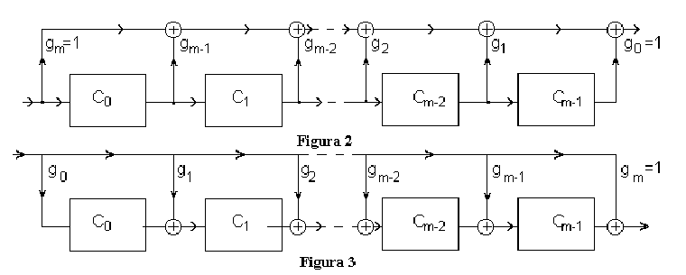
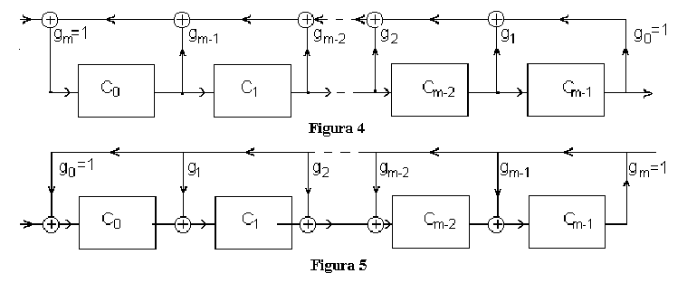
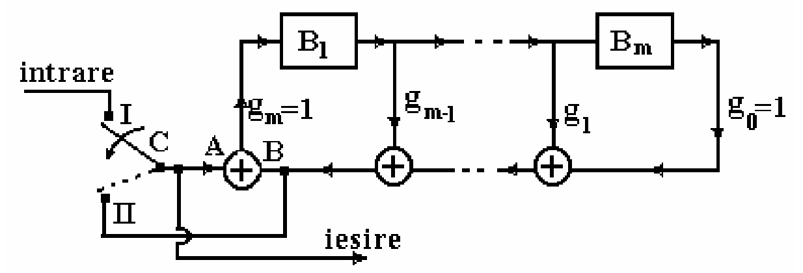
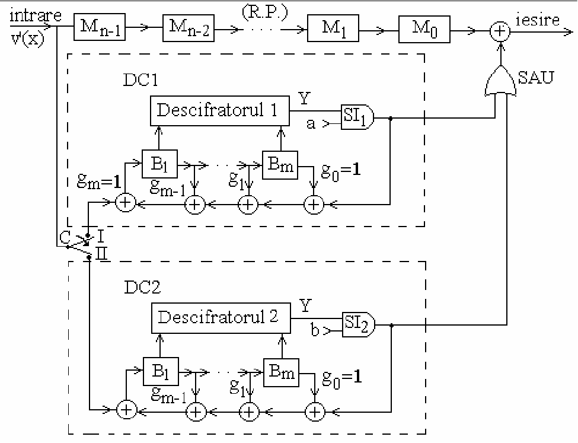

### Skip next slides for 2018-2019

**The remaining slides in this file are skipped for the class of 2018-2019.**

### 3. Coding and encoding - The hardware way

* Coding = based on polynomial multiplications and divisions
* Efficient circuits for multiplication / division exist, that can be used for systematic or non-systematic codeword generation (draw on blackboard)

### Circuits for multiplication of binary polynomials

### Operation of multiplication circuits

- The circuits multiply an input polynomial $a(x)$ with a polynomial $g(x)$
defined by their structure

- The input polynomial is applied at the input, 1 bit at a time, starting from highest degree
- The output polynomial is obtained at the output, 1 bit at a time, starting from highest degree
- Because output polynomial has larger degree, the circuit needs to operate a few more samples until the final result is obtained. During this time the input is 0.
- Examples: at the whiteboard

### Circuits for division binary polynomials

### Operation of division circuits

- The circuits divide an input polynomial $a(x)$ to a polynomial $g(x)$
defined by their structure
- The input polynomial is applied at the input, 1 bit at a time, starting from highest degree
- The output polynomial is obtained at the output, 1 bit at a time, starting from highest degree
- Because output polynomial has smaller degree, the circuit first outputs some zero values, until starting to output the result.
- If the remainder is 0, all the cells remain with 0 at the end
- Examples: at the whiteboard

### Non-systematic cyclic encoder circuit

* Non-systematic cyclic encoder circuit:
    * simply a polynomial multiplication circuit
    * input is $i(x)$, output is $c(x)$

{height=40%}

### Systematic cyclic encoder circuit

{width=80%}

* It contains inside a division circuit (upper right part)

### Systematic cyclic encoder circuit

Operation of the cyclic encoder circuit:

* Initially all cells are 0

* Switch in position I:
    - information bits are applied to the output and to the division circuit
    - first bits of the output are the information bits => indeed systematic
    - the input bits are applied to the division circuit

* Switch in position II:
    - some output bits are put at the ouput
    - the same output bits are also applied to the input of the division circuit

* **In the end all cells end up with value 0**
    - because in phase II we add the input (A) with itself (B) at the input of the division circuit,
    so they cancel each other

### Systematic cyclic encoder circuit

* Why is the output $c(x)$ the desired codeword? Because:
    1. has the information bits in the first part (systematic)
    2. is a multiple of $g(x)$

* Why is it a multiple of $g(x)$? Because:
    * the output $c(x)$ is always applied also to the input of the division circuit
        * in both phases of operation
    * after division, the cells end up in 0, which means there is no remainder of division

* Side note: we haven't really explained *why* the output $c(x)$ is a codeword,
we just showed that it is so

### The parity-check matrix for systematic cyclic codes

* Requires a more in-depth anaysis of Linear Feedback Shift Registers (LFSR)

### Linear-Feedback Shift Registers (LFSR)

* A **flip-flop**  = a cell holding a bit value (0 or 1)
    * called *"bistabil"* in Romanian
    * operates on the edges of a clock signal

* A **register** = a group of flip-flops, holding multiple bits
    * example: an 8-bit register

* A **shift register** = a register where the output of a flip-flop is connected
to the input of the next one
    - the bit sequence is shifted to the right
    - has an input (for the first cell)

* A  **linear feedback shift register** (LFSR) =  a shift register for which
the input is a computed as a linear combination of the flip-flops values
    - input = usually a XOR of some cells from the register
    - like a division circuit without any input
    - feedback = all flip-flops, with coefficients $g_i$ in general
    - example at whiteboard

### States and transitions of LFSR

* **State** of the LFSR = the sequence of bit values it holds at a certain
moment (in order: right to left)

* The state at the next moment, $S(k+1)$,  can be computed by multiplication
of the current state $S(k)$ with the **companion matrix** (or **transition matrix**) $[T]$:
$$S(k+1) = [T]*S(k)$$

* The companion matrix is defined based on the feedback coefficients $g_i$:
$$T =
\begin{bmatrix}
0 & 1 & 0 & ... & 0 \\
0 & 0 & 1 & ... & 0 \\
\cdot & \cdot & \cdot & ... & \cdot \\
0 & 0 & 0 & ... & 1 \\
g_0 & g_1 & g_2 & ... & g_{m-1} \\
\end{bmatrix}$$

* Note: reversing the order of bits in the state => transposed matrix

* Starting at time 0, then the state at time $k$ is:
$$S(k) = [T]^k S(0)$$

### Period of LFSR

* The number of states is finite => they must repeat at some moment
* The state equal to 0 must not be encountered (in this case the LFSR will remain 0 forever)
* The **period** of the LFSR = number of time moments until the state repeats
* If period is $N$, then state at time $N$ is same as state at time $0$:
$$S(N) = [T]^N S(0) = S(0),$$
which means:
$$[T]^N = I_m$$

* Maximum period is $N_{max} = 2^m-1$ (excluding state 0), in this case the
polynomial $g(x)$ is called **primitive polynomial**

### LFSR with inputs

* What if the LFSR has an input added to the feedback (XOR)?
    * exactly like a division circuit
    * assume the input is a sequence $a_{N-1}, ... a_0$

* Since a LFSR is a **linear circuit**, the effect is added:
$$S(1) = [T] \cdot S(0) \oplus
\begin{bmatrix}
0\\
0\\
...\\
a_{N-1}
\end{bmatrix}$$

* In general:
$$S(k_1) = [T] \cdot S(k) \oplus a_{N-k}\cdot [U],$$
where $[U]$ is:
$$[U] = \begin{bmatrix}
0\\
0\\
...\\
1
\end{bmatrix}$$

### The parity-check matrix for systematic cyclic codes

* Cyclic codes are linear block codes, so they have a parity-check and a generator matrix
    * but it is more efficient to implement them with polynomial multiplication / division circuits

* The parity-check matrix $[H]$ can be deduced by analyzing the states of the LFSR (divider) inside
the encoder:
    * it is a LFSR with feedback and input
    * the input is the codeword $c(x)$
    * do computations at whiteboard ...
    * ... arrive at expression for matrix $[H]$

### The parity-check matrix for systematic cyclic codes

* The parity check matrix $[H]$ has the form
$$[H] = [U, TU, T^2U, ... T^{n-1}U]$$

* The cyclic codeword satisfies the usual relation
$$S(n) = 0 = [H] \mathbf{c^T}$$

* In case of an error, the state at time $n$ will be the syndrome (non-zero):
$$S(n) = [H] \mathbf{r^T} \neq 0$$

### Error detection and correction capability

**Theorem**:

Any (n,k) cyclic code with $g(x)$ being a primitive polynomial is capable of detecting 2 errors, or of correcting 1 error

* Proof:
    * $g(x)$ is primitive polynomial => the LSFR cycles through all possible states (non-zero)
    * therefore all the columns of [H] are distinct
    * Use the conditions based on the columns of [H] from first part of chapter
        * sum of any two columns is non-zero => can detect 2 errors
        * any two columns are distinct => can correct 1 error

### Packets of errors

* Until now, we considered a single error (i.e errors appear independently)

* In real life, many times the errors appear in groups
* A **packet of errors** (*an error burst*) is a sequence of two or more
**consecutive errors**
    * examples: *fading* in wireless channels

*  The **length**  of the packet = the number of consecutive errors

### Condition on columns of [H] for packets of errors

* Conditions for packets of **e** errors are less restrictive than for
**e** independent errors

* Error **detection** of $e$ independent errors:
    * sum of **any** $e$ or fewer columns is **non-zero**
* Error **detection** of a packet of $e$ errors
    * sum of any **consecutive** $e$ or fewer columns is **non-zero**
* Error **correction** of $e$ independent errors
    * sum of **any** $e$ or fewer columns is **unique**
* Error **correction** of a packet of $e$ errors
    * sum of any **consecutive** $e$ or fewer columns is **unique**

### Detection of packets of errors

**Theorem**:

Any (n,k) cyclic code is capable of detecting any error packet of length $n-k$ or less

* A large fraction of longer bursts can also be detected (but not all)

* No proof (too complicated)

### Cyclic decoder implemented with LFSR

{width=80%}

### Cyclic decoder implemented with LFSR

* Consists of:
    - main shift register MSR
    - main switch SW
    - 2 LFSRs (divider circuits), built based on $g(x)$
    - 2 error locator blocks, one for each divider
    - 2 validation gates V1, V2, for each divider
    - output XOR gate for correcting errors

### Cyclic decoder implemented with LFSR

* Operation phases:

1. Input phase: SW on position I, validation gate V1 blocked
    - The received codeword $r(x)$ is received one by one, starting with largest power of $x^n$
    - The received codeword enters the MSR and first LFSR (divider)
    - The first divider computes $r(x) : g(x)$
    - The validation gate V1 is blocked, no output

* Input phase ends after $n$ moments, the switch SW goes into position II
* If the received word has no errors, all LFSR  cells are 0 (no remainder),
will remain 0, the error locator will always output 0,
   * the MSR will output the received bits unchanged

### Cyclic decoder implemented with LFSR

2. Decoding phase: SW on position II, validation gate V1 open
    - LFSR keeps running with no input for $n$ more moments
    - the MSR provides the received bits at the output, one by one
    - **exactly when the erroneous bit is at the main output of MSR, the error locator will output 1, and the output XOR gate will correct the bit (TO BE PROVEN)**
    - during this time the next codeword is loaded into MSR and into second LFSR (input phase for second LFSR)

* After $n$ moments, the received word is fully decoded and corrected
* SW goes back into position I, the second LFSR starts decoding phase, while the first LFSR is loading the new receiver word, and so on

* **To prove:** error locator outputs 1 exactly when the erroneous bit is at the main output

### Cyclic decoder implemented with LFSR

**Theorem:** if the $k$-th bit $r_{n-k}$ from $r(x)$ has an error, the error locator will output 1 exactly after $k-1$ moments

* That's exactly when the erroneous $k$-th bit will be output from MSR => will be changed back to the good value

* **Proof:**
    1. assume error on position $r_{n-k}$
    2. the state of the LFSR at end of phase I = syndrome = column $(n-k)$ from $[H]$
    $$S(n) = [H]\mathbf{r}^T = [H] \mathbf{e}^T = T^{n-k}U$$
    3. after another $k-1$ moments, the state will be
    $$T^{k-1}T^{n-k}U = T^{n-1}U$$
    4. since $T^n = I_n$ --> $T^{n-1} = T^{-1}$
    5. $T^{-1}U$ is the state preceding state U, which is state
    $$\begin{bmatrix} 1 \\ 0 \\ ... \\ 0 \end{bmatrix}$$

### Cyclic decoder implemented with LFSR

* Step 5 above can be shown in two ways:
    - reasoning on the circuit
    - using the definition of $T^{-1}$

$$T =
\begin{bmatrix}
g_1 & g_2 & ...g_{m-1} & 1 \\
1 & 0 & ... & 0 & 0 \\
0 & 1 & ... & 0 & 0\\
\cdot & \cdot & \cdot & ... & \cdot \\
0 & 0 & ... & 1 & 0 \\
\end{bmatrix}$$

* The error locator is designed to detect this state $T^{-1}U$,
i.e. it is designed as shown on blackboard

* Therefore, the error locator will correct an error
* This works only for 1 error, due to proof (1 column from [H])

### Summary of cyclic codes

* Generated using a generator polynomial $g(x)$
* Non-systematic:
$$c(x) = i(x) \cdot g(x)$$
* Systematic:
$$c(x) = b(x) \oplus X^{n-k}i(x)$$
    *  $b(x)$ is the remainder of dividing $X^{n-k} i(x)$ to $g(x)$

* A codeword is always a multiple of $g(x)$
* Error detection: divide by $g(x)$, look at remainder
* Schematics:
    * Cyclic encoder
    * Cyclic decoder with LFSR
    * Thresholding cyclic decoder
    * Encoder/decoder for packets of up to 2 errors
