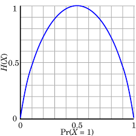
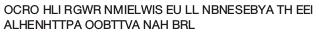

<!-- ```{math}
%\newcommand{\snII}[5]{#1: \left( \begin{matrix} {#2} & {#4} \\ #3 & #5 \end{matrix} \right)}
%\newcommand{\snIII}[7]{#1: \left( \begin{matrix} {#2} & {#4} & {#6} \\ #3 & #5 & #7 \end{matrix} \right)}
%\newcommand{\snIV}[9]{#1:  \left( \begin{matrix} {#2} & {#4} & {#6} & {#8} \\ #3 & #5 & #7 & #9 \end{matrix} \right)}

%\newcommand{\sII}[3] {#1: \left( \begin{matrix} s_1 & s_2 \\ #2 & #3 \end{matrix} \right)}
%\newcommand{\sIII}[4] {#1: \left( \begin{matrix} s_1 & s_2 & s_3 \\ #2 & #3 & #4 \end{matrix} \right)}
%\newcommand{\sIV}[5] {#1: \left( \begin{matrix} s_1 & s_2 & s_3 & s_4 \\ #2 & #3 & #4  & #5 \end{matrix} \right)}
%\newcommand{\sVI}[7] {#1: \left( \begin{matrix} s_1 & s_2 & s_3 & s_4 & s_5 & s_6 \\ #2 & #3 & #4 & #5 & #6 & #7\end{matrix} \right)}
%\newcommand{\sVIII}[9] {#1: \left( \begin{matrix} s_1 & s_2 & s_3 & s_4 & s_5 & s_6 & s_7 & s_8\\ #2 & #3 & #4 & #5 & #6 & #7 & #8 & #9 \end{matrix} \right)}
%\newcommand{\fIoII}{\frac{1}{2}}
%\newcommand{\fIoIII}{\frac{1}{3}}
%\newcommand{\fIoIV}{\frac{1}{4}}
%\newcommand{\fIoV}{\frac{1}{5}}
%\newcommand{\fIoVI}{\frac{1}{6}}
%\newcommand{\fIoVII}{\frac{1}{7}}
%\newcommand{\fIoVIII}{\frac{1}{8}}
```
-->

# Discrete Information Sources

## A mathematical definition of information

In order to analyze information generation, encoding and transmission
with mathematical tools,
we need a solid and clear definition of information.

<!-- ### Block diagram of a communication system

{width=50%}

- Source: creates information messages
- Encoder: converts messages into symbols for transmission (i.e bits)
- Channel: delivers the symbols, introduces errors
- Decoder: detects/corrects the errors, rebuilds the information messages -->

So, what is information?

Let's start first with a simple example.
Imagine someone rolls a dice and tells you the resulting value:

> "The value is 5"

Does this message carry information? How, why, how much?

When thinking about the information brought by such a phrase, let's consider the following principles:

- The message carries information only when you don't already know the result. If you already known the result, the message is useless,
  which means it brings zero information.
- If the result was to be expected, there is little information,
  e.g. suppose the message is "The value is smaller than 7". Does this carry any information?
- Conversely, if the result is highly unusual, there is more information in this message

All this suggests that the information is related to the probability of
some event happening, in a inverse manner: the lower the probability, the higher the information.

### Definition of information

Throughout this class, we refer to a probabilistic event as a **"message"**

Consider a message (event) $s_i$ which happens with probability $p(s_i)$.
The information attached to $s_i$ is rigorously defined as:

$$
i(s_i) = -\log_2(p(s_i))
$$

Consequences of this definition:

- Information of an event is always non-negative:

$$
i(s_i) \geq 0
$$

- Lower probability (rare events) means higher information
- Higher probability (frequent events) means lower information
- The certain event ($p = 1)$ brings no information:

$$
-\log(1) = 0
$$

- An event with probability $0$ brings infinite information (but it never happens...)
- When two independent $s_i$ and $s_j$ events take place, their information gets added:

$$
\begin{align*}
i(s_i \cap s_j) &= -\log_2(p(s_i \cap s_j) \\
&= -\log_2(p(s_i) \cdot p(s_j) \\
&= -\log_2(p(s_i) - log_2(p(s_j)) \\
&= i(s_i) + i(s_j)
\end{align*}
$$

The information is a purely abstract mathematical quantity,
and it is not related to the meaning of the message,
and neither to its particular form.
It's not related to the fact that the message is
written as a sentence in English, or in some other language or different signs.
The information attached to an event simply states that "this event happened",
and depends only on the probability of that event.

Encoding the information as a particular sequence of symbols
(letters, bits etc.) is a different matter, and shall be discussed in later chapters.

```{admonition} Information depends on probability

To understand why the amount of information
depends on the probability,
consider a case when information is valuable, for example:

- in an exam or quiz with multiple-choice answers (e.g. Who Wants to be a Millionaire show);
- in financial investments.

For easy questions or expected results, you don't win much.
Knowing these answers is not very valuable, because they
doesn't contain much information.

You do win a lot by answering hard questions, or investing in surprising startups.
Unexpected results (very small probability) have large amounts of information,
and since information is valuable, you win much.

```{hint}
As a rule of thumb, keep in mind:

  - if you can guess something most of the times, it has little information
  - if something is unexpected, it has a lot of information
```

<!-- ``` -->

```{admonition} Question
Let's answer some questions:

  - does a sure event (p = 1) bring any information?
  - does an almost sure event (e.g. P = 0.9999)  bring little or much information?
  - does a rare event (e.g. P = 0.0001) bring a little or much information?
```

### Choice of logarithm

Using the logarithm function in the definition is crucial,
since it is responsible for most of these properties.
In particular, the fact that logarithm transforms a product into a sum
allws to sum the information of independent events.

The choice of logarithm base is merely a convention.
Any base of logarithm can be used in the definition, not just base 2,
and all the consequences still hold.

- By convention, we typically use the binary logarithm $\log_2()$.
  In this case, the information $i(s_i)$ is measured in **bits**

- We could use instead the natural logarithm $ln()$, and the result
  is measured in *nats*.

The choice of the algorithm is not critical and doesn't change anything fundamental,
since logarithm bases can always be converted to/from one another:

$$
\log_b(x) = \frac{\log_a(x)}{\log_a(b)}
$$

This means that information defined using different logarithms differ only by a scaling factor:

$$
i_b(s_i) =\frac{i_a(s_i)}{\log_a(b)}
$$

Following the convention of the scientific literature, we shall use
the **base 2 logarithm $\log_2()$** from now on.

### Information Sources

A probabilistic event is always part of a set of multiple events,
containing all the possible outcomes which can happen at a given time.
Continuing the previous example, the value we obtained was 5,
but we could have obtained any interger between 1 and 6.
There are 6 messages, each having its own probability, all known beforehand.
At a given time, only one of the events can happen,
and it carries the information that **it** happened (out of all the possible events).

We define an **information source** as the set of all events,
together with their probabilities. The set of all messages forms the "*alphabet*" of the source.
When an event takes place, we say that "the information source **generates** a message".

We are very rarely interested in a single message.
Instead, we are interested analyzing large amounts of messages.
An information source creates a **sequence of messages**, by generating
messages one after another, randomly, according to the known probabilities.
(e.g. like throwing a coin or a dice several times in a row).

Depending on how the messages are generated, we distinguish between two types
of information sources:

1. **Memoryless** sources: each new message is generated independently on the previous messages
2. Sources **with memory**: when generating a new message, the probabilities depend on one or more of the previous messages

## Discrete memoryless sources

```{prf:definition} Discrete memoryless source
A **discrete memoryless source** (DMS) is an information source which
produces a sequence of **independent** messages.
The choice of a message at one time does not depend on the previous messages.
Each message has a fixed probability,
and every new message is generated randomly based on the probabilities.
```

The set of probabilities is the **distribution** of the source,
also known as a **probabilty mass function**.

We represent a DMS as below,
by giving it a name ("S"), listing the messages ($s_1, s_2, s_3$) and the probability distribution:

$$
\sIII{S}{\fIoII}{\fIoIV}{\fIoIV}
$$

A DMS is a discrete, complete and memoryless information source. Below
we give the definition of these terms.

- **Discrete**: the set of messages is a discrete set.
- **Complete**: the sum of all probabilities is 1, which means that one and only one event must take place at a given time:

  $$
  \sum p(s_i) = 1
  $$

- **Memoryless**: each message is independent of the previous messages.

A good example of a DMS is a coin, or a dice.

One message generated by DMS is also called a **random variable** in probabilistics.

```{admonition} Examples

A coin is a discrete memoryless source (DMS) with two messages:

  $$
  \snII{S}{heads}{\fIoII}{tails}{\fIoII}
  $$

A dice is a discrete memoryless source (DMS) with six messages:

  $$
  \sVI{S}{\fIoVI}{\fIoVI}{\fIoVI}{\fIoVI}{\fIoVI}{\fIoVI}
  $$

Playing the lottery can be modeled as DMS:

  $$
  \sII{S}{0.9999}{0.0001}
  $$

An extreme type of DMS containing the certain event:

  $$
  \sII{S}{1}{0}
  $$

Receiving an unknown *bit* (0 or 1) with equal probabilities:

  $$
  \snII{S}{0}{\fIoII}{1}{\fIoII}
  $$
```

A DMS produces a sequence of messages by randomly selecting a message every time,
with the same fixed probabilities, producing a sequence like:

$$
s_3 s_2 s_4 s_1 s_2 s_1 s_3 \dots
$$

For example, throwing a dice several times in a row you can get a sequence

$$
4, 2, 3, 2, 1, 6, 1, 5, 4, 5 \dots
$$

In a sequence which is very long, with length $N \to \infty$,
each message $s_i$ appears in the sequence approximately $p(s_i) \cdot N$ times.
This gets more precise as $N$ gets larger.

### Entropy of a DMS

We usually don't care about the information of single message. We are interested in long sequences of messages
(think millions of messages, like in millions of bits of data).
To analyze this in an easy manner, we need the *average* information of a message from a DMS.

In general, the average value of any set of quantities $x_k$ is defined like

$$
\overline{x} = \sum_{k} p(x_k) \cdot x_k
$$
where $x_k$ are the individual values and $p(x_k)$ are their probabilities (or weights).

```{prf:definition} Entropy
The **entropy** of an information source $S$ is **the average information of messages**.
```

For a DMS, because the messages are independent, we can compute the entropy
as a weighted average of the information of each message.

```{prf:definition} Entropy of a DMS
The entropy of a DMS source is:

$$
H(S) = \sum_{k} p(s_k) i(s_k) = -\sum_{k} p_k \log_2(p_k)
$$

where $p_k = p(s_k)$  is the probability of message $s_k$
```

Since information of a message is measured in bits,
entropy is measured in **bits** (or **bits / message**, to indicate it is an average value).

Entropies using information defined with different logarithms base are differ only by a scaling factor.
If $H_a(S)$ is the entropy computed using the logarithm base $a$,
and $H_b(S)$ is the entropy computed using the logarithm base $b$,
then these values are related through simple scaling:

$$
H_b(S) =\frac{H_a(S)}{\log_a(b)}
$$
However, as mentioned earlier, we use the convention based on logarithm base 2.
In this case we simply denote the entropy as $H(S)$.

```{admonition} Examples

Let's compute the entropies of some of the DMS defined above.

Coin:

  $$
  H(S) = 1 \textrm{ bit/message}
  $$

Dice:

  $$
  H(S) = \log(6) \textrm{  bits/message}
  $$

Lottery:

  $$
  \begin{aligned}
  H(S) &= -0.9999 \log(0.9999) - 0.0001 \log(0.0001) \\
  &= 0.00147 \textrm{ bits/message}
 \end{aligned}
  $$

Receiving 1 bit with equal probabilities:

  $$
  H(S) = 1 \textrm{ bit/message}
  $$
 (hence the name!)
```

### Interpretation of the entropy

The entropy of an information source S is a fundamental quantity.
It allows us to compare two different sources, which model
different scenarios from real life.

All the following interpretations of entropy are true:

- $H(S)$ is the **average uncertainty** of the source S

- $H(S)$ is the **average information** of a message from source S

- A very long sequence of $N$ messages generated by source S has total information $\approx N \cdot H(S)$

We shall see in Chapter III that the entropy $H(S)$ says something very important
about the **number of bits** requires to represent data in binary form:

- $H(S)$ is the minimum number of bits ($0$, $1$) required to uniquely represent a message from source S, on average

- A very long sequence of $N$ messages generated by source S needs at least $\approx N \cdot H(S)$ bits in order to be represented in binary form

Thus, $H(S)$ is crucial when we discuss how to represent data efficiently.

### Properties of entropy

We prove the following three properties for the entropy of a DMS:

```{prf:property} Entropy is non-negative
1. $H(S) \geq  0$
```

```{prf:proof}
Using the definition:

$$H(S) = -\sum_{k} p_k \log_2(p_k)$$


Every term in the sum is a product between a positive number ($p_k \geq 0$)
and a negative number ($p_k \geq 1$ means $\log_2(p_k) \leq 0$),
or possibly zero.
Together with the minus sign in front, we have a total result which
is either positive or zero.

```{figure} img/Chapter1_EntropyPos.png
---
width: 300px
name: directive-fig
---
Entropy is always non-negative
```
<!-- ``` -->

```{prf:property} Maximum when equal
2. Entropy $H(S)$ is maximum when all $n$ messages have equal probability $\frac{1}{n}$.
The maximum value is $\max H(S) = \log(n)$
```

```{prf:proof}
We are only proving here for the case of $n=2$ messages.

Consider a generic source with two messages, with probabilities $p$ and $1-p$:

$$
\sII{S}{p}{1-p}
$$

Its entropy is:

$$
H(S) = -p \cdot \log(p) - (1-p) \cdot \log(1-p)
$$

To look for the maximum, we take the derivative of $H(S)$ with respect to $p$ and set it to zero:

$$ \begin{aligned}
\frac{dH(S)}{dp} &= -\log(p) - p \frac{1}{p \ln(2)} + \log(1-p) + (1-p) \frac{1}{(1-p) \ln(2)} = 0\\
&\Leftrightarrow -\log(p) + \log(1-p) = 0 \\
&\Leftrightarrow \log(p) = \log(1-p) \\
&\Leftrightarrow p = \frac{1}{2} \\
\end{aligned} $$

So the maximum entropy is reached when $p = \frac{1}{2}$, and its value is:

$$
H_{max}(S) = -\frac{1}{2} \log(\frac{1}{2}) - \frac{1}{2} \log(\frac{1}{2}) = 1 = \log(2)
$$

The same result holds for any number $n$ of messages.
```

```{prf:property} Diversification
3. *Diversification* of the source always increases the entropy.

*Diversification* means that the one message $s_1$ is split into two sub-messages
$s_{1A}$ and $s_{1B}$, preserving the total probability: $p_1 = p_{1A} + p_{1B}$.
```

```{prf:proof}
The original source is:

$$
\snIII{S}{s_1}{p_1}{...}{...}{s_n}{p_n}
$$
and the diversified source, with a message $s_1$ split into two sub-messages, is:

$$
\snIV{S'}{s_{1A}}{p_{1A}}{s_{1B}}{p_{1B}}{s_2}{p_2}{...}{...}
$$

We want to prove that $H(S') \geq H(S)$, or equivalently that $H(S') - H(S) \geq 0$.

The two entropies are:

$$
\begin{aligned}
H(S) &= -p_1 \log_2(p_1) - p_2 \log_2(p_2) - ... - p_n \log_2(p_n) \\
H(S') &= -p_{1A} \log_2(p_{1A}) - p_{1B} \log_2(p_{1B}) - p_2 \log_2(p_2) - ... - p_n \log_2(p_n) \\
\end{aligned}
$$

The terms from $s_2$ to $s_n$ are the same in both entropies, so their difference is given by the terms for $s_1$:

$$
\begin{aligned}
H(S') - H(S) &= -p_{1A} \log_2(p_{1A}) - p_{1B} \log_2(p_{1B}) + p_1 \log_2(p_1) \\
&= -p_{1A} \log_2(p_{1A}) - p_{1B} \log_2(p_{1B}) + (p_{1A} + p_{1B}) \log_2(p_{1A} + p_{1B}) \\
&= -p_{1A} \log_2(p_{1A}) - p_{1B} \log_2(p_{1B}) + p_{1A} \log_2(p_{1A} + p_{1B}) + p_{1B} \log_2(p_{1A} + p_{1B}) \\
&= p_{1A} \left( -\log_2(p_{1A}) + \log_2(p_{1A} + p_{1B}) \right) + p_{1B} \left( -\log_2(p_{1B}) + \log_2(p_{1A} + p_{1B}) \right) \\
&= p_{1A} \log_2(\frac{p_{1A} + p_{1B}}{p_{1A}}) + p_{1B} \log_2(\frac{p_{1A} + p_{1B}}{p_{1B}}) \\
\end{aligned}
$$

Since $\frac{p_{1A} + p_{1B}}{p_{1A}} \geq 1$ and $\frac{p_{1A} + p_{1B}}{p_{1B}} \geq 1$, the two logarithms are $\geq 0$,
and thus the whole sum is $\geq 0$, i.e.:

$$
\begin{aligned}
H(S') - H(S) &\geq 0 \\
H(S') &\geq H(S)
\end{aligned}
$$

```

### Entropy of a binary source

Consider a general DMS with two messages:

$$
  \sII{S}{p}{1-p}
$$

It's entropy is:

$$
H(S) = -p \cdot \log(p) - (1-p) \cdot \log(1-p)
$$

The entropy value as a function of $p$ is represented below:

<!-- {height=40%} -->

```{figure} img/EntropyBinary.png
---
width: 200px
name: directive-fig
---
Entropy of a binary source
```

As an illustration of the property no.2 from above,
we can see that the maximum entropy value of a DMS with two messages is reached
when the two messages have the same probability, $p = 0.5$:

$$
p(s_1) = p = p(s_2) = 1 - p = 0.5
$$

and its value is:

$$
H_{max}(S) = 1
$$

### Study case: games of guessing numbers

Let's analyze the following guessing games with the tools introduced until now.

```{admonition} Exercises

1. I think of a number between 1 and 8. You have to guess it by asking
   yes/no questions.

   - How much uncertainty does the problem have?
   - How is the best way to ask questions? Why?
   - What if the questions are not asked in the best way?
   - On average, what is the number of questions required to find the number?


2. Now suppose I randomly choose a number according to the following distribution:

   $$
   \sIV{S}{\fIoII}{\fIoIV}{\fIoVIII}{\fIoVIII}
   $$

   - On average, what is the number of questions required to find the number?
   - What questions would you ask?

3. But what if the distribution is the following?

   $$
   \sIV{S}{0.14}{0.29}{0.4}{0.17}
   $$

Let's draw some general conclusions:

- What distribution makes guessing the number the most difficult?
- What distribution makes guessing the number the easiest?

An **optimal decision tree** is best sequence of questions to ask in order to find the number with a minimum number
of questions, represented as a binary tree graph. You will see examples when we solve the exercises.
```

### Efficiency, redundancy, flow

Using the $H(S)$, we define several other useful characteristics of a DMS.

The **efficiency** of a DMS indicates how close is the entropy to its maximum possible value:

$$
\eta = \frac{H(S)}{H_{max}} = \frac{H(S)}{\log(n)}
$$

The **redundancy** of a source is the remaining gap.
We can define an absolute redundancy and a relative redundancy.

**Absolute** redundancy of a DMS:

$$
R = H_{max} - H(S)
$$

**Relative** redundancy of a DMS:

$$
\rho = \frac{H_{max} - H(S)}{H_{max}} = 1 - \eta
$$

Suppose that each message $s_i$ takes some time $t_i$ to be transmitted via some communication channel.
The **information flow** of a DMS $S$ is the average information transmitted per unit of time:

$$
H_\tau(S) = \frac{H(S)}{\overline{t}},
$$

where $\overline{t}$ is the average duration of transmitting a message:

$$
\overline{t} = \sum_{i} p_i t_i
$$

The information flow is measured in **bps** (bits per second), and is important for data communication.

### The Kullback-Leibler distance

Suppose we have the following two DMS:

$$
\begin{gather*}
\sIV{P}{0.14}{0.29}{0.4}{0.17}
\\
\sIV{Q}{0.13}{0.33}{0.43}{0.11}
\end{gather*}
$$

The probability values of $P$ and $Q$ are close, so the two sources
are similar. But exactly how similar? Can we quantify the "closeness" of the two sources?

In many application we need a way to quantify how similar or how different
are two probability distributions. The Kullback-Leibler distance
(also known as *"Kullback-Leibler divergence"*, or *"cross-entropy"*, or *"relative entropy"*)
is a way to quantify numerically how much different is one distribution from another one.

The **Kullback–Leibler (KL) distance** of two distributions P and Q  is:

$$
D_{KL}(P,Q) = \sum_i p(s_i) \log(\frac{p(s_i)}{q(s_i)})
$$

The two distributions must have the same number of messages.

The KL distance provides a meaningful way to to measure the distance (difference) between two distributions.
In many ways it provides the same intuitions as a geometrical distance:

1. $D_{KL}(P, Q)$ is always $\geq 0$, and is equal to $0$ only when P and Q are the same
2. The higher $D_{KL}(P, Q)$ is, the more different the two distributions are

However, one important property is not satisfied, and for this reason
the KL distance is not proper distance function as defined e.g. in mathematical algebra.
The KL distance is **not commutative**: :

$$
D_{KL}(P, Q) \neq D_{KL}(Q, P)
$$

Despite this, it is widely used in applications.

```{admonition} Example
The KL distance is used to evaluate the performance of classification algorithms.
Suppose we have a neural network algorithm trained to recognize if an image
is showing a car, a human, or a dog.

To test the algorithm, we give it an image of a dog. The algorithm outputs
a probability score indicating what it believes the image contains:

$$
\snIII{Result}{car}{0.23}{human}{0.08}{dog}{0.69}
$$

Here, the algorithm thinks it sees a dog, but is not very sure (only $69 \%$ score).

The ideal output for this image is $100 \%$ score for the dog:

$$
\snIII{Target}{car}{0}{human}{0}{dog}{1}
$$

The KL distance $D_{KL}(Target, Result)$ expresses as a single number
the difference between the desired target and the algorithm's result.
Thus is serves as a way to define the classification error.
It can be used, for example, to compare different algorithms or to improve an existing algorithms.

In machine learning terminology, the KL distance is better known as the "*categorical cross-entropy*".
```

### Extended DMS

The **n-th order extension** of a DMS $S$, represented as $S^n$,
is a DMS which has as messages $\sigma_i$
all the combinations of $n$ messages of $S$:

$$
\sigma_i = \underbrace{s_j s_k ... s_l}_{n}
$$

If $S$ has $k$ messages, $S^n$ has $k^n$ messages,

Since $S$ is DMS, consecutive messages are independent of each other,
and therefore their probabilities are multiplied:

$$
p(\sigma_i) = p(s_j) \cdot p(s_k) \cdot ... \cdot p(s_l)
$$

An example is provided below:

$$
\sII{S}{\fIoIV}{\frac{3}{4}}
$$

$$
\snIV{S^2}{\sigma_1 = s_1 s_1}{\frac{1}{16}}{\sigma_2 = s_1 s_2}{\frac{3}{16}}{\sigma_3 = s_2 s_1}{\frac{3}{16}}{\sigma_4 = s_2 s_2}{\frac{9}{16}}
$$

$$
S^3: \left( \begin{matrix} s_1 s_1 s_1 & s_1 s_1 s_2 & s_1 s_2 s_1 & s_1 s_2 s_2 & s_2 s_1 s_1 & s_2 s_1 s_2 & s_2 s_2 s_1 & s_2 s_2 s_2 \\ ... & ... & ... & ... & ... & ... & ... & ... \end{matrix} \right)
$$

Extended DMS are useful because they provide a way to group messages
inside a sequence of messages.

Suppose we have a long sequence of binary messages:

$$
0 1 0 0 1 1 0 0 1 1 1 0 0 1 0 0
$$

What kind of source generated this sequence?

1. We can view it as a sequence of 16 messages generated from a source $S_1$ with two messages, $s_1 = 0$ and $s_2 = 1$
2. We can group two bits, and view it as a sequence of 8 messages generated from a source $S_2$ with messages $00$, $01$, $10$, $11$
3. We can group 8 bits into bytes, and view it is a sequence of 2 messages from a DMS $S_8$ which generates 256 bytes
4. ... and so on

There must be a connection between the DMS, no matter how we group the bits, since we're talking about the same binary sequence.
The connections is that they are all just n-th order extensions of the initial binary DMS.

### Entropy of an extended DMS

We now prove an important theorem about extended DMS.

```{prf:theorem} Entropy of extended DMS

The entropy of a $n$-th order extension of a DMS, $S^n$, is $n$ times larger than the entropy of the original DMS $S$

$$
H(S^n) = n \cdot H(S)
$$
```

```{prf:proof}

TBD. For now will be done in class, at the whiteboard.

Let's consider a DMS $S$ with $k$ messages $s_1, ... s_k$, and its $n$-th order extension $S^n$, with $k^n$ compound messages $\sigma_1, ...\sigma_{k^n}$
and probabilities $\pi_1, ... \pi_{n^k}$.

$$ \begin{aligned}
&\sIV{S}{p_1}{p_2}{...}{p_k} \\
&\snIV{S^n}{\sigma_1}{\pi_1}{\sigma_2}{\pi_2}{...}{...}{\sigma_{k^n}}{\pi_{k^n}}
\end{aligned} $$

The entropy of $S$ is:

$$
H(S) = -\sum_{i=1}^{k} p_i \log_2(p_i)
$$

The entropy of the $n$-th order extension $S^n$ is:

$$
H(S^n) = -\sum_{i=1}^{k^n} \pi_i \log_2(\pi_i)
$$

For the extended source, a compound message $\sigma_i$ is just a combination of $n$
messages from the original source, $\sigma_i = s_{i_1} ... s_{i_n}$, and has the
probability $\pi_i = p_{i_1} \cdot p_{i_2} \cdot ... \cdot p_{i_n}$, so
we have:

$$
\begin{aligned}
H(S^n) &= -\sum_{i=1}^{k^n} \pi_i \log_2(\pi_i) \\
&= -\sum_{i_1=1}^k \sum_{i_2=1}^k ... \sum_{i_n=1}^k \left( p_{i_1} \cdot p_{i_2} \cdot ... \cdot p_{i_n} \right) \log_2\left( p_{i_1} \cdot p_{i_2} \cdot ... \cdot p_{i_n} \right) \\
&= -\sum_{i_1=1}^k \sum_{i_2=1}^k ... \sum_{i_n=1}^k p_{i_1} \cdot p_{i_2} \cdot ... \cdot p_{i_n} \left( \log_2(p_{i_1}) + \log_2(p_{i_2}) + ... + \log_2(p_{i_n}) \right) \\
&= -\sum_{i_1=1}^k \sum_{i_2=1}^k ... \sum_{i_n=1}^k p_{i_1} \cdot p_{i_2} \cdot ... \cdot p_{i_n} \log_2(p_{i_1}) - ... \\
&-\sum_{i_1=1}^k \sum_{i_2=1}^k ... \sum_{i_n=1}^k p_{i_1} \cdot p_{i_2} \cdot ... \cdot p_{i_n} \log_2(p_{i_n}) \\
\end{aligned}
$$

The first term in the resulting expression is equal to the entropy of the original source $S$.
This is visible by rearranging, and taking into account that $\sum_{i_j=1}^k p_{i_j} = 1$:

$$
\begin{aligned}
&-\sum_{i_1=1}^k \sum_{i_2=1}^k ... \sum_{i_n=1}^k p_{i_1} \cdot p_{i_2} \cdot ... \cdot p_{i_n} \log_2(p_{i_1}) \\
&= -\sum_{i_1=1}^k p_{i_1} \log_2(p_{i_1}) \sum_{i_2=1}^k p_{i_2} ... \sum_{i_n=1}^k p_{i_n} \\
&= -\sum_{i_1=1}^k p_{i_1} \log_2(p_{i_1}) \\
&= H(S)
\end{aligned}
$$

The same thing appears $n$ times. Therefore the entropy of the $n$-th order extension is $n$ times larger than the entropy of the original source:

$$
H(S^n) = \underbrace{H(S) + H(S) + ... + H(S)}_{n \textrm{ times}} = n \cdot H(S)
$$

```

This theorem has a nice interpretation:
when having a long sequence in of messages, we may group together blocks of $n$ messages as we like,
this does not change total information of a sequence.
This makes sense because we're talking about the same sequence, even if we group bits into half-bytes, bytes, 32-bit words etc.

For example, imagine when we have a sequence of 1000 bits:

$$
  0,1,1,0,0,1,0, .... 0,1
$$

We can think of this sequence as being $1000$ bits from a binary source $S$ which
generates 0's and 1's. The total information in the sequence is $\approx 1000 \cdot H(S)$.

However, if we group 8 bits into 1 byte, we can think of the same sequence as being
125 bytes from a source which produces bytes.
This source is simply the extension $S^8$ of the original source $S$,
since its messages are just groupings of 8 messages from the original source.
It's entropy is therefore $8 \cdot H(S)$.
Hence the total information in the sequence is the same: $\approx 125 \cdot 8 H(S)$.

The theorem shows that both interpretations are correct. Grouping $8$ messages
of a source results in compound messages which are 8 times fewer, but
carry 8 times more average information, so the total information is the same.

### DMS as models for language generation

We use information sources as mathematical models for real-life data generation and analysis.
A straightforward example in in text analysis, since text is basically a sequence of graphical symbols
(letters and punctuation signs), similar to a sequence of messages from an information source.

Is a DMS a good model for text? Let's take the following example, for the English language.
The probability distribution of letters in English (26 letters, ignoring capitalization) is given below [^imageCover]:

[^imageCover]: Image is taken from the book "*Elements of Information Theory" by Cover, Thomas*"

```{figure} img/EngLetterProb.jpg
---
width: 35%
name: directive-fig
---
Probability distribution of letters in English
```

Let's image a DMS which has the 26 letters as messages, with these probabilities.
Generating a sequence of letters from this DMS produces the following:

```{figure} img/EnglishFirstOrder.png
---
width: 50%
name: directive-fig
---
Text generated from a DMS with English letter probabilities
```

This doesn't look like English. What's wrong?

A DMS is **memoryless**, which means that every message is generated irrespective
of the previous ones. This is not a good model for written text.
In a real language, the frequency of letter depends a lot on the previous letters.
Foe example, `a` is a common letter in English (probability $8.2 \%$),
but if the previous letter is also `a`, the probability is close to zero
because the group `aa` is extremely rare. Similarly, `h` has
a much higher probability if the previous letter is `t`
then if the previous letter is `x`.

The DMS is not capturing the dependencies between letters, because the memoryless property
makes it very restrictive. We need to consider sources with memory.

## Sources with memory

```{prf:definition}
A source has **memory of order $m$** if the probability
of a message depends on the last $m$ messages.
```

The last $m$ messages define the **state** of the source,
which is denoted as $S_i$.
We say that the source "is in the state $S_i$".
Sources with memory are also known as *Markov sources*.

A source with $n$ messages and memory $m$ has a number of states equal to $n^m$.

A source with memory generates messages randomly,
but the message probabilities are different
depending in which state the source is.
We use the notation:

$$
p(s_i | S_k)
$$

to refer to probability of message $s_i$ being generated when
the source is in state $S_k$.
This is called the **conditional probability** of message $s_i$ given state $S_k$.


```{admonition} Example
The folllowing is a source with $n=4$ messages and memory $m=1$

- if last message was $s_1$ (state $S_1$), choose next message with distribution

$$
\sIV{S_1}{0.4}{0.3}{0.2}{0.1}
$$

- if last message was $s_2$ (state $S_2$), choose next message with distribution

$$
\sIV{S_2}{0.33}{0.37}{0.15}{0.15}
$$

- if last message was $s_3$ (state $S_3$), choose next message with distribution

$$
\sIV{S_3}{0.2}{0.35}{0.41}{0.04}
$$

- if last message was $s_4$ (state $S_4$), choose next message with distribution

$$
\sIV{S_4}{0.1}{0.2}{0.3}{0.4}
$$
```

### Transition matrix

When a new message is provided, the source **transitions** to a
new state:

$$
...\underbrace{s_i s_j s_k}_{\text{old state}} s_l
$$

$$
...s_i \underbrace{s_j s_k s_l}_{\text{new state}}
$$

Therefore we can view the conditional probabilities of messages $s_i$
as **transition probabilities** from some state $S_u$ to another state $S_v$.
We can write:

$$
p(s_i | S_u) = p(S_v | S_u)
$$

which means that generating some message $s_i$ while in state $S_u$
is the same as transitioning into state $S_v$ from state $S_u$.

The transition probabilities are organized in a **transition matrix** $[T]$
of size $N \times N$, where $N$ is the total number of states.

$$
[T] =
\begin{bmatrix}
p_{11} & p_{12} & ... & p_{1N} \\
p_{21} & p_{22} & ... & p_{2N} \\
... & ... & ... & ... \\
p_{N1} & p_{N2} & ... & p_{NN} \\
\end{bmatrix}
$$

The element $p_{ij}$ from $[T]$, located on row $i$ and column $j$,
is the transition probability from state $S_i$ to state $S_j$:

$$
p_{ij} = p(S_j | S_i)
$$

Note that the sum of the probabilities on each row is $1$,
because the source must move to some state after generating a message.

```{admonition} Exercise
Write the transition matrix $[T]$ for the previous example
```

### Graphical representation

The transition matrix which defines a source with memory can be represented graphically,
as a directed graph where the vertices are the states, and the edges are the transitions.
Every edge (transition) has a certain probability,

The graphical representation of the previous example source is:

```{figure} img/Chapter1_SourceWithMemory.png
---
width: 75%
name: directive-fig
---
A source with memory $m=1$ and $n=4$ messages
```

For example, generating message $s_3$ while in state $S_2$ means
we move from state $S_2$ to state $S_3$ (defined as last message $s_2$),
so we have an arrow from $S_2$ to $S_3$ with probability $0.15$.

Note that the sum of the probabilities of the transitions exiting from a state is $1$,
since the source must move to some state after generating a message.
It is possible that the source stays in the same state,
which is represented as a self-loop.

```{admonition} Warning
Pay attention to the differente between messages $s_i$ and states $S_i$.
In general, they are not the same thing. It is only a coincidence
in this example that the messages and states have the same labels.

Messages are always written with small letter $s$, while states
with capital letter $S$.
```

### Entropy of sources with memory

How to compute the entropy of a source with memory?

In each state $S_k$ there is different distribution, so each state can be viewed
as a kind of DMS. We can compute an entropy $H(S_k)$ for every state $S_k$,
using the same formula as for DMS:

$$
H(S_k) = - \sum_i p(s_i | S_k) \cdot \log(p(s_i | S_k))
$$

However, $H(S_k)$ is the entropy of a single state.
While operating, the source moves from state to state,
and it can spend more time
in a state than in another one.

The global entropy of a source with memory is **the average entropy of the states**:

$$
\begin{aligned}
H(S) &= \sum_k p_k H(S_k) \\
&= - \sum_k p_k \sum_i p(s_i | S_k) \cdot \log(p(s_i | S_k)
\end{aligned}
$$

The probabilities $p_k$ are known as the **stationary probabilities**,
and they represent the probability that the source is in state $S_k$ at a given moment.
Considering that the source operates for a very long time and generates
a very long sequence of messages, you can think of $p_k$ as
the fraction of time when the source was in state $S_k$.

#### Stationary probabilities

How to find out the stationary probabilities $p_k$?
To find this, we first need to answer the following question:

> If we know the state $S_k$ at time $n$, what will be the state at time $n+1$?

Let $p_i^{(n)}$ denote the probability that the source is in state $S_i$ at time $n$.
The source generates a message. In what state will the source end up at time $n+1$?

The probabilities of the states at time $n+1$, $p_i^{(n)}$, are found by multiplying with $T$

$$
[p_1^{(n)}, p_2^{(n)}, ... , p_N^{(n)}] \cdot [T] = [p_1^{(n+1)}, p_2^{(n+1)}, ... , p_N^{(n+1)}]
$$

```{admonition} Exercise
Prove this.
```

After one additional message, at time $(n+2)$? Multiply once more with $T$:

$$
[p_1^{(n)}, p_2^{(n)}, ... , p_N^{(n)}] \cdot [T] \cdot [T] = [p_1^{(n+2)}, p_2^{(n+2)}, ... , p_N^{(n+2)}]
$$

For every new moment of time, we do one more multiplication with $T$.
In general, if we start from time $0$, after $n$ messages, the probabilities that the source ends up in a certain state are:

$$
[p_1^{(0)}, p_2^{(0)}, ... , p_N^{(0)}] \cdot [T]^{n} = [p_1^{(n)}, p_2^{(n)}, ... , p_N^{(n)}]
$$

However, in general we don't know the initial state or the initial probabilities.

#### Ergodicity

To work around the problem of the unknown initial state, we make use a property called "*ergodicity*".

```{prf:definition} Ergodicity
An information source with memory is called **ergodic** if every state can be reached from every state, in a finite number of steps.
```

If an ergodic source runs for a very long time $M \to \infty$, it will go through all transitions and all states many times,
and, eventually, the fraction of time it finds itself in a certain state $S_k$ stabilizes.
This happens irrespective of what was the starting state.
Intuitively, the initial state is not important anymore
if the source will anyway travel
through all states and transitions many times, as $M \to \infty$.

```{admonition} Counter-example
Can you show why ergodicity is important for this?

Think of a non-ergodic source, where the initial state always matters,
even as the number of generated messages $M \to \infty$.
```

We formalize this as the following property of an ergodic source with memory:

```{prf:property}
For an ergodic source with memory, after many messages, the probabilities of the states
**become stationary**,
i.e. that converge to some fixed values,
no matter what state the source started from initially.

$$
\lim_{n \to \infty} [p_1^{(n)}, p_2^{(n)}, ... p_N^{(n)}] = [p_1, p_2, ... p_N]
$$
```

#### Finding the stationary probabilities

The ergodicity property helps us find the values of the stationary probabilities.
When $n$ is very large, after $n$ messages and after $n+1$ messages the probabilities are the same,
and therefore the following equation holds:

$$
[p_1, p_2, ... p_N] \cdot [T] = [p_1, p_2, ... p_N]
$$

Note that we dropped the time exponent indicator $(n)$ or $(n+1)$, since the values
have converged to fixed values and the times doesn't matter anymore.

This is an equation system in matrix form, with $M$ unknowns and $M$ equations.

However, the system is rank-deficient, i.e. one row is actually
a linear combination of the others.
Because of this, one row of the system should be removed,
and replaced with a new equation which reflects
the fact that the sum of probabilities is 1:

$$
p_1 + p_2 + ... + p_N = 1
$$

With this new equation, we obtain a complete system, which has a unique set of solutions by solving the system.

### Example: Modelling English

This example is taken from "Elements of Information Theory" by Cover & Thomas.

Let us consider a sequence of information sources modelling English language,
going progressively from the most rudimentary model (memoryless),
to the most advanced (source with memory of large order).

Let's look at a sample sequence of letters generated from these sources.

1. Text generated by memoryless source, where all letters have equal probabilities:

   <!-- {width=40%} -->
   

2. A memoryless source, but the probabilities of each letter as the ones in English:

   <!-- {width=40%}\ -->
   

3. A source with memory of order $m=1$, i.e. frequency of letter pairs are as in English:

   <!-- {width=40%}\ -->
   

4. A source with memory $m=2$, i.e. the frequency of letter triplets as in English:

   <!-- {width=40%}\ -->
   

5. A source with memory $m=3$, frequency of 4-plets as in English:

   <!-- {width=40%}\ -->
   

The generated text, while still random, gradually looks more and more
like actual English as the memory order increases.

Sources with more memory are able to capture better
the statistical dependencies between the letters, and because
of this the generated text looks more and more like English.

### Working with information sources

When using information sources to model a real-life process,
you will encounter some typical use-cases.

1. How to train an information source (e.g. find the probabilities)
2. Generate sequences from a source
3. Compute the probability of an existing sequence

#### Training an information source model

By training a model we mean finding the correct value of the parameters.
In our case, the parameters are the probabilities of messages.

For simplicity, we consider the case of text analysis in a certain language (e.g. English).

First, we need a large sample of text, representative for the language.

##### How to find the probabilities of a DMS?

Go through your sample text, count the occurrences of every distinct character,
  then divide the counters to the total number of characters.
  You obtain the probabilities of each individual characters.

##### How to find the probabilities of a source with memory of order $m$?

A direct approach to find the transition matrix $[T]$ is as follows:

- First, define each possible state $S_k$. Let's assume there are $N$ states.
- Go though the sample text, count every occurrence of a group of $(m+1)$ distinct characters.
  Place the counters in an $N \times N$ matrix $[T]$, where each row corresponds to the old state (first $m$ characters of the group), and columns are the new state (last $m$ characters of the group).
- Normalize each row: divide each row to the sum of the row. This ensures that the resulting row sums up to 1, i.e. it forms a probability distribution.

One drawback is the huge memory requirements required to count all the possible combinations.
The memory requirement increases at least exponentially with the memory order $m$.
For example, if there are 26 letters, a source with memory of order $m = 3$ has $26^3 = 17576$ states,
while a source with $m=4$ has $26^4 = 456976$ states. Considering capital letters and punctuation signs,
the numbers are much larger. This makes it very cumbersome to work with sources of large memory, at least
with such a brute-force approach.

#### Generating messages from a source

Supposing we have a source, we generate sequences by generating messages one after another.

For a DMS, we generate each message independently of all the previous ones.

For a source with memory $m$, described by a transition matrix $T$, we generate a message
according to the transition probabilities from the row of $T$ corresponding to the current state.
Then we update the current state and repeat the process.

For a source with memory, we must also specify how to generate the first $m$ messages,
i.e. before we have the first $m$ previous messages which define a full state.

#### Compute the probability of an existing sequence

Suppose we have a sequence *Seq* of messages, e.g.

> "wirtschaftwissenschaftler"

If we have an information source, how do we compute the probability that the sequence *Seq*
was generated from the source?

- For a DMS, simply multiply the probabilities of every letter in the sequence
- For a DMS with memory $m$, look at every group of $(m+1)$ letters
  and multiply the corresponding probabilities from the transition matrix $T$

Multiplying many probabilities quickly results in a very small number, which makes it
problematic on a digital device due to numerical errors.

To avoid this, instead of probabilities we can work with the log-probabilities, i.e. $\log(p)$,
which allows for much more manageable values. Instead of multiplying probabilities,
we sum the log-probabilities.

$$
\begin{gather*}
P = p(w) \cdot p(i) \cdot p(r) \cdot \dots \cdot p(r) \\
\log(P) = \log(p(w)) + \log(p(i)) + \log(p(r)) + \dots + \log(p(r))
\end{gather*}
$$

### Sample applications

#### Predict text

- Suppose we receive a text with random missing letters

- We need to fill the blanks with the appropriate letters

- How?

  - build a model: source with memory of some order
  - fill the missing letter with the most likely letter given by the model

#### Guess language of a sentence

- We have piece of text. What language is it written in?

- We model each language with a source with memory, each trained on a sufficiently large
  piece of text representative of the language

- We compute the log-probability of the text with every language source model.
  Pick the one with the highest value.

