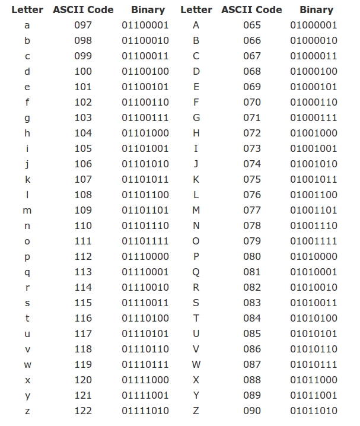

---
jupyter:
  jupytext:
    formats: ipynb,md,.myst.md:myst
    main_language: python
    text_representation:
      extension: .md
      format_name: markdown
      format_version: '1.3'
      jupytext_version: 1.10.3
  kernelspec:
    display_name: 'Python 3.8.5 64-bit (''base'': conda)'
    name: python3
---

<!-- #region -->
```{math}
\newcommand{\snII}[5]{#1: \left( \begin{matrix} {#2} & {#4} \\ #3 & #5 \end{matrix} \right)}
\newcommand{\snIII}[7]{#1: \left( \begin{matrix} {#2} & {#4} & {#6} \\ #3 & #5 & #7 \end{matrix} \right)}
\newcommand{\snIV}[9]{#1:  \left( \begin{matrix} {#2} & {#4} & {#6} & {#8} \\ #3 & #5 & #7 & #9 \end{matrix} \right)}

\newcommand{\sII}[3] {#1: \left( \begin{matrix} s_1 & s_2 \\ #2 & #3 \end{matrix} \right)}
\newcommand{\sIII}[4] {#1: \left( \begin{matrix} s_1 & s_2 & s_3 \\ #2 & #3 & #4 \end{matrix} \right)}
\newcommand{\sIV}[5] {#1: \left( \begin{matrix} s_1 & s_2 & s_3 & s_4 \\ #2 & #3 & #4  & #5 \end{matrix} \right)}
\newcommand{\sVI}[7] {#1: \left( \begin{matrix} s_1 & s_2 & s_3 & s_4 & s_5 & s_6 \\ #2 & #3 & #4 & #5 & #6 & #7\end{matrix} \right)}
\newcommand{\sVIII}[9] {#1: \left( \begin{matrix} s_1 & s_2 & s_3 & s_4 & s_5 & s_6 & s_7 & s_8\\ #2 & #3 & #4 & #5 & #6 & #7 & #8 & #9 \end{matrix} \right)}
\newcommand{\fIoII}{\frac{1}{2}}
\newcommand{\fIoIII}{\frac{1}{3}}
\newcommand{\fIoIV}{\frac{1}{4}}
\newcommand{\fIoV}{\frac{1}{5}}
\newcommand{\fIoVI}{\frac{1}{6}}
\newcommand{\fIoVII}{\frac{1}{7}}
\newcommand{\fIoVIII}{\frac{1}{8}}
```

# Source Coding

In this chapter we take a look at the basic principles
and algorithms for data compression.

## The role of coding

In the general block diagram of a communication system, 
the coding block is situated 
between the information source and the communication channel.

{width=35%}

It's role is to prepare the raw information in order to be transmitted
over the channel. It has two main jobs:

1. **Source coding**:
   - Convert source messages to channel symbols, i.e. the actual 
     symbols which the channel knows to transmit.

     For example, express the messages in binary form (zeros and ones), for sending over a binary channel.

   - Minimize the number of symbols needed to be transmitted (i.e., data compression). 
     We don't want to transmit more symbols than necessary to recover the messages at the receiving end.
 
   - Adapt probabilities of symbols in order to maximize to maximize mutual information. 
   We will discuss this more in Chapter IV.

2. **Error control coding**
    - Protect the information against channel errors
    - Also known as "*channel coding*"

Basically, source coding refers to all the procedures required to express
the source messages as channel symbols in the most efficient way possible,
while error control coding refers to all the algorithms used to
protect the data against errors.

The coding block has a corresponding decoding block on the receiving end.
Its job is to "*undo*" all the coding operations:

- detect and fix the errors in the received data, based on the algorithms introduced by the coding block
- convert the channel symbols back into the message representations that the receiver expects

Is it possible to do these two jobs separately, one after another, 
in two consecutive operations? Yes, as the **source-channel separation theorem** establishes.

We give below only an informal statement of the theorem:

```{prf:theorem} Source-channel separation theorem
It is possible to obtain the best reliable communication by performing the
two tasks **separately**:

1. Source coding: to minimize number of symbols needed
2. Error control coding (channel coding): to provide protection against errors happening on the channel
```

In this chapter, we consider only the source coding algorithms, without any error control.
Basically, we assume that data transmission is done over an ideal channel with no noise, 
and therefore the transmitted symbols are perfectly recovered at the receiver.

In this context, our main concern is how to minimize the number of symbols needed to represent the messages, while making sure that the receiver can decode the messages correctly. 
The advantages of data compression are self-evident:

- Efficiency
- Short communication times
- Can decode easily


## Definitions

Let's define what coding means from a mathematical perspective.

Consider an input information source with the set of messages:

$$S = \left\lbrace s_1, s_2, ... s_N \right\rbrace$$

and suppose we would like to express the messages as a sequence of the following **code symbols**:

$$X = \left\lbrace x_1, x_2, ... x_M \right\rbrace$$

The set $X$ is known as the **alphabet of the code**.

For example, for a binary code we have $X = \lbrace 0, 1\rbrace$ 
and a possible sequence of symbols is $c = 00101101$

```{prf:definition} Code definition
A **code** is a mapping from the set $S$ of $N$ messages
to a set of $N$ sequences of symbols, known as **codewords**:

$$C = \left\lbrace c_1, c_2, ... c_N \right\rbrace$$

An example code mapping is given below: 

 Message   |               | Codeword
---------: | :----------:  | :----------
$s_1$      | $\rightarrow$ | $c_1 = x_1x_2x_1...$ 
$s_2$      | $\rightarrow$ | $c_2 = x_1x_2x_2...$ 
$\dots$    | $\rightarrow$ | $\dots$ 
$s_N$      | $\rightarrow$ | $c_N = x_2x_2x_2...$ 

```

The codewords are the sequences of symbols used by the code.

The **codeword length**, which we denote as $l_i$, 
is the the number of symbols in a given codeword $c_i$.


**Encoding** a given message or sequences of messages means 
replacing each message with its codeword.

**Decoding** means deducing back the original sequence of messages,
given a sequence of symbols.

As an example, the ASCII code is a widely-used code for encoding characters,
consisting of 256 codewords (stored on 1 byte):

<!-- {width=50%} -->


Nowadays, ASCII is usually replaced by Unicode (UTF-8), which is a more general code using 65536 codewords (stored on 2 bytes), allowing for many more letters used in languages around the globe.

### The graph of a code

The codewords of a code can represented as a binary tree.
We call this representation **the graph of the code**. 

Example at blackboard

### Average code length

Consider a code for the messages of a discrete memoryless source.
There are many ways to define the codewords and their mapping to messages.

How to measure representation efficiency of a code? We need this, for example, 
in order to choose the most efficient code out of all possible codes we might define.

The most basic quantity indicating efficiency of a code is the average code length.

```{prf:definition} Average code length
Given a code, the **average code length** is the average of the codeword lengths:

$$\overline{l} = \sum_i p(s_i) l_i$$
```

Here, for every codeword $c_i$ we consider its probability
to be the probability of the corresponding message $p(s_i)$, and its length $l_i$.

A code with smaller average length is better, because it represents sequences of messages
with less symbols, on average. However, we expect a certain 
lower limit to the average length (for example, it cannot be 0, for self-evident reasons).
This raises the following interesting question:

> Given a source $S$, how small can the average length be?

This is a fundamental question, to which we will provide an answer later in this chapter.

### Instantaneous codes

We introduce another set of useful definitions regarding the codeword structure.

A code is:

- **non-singular**: all codewords are different
- **uniquely decodable**: for any received sequence of symbols, there is only one corresponding sequence of messages
  - i.e. no sequence of messages produces the same sequence of symbols
  - i.e. there is never a confusion at decoding
- **instantaneous** (also known as **prefix-free**): no codeword is prefix to another code
  - A **prefix** = a codeword which is the beginning of another codeword

Examples: at the blackboard

The follwing relations exist between these types of codes.

```{prf:theorem} Instantaneous codes are uniquely decodable
An instantaneous code is uniquely decodable
```

```{prf:proof}

There is exactly one codeword matching the beginning of the sequence:

- Suppose the true initial codeword is **c**
- There can't be a shorter codeword **c'**, since it would be prefix to **c**
- There can't be a longer codeword **c''**, since **c** would be prefix to it

Once we find the first codeword, write down the corresponding message and remove the codeword from the sequence.

The remaining part is another sequence and, by the same argument, there is exactly one codeword matching the new beginning, and so on.
```

```{note}
The converse is not necessary true; there exist uniquely decodable codes which
are not instantaneous.
```

```{prf:theorem} Uniquely decodable codes are non-singular
An uniquely decodable code is non-singular
```

```{prf:proof}
The proof is by contradiction:

- If the code is singular, some codewords are not unique (different messages have the same codeword)
- This means that at decoding we can't decide which of those messages is there. 
  This means that the code is not uniquely decodable
- Therefore, if the code is uniquely-decodable, it must also be non-singular ($A \rightarrow B \Leftrightarrow \overline{B} \rightarrow \overline{A}$)
```

We can summarize the relation between these three code types as follows:

Instantaneous $\subset$ uniquely decodable $\subset$ non-singular


### Graph-based decoding of instantaneous codes

Using the graph of the code, we can use a very simple procedure for decoding any instantaneous code:

```{prf:algorithm} Graph-based decoding of instantaneous codes
:label: graph-based-decoding

**Inputs** An input symbol sequence, the graph of an instantaneous code

**Output** The decoded message sequence

1. Start at the root of the tree graph
2. Follow the edges in the tree according to the next symbols in the sequence
3. When a message is reached in the tree, write it down and go back to the root
4. Continue until the end of the symbol sequence
```

TBD: Illustrate at whiteboard

This procedure shows the advantage of instantaneous codes over other codes which
might be uniquely decodable, but are not instantaneous: 
instantaneous codes allow for **simple decoding**. There is never any doubt about
the next message in the sequence.

This decoding scheme is also showing why these codes are named "*instantaneous*":
a codeword can be decoded as soon as it is fully received, immediately, without any delay.

As a counter example, consider the following uniquely decodable, but non-instantaneous code: $\left\lbrace 0, 01, 011, 1110 \right\rbrace$. When you read the first $0$, you cannot decode it yet, because you need to wait the next bits to understand how to segment the sequence. This implies that the decoding has some delay.

### The Kraft inequality theorem

When can an instantaneous code exist? Given a DMS $S$, are we sure we can find an 
instantaneous code for it, and if yes, under which conditions?

The answers to these questions is provided by the Kraft inequality.

```{prf:theorem} Kraft inequality theorem
Given a code alphabet of $D$ symbols, there exists an instantaneous code with codeword lengths ${l_1, l_2, \ldots l_n}$ 
if and only if the lengths satisfy the following inequality:

$$\sum_i D^{-l_i} \leq 1$$
```

```{prf:proof}
At blackboard
```

Comments on the Kraft inequality:

- If lengths do not satisfy the relation, no instantaneous code exists with these lengths
- If the lengths of a code satisfy the relation, that code can be instantaneous or not (there   exists an instantaneous code, but not necessarily that one).
  Keep in mind that the Kraft inequality only looks at the lengths of the codewords, not
  at their actual symbols, so it can only say something about the lengths, not about the actual codewords
- The Kraft inequality implies that the codewords lengths cannot be all very small, because if
  all $l_i$ values are too small the sum exceeds 1. Thus, implicitly, it sets a lower limit to the permissible lengths.

- From the proof, it follows that we have equality in the relation
  
  $$ \sum_i D^{-l_i} = 1$$
  
  only if the lowest level of the tree is fully covered.
  Thus, for an instantaneous code which satisfies Kraft with equality, 
  all the graph branches terminate with codewords and there are no unused branches.
  
  This makes sense intuitively, since is most economical way: codewords are as short as they can be. Any unused branch means that we can actually make the code shorter by moving some message up the tree.

We have seen that instantaneous codes must obey the Kraft inequality
But how about uniquely decodable codes? 
The answer is given by the next theorem.

```{prf:theorem} McMillan theorem
Any uniquely decodable code **also** satisfies the Kraft inequality:

$$ \sum_i D^{-l_i} \leq 1.$$
```

```{prf:proof}
No proof given
```

Consequences of the McMillan theorem:

- For every uniquely decodable code, there exists in instantaneous code
with the same lengths. This is because the lengths $l_i$ must satisfy the same
relation both for unique-decodable and for instantanous codes.

- Thus, even though the class of uniquely decodable codes is larger than that of
instantaneous codes (because any instantaneous code is uniquely decodable, but not
any uniquely decodable code is instantaneous), using uniquely-decodable codes
brings **no additional benefit** in average codeword length

- Instead of an uniquely decodable code, we can always use an instantaneous code, 
which has the same lengths, but is much easier to decode.

### Finding an instantaneous code for given lengths

How to find codewords with code lengths $\{l_i\}$?

In general, we may use the following procedure:

```{prf:algorithm}
1. Check that lengths satisfy Kraft relation
2. Draw graph with the specified lengths
3. Assign codewords to the graph terminations
```

Note that this procedure only gives us the codewords, not the mapping
to a particular set of messages.

In practice, there might be more elaborate ways to find the codewords and map them
to the messages of the source, with additional benefits.

### Optimal codes

We consider now the core aspect of this chapter,

Given a DMS $S$, suppose we want to find an instantenous code for it, 
but in such a way as to **minimize the average length** of the code:

$$\overline{l} = \sum_i p(s_i) l_i$$

How can we find such an optimal code?

Given that it should be instantaneous, the codeword lengths must obey the Kraft inequality.

In mathenatical terms, we formulate the problem as a **constrained optimization problem**:

$$\begin{aligned} \textbf{minimize } &\sum_i p(s_i) l_i \\
\textrm{subject to } &\sum_i D^{-l_i} \leq 1
\end{aligned}$$

This means that we want to find the unknowns $l_i$ 
in order to minimize a certain quantity ($\sum_i p(s_i) l_i$),
but the unknowns must satisfy a certain constraint ($\sum_i D^{-l_i} \leq 1$).

### The method of Lagrange multipliers

* Method of Lagrange multipliers: standard mathematical tool

* To solve the following constrained optimization problem
$$\begin{aligned} \textbf{minimize } & f(x) \\
\textrm{subject to } & g(x) = 0
\end{aligned}$$
	one must build a new function $L(x, \lambda)$ (the **Lagrangean function**):
$$L(x, \lambda) = f(x) - \lambda g(x)$$
	and the solution $x$ is among the solutions of the system:
$$\begin{aligned} & \frac{\partial L(x, \lambda)}{\partial x} = 0 \\
& \frac{\partial L(x, \lambda)}{\partial \lambda} = 0
\end{aligned}$$

* If there are multiple variables $x_i$, derivation is done for each one

### Solving for minimum average length of code

* In our case:
    - The unknown $x$ are $l_i$
    - The function is $f(x) = \overline{l} = \sum_i p(s_i) l_i$
    - The constraint is $g(x) = \sum_i D^{-l_i} - 1$

* (Solve at blackboard)

* The optimal values are:
$$\boxed{l_i = -\log(p(s_i))}$$

* Intuition: using $l_i = -\log(p(s_i))$ satisfies Kraft with equality,
so the lengths cannot be any shorter, in general

### Optimal lengths

* The optimal codeword lengths are:
$$\boxed{l_i = -\log(p(s_i))}$$

* Higher probability => smaller codeword
    * more efficient
    * language examples: "da", "nu", "the", "le" ...
* Smaller probability => longer codeword
    * it appears rarely => no problem
* Overall, we obtain the minimum average length

### Entropy = minimal codeword average length

* If the optimal values are:
$$l_i = -\log(p(s_i))$$

* Then the minimal average length is:
$$\min \overline{l} = \sum_i p(s_i) l_i = -\sum_i p(s_i) \log(p(s_i)) = H(S)$$

* The **entropy** of a source = the **minimum average length** necessary to encode the messages
    * e.g. the minimum number of bits required to represent the data in binary form

### Meaning of entropy

* This tells us something about entropy
    * This is what entropy means in practice
    * Small entropy => can be written (encoded) with few bits
    * Large entropy => requires more bits for encoding

* This tells us something about the average length of codes
    * The average length of an uniquely decodable code must be at least as large
    as the source entropy
    $$H(S) \leq \overline{l}$$

* One can never represent messages, on average, with a code  having average length less than the entropy

### Analogy of entropy and codes     

* Analogy: 1 liter of water 
    * 1 liter of water = the quantity of water that can fit in any bottle
    of size $\geq$ 1 liter, but not in any bottle $<$ 1 liter
    $$Bottle \geq water$$
    * Information of the source = the water
    * The code used for representing the messages = the bottle that carries the water
    $$\overline{l} \geq H(S)$$

### Efficiency and redundancy of a code

* **Efficiency** of a code ($M$ = size of code alphabet):
$$\eta = \frac{H(S)}{\overline{l} \log{M}}$$

    * usually $M$ = 2 so $\eta = \frac{H(S)}{\overline{l}}$
    * but if $M>2$ a factor of $\log{M}$ is needed because $H(S)$ in bits (binary)
    but $\overline{l}$ not in bits (M symbols)

* **Redundancy** of a code:
$$\rho = 1- \eta$$

* These measures indicate how close is the average length to the 
optimal value

* When $\eta = 1$: **optimal code** 

### Optimal codes

* Problem: $l_i = -\log(p(s_i))$ might not be an integer number
    * but the codeword lengths must be natural numbers

* An **optimal code** = a code that attains the minimum average length
$\overline{l} = H(S)$

* An optimal code can always be found for a source where all $p(s_i)$ are powers of 2
    * e.g. $1/2$, $1/4$, $1/2^n$, known as *dyadic distribution*
    * the lengths $l_i = -\log(p(s_i))$ are all natural numbers => can be
    attained
    * the code with lengths $l_i$ can be found with the graph-based procedure


### Non-optimal codes

* What if $-\log(p(s_i))$ is not a natural number?
    i.e. $p(s_i)$ is not a power of 2
    
* Shannon's solution: round to next largest natural number
$$l_i = \lceil -\log(p(s_i)) \rceil$$

    i.e. $-\log(p(s_i)) = 2.15$ => $l_i = 3$


### Shannon coding

* Shannon coding:
    1. Arrange probabilities in descending order
    2. Use codeword lengths $l_i = \lceil -\log(p(s_i)) \rceil$
    3. ~~Find any instantaneous code for these lengths $^{*}$~~
	3. For every message $s_i$:
        1. compute the sum of all the probabilities up to this message
        2. multiply this value with $2^{l_i}$
		3. floor the result and convert to binary

* The code obtained = a "*Shannon code*"

* Simple scheme, better algorithms are available
    * Example: compute lengths for $S: (0.9, 0.1)$
* But still enough to prove fundamental results


### Average length of Shannon code

Theorem:

* The average length of a Shannon code satisfies
$$H(S) \leq \overline{l} < H(S) + 1$$

### Average length of Shannon code

Proof:

1. The first inequality is because H(S) is minimum length
2. The second inequality:
    a. Use Shannon code:
$$l_i = \lceil -\log(p(s_i)) \rceil = -\log(p(s_i)) + \epsilon_i$$ where $0 \leq \epsilon_i < 1$

    a. Compute average length:
$$\overline{l} = \sum_i p(s_i) l_i = H(S) + \underbrace{\sum_i p(s_i) \epsilon_i}_{< 1}$$
    a. Since $\epsilon_i < 1$ => $\sum_i p(s_i) \epsilon_i < \sum_i p(s_i)  = 1$ \qed

### Average length of Shannon code

* Average length of Shannon code is **at most 1 bit longer** than the minimum possible value
    * That's quite efficient
    * There exist even better codes, in general
    
* Q: Can we get even closer to the minimum length?
* A: Yes, as close as we want!
    * In theory, at least ... :)
    * See next slide.

### Shannon's first theorem

Shannon's first theorem (coding theorem for noiseless channels):

* It is possible to encode an infinitely long sequences of messages 
from a source S with an average length 
as close as desired to H(S), 
but never below H(S)

\ 
\

Key points:

  * we can always obtain $\overline{l} \to H(S)$
  * for an infinitely long sequence

### Shannon's first theorem

Proof:

* Average length can never go below H(S) because this is minimum
* How can it get very close to H(S) (from above)?
    1. Use **$n$-th order extension** $S^n$ of S
    2. Use Shannon coding for $S^n$, so it satisfies
$$H(S^n) \leq \overline{l_{S^n}} < H(S^n) + 1$$
    3. But $H(S^n) = n H(S)$, and average length **per message of $S$** is
$$\overline{l_{S}} = \frac{\overline{l_{S^n}}}{n}$$
because messages of $S^n$ are just $n$ messages of $S$ glued together
    4. So, dividing by $n$:
$$\boxed{H(S) \leq \overline{l_{S}} < H(S) + \frac{1}{n}}$$
    5. If extension order $n \to \infty$, then
$$\overline{l_{S}} \to H(S)$$ \qed

### Shannon's first theorem

* Analogy: how to buy things online without paying for delivery :)
    * FanCourier taxes 15 lei per delivery
        * not efficient to buy something worth a few lei
    * How to improve efficiency? Buy $n$ things bundled together!
    * The delivery cost **per unit** is now $\frac{15}{n}$
    * As $n \to \infty$, the delivery cost per unit $\to 0$
        * What's 15 lei when you pay $\infty$ lei...

### Shannon's first theorem

Comments:

 * Shannon's first theorem shows that we can approach H(S) 
 to any desired accuracy using extensions of large order of the source
     * This is not practical: the size of $S^n$ gets too large for large $n$
     * Other (better) algorithms than Shannon coding are used in practice to approach $H(S)$


### Coding with the wrong code

* Consider a source with probabilities $p(s_i)$
* We use a code designed for a different source: $l_i = -\log(q(s_i))$
* The message probabilities are $p(s_i)$ but the code is designed for $q(s_i)$
\ 

* Examples:
    * design a code based on a sample data file (like in lab)
    * but we use it to encode various other files => probabilities might differ slightly
    * e.g. design a code based a Romanian text, but encode a text in English
\ 

* What happens?

### Coding with the wrong code

* We lose some efficiency:
    * Codeword lengths $\overline{l_i}$ are not optimal for our source => increased $\overline{l}$

* If code were optimal, best average length = entropy $H(S)$:
$$\overline{l_{optimal}} = -\sum{p(s_i) \log{p(s_i)}}$$

* But the actual average length we obtain is: 
$$\overline{l_{actual}} = \sum{p(s_i) l_i} = -\sum{p(s_i) \log{q(s_i)}}$$

### The Kullback–Leibler distance

* Difference between average lengths is:

$$\overline{l_{actual}} - \overline{l_{optimal}} = \sum_i{p(s_i) \log(\frac{p(s_i)}{q(s_i)})} = D_{KL}(p || q)$$

* The difference  = **the Kullback-Leibler distance** between the two distributions
    * is always $\geq 0$ => improper code means increased $\overline{l}$ (bad)
    * distributions more different => larger average length (worse)
    
* The KL distance between the distributions = the number of extra bits used because 
of a code optimized for a different distribution $q(s_i)$ than the true distribution
of our data $p(s_i)$

### The Kullback–Leibler distance

Reminder: where is the Kullback–Leibler distance used

* Here: Using a code optimized for a different distribution:
    * Average length is increased with $D_{KL}(p || q)$

* In chapter IV (Channels): Definition of mutual information:
    * Distance between $p(x_i \cap y_j)$ and the distribution of two independent variables $p(x_i) \cdot p(y_j)$
$$I(X,Y) = \sum_{i,j} p(x_i \cap y_j) \log(\frac{p(x_i \cap y_j)}{p(x_i)p(y_j)})$$


### Shannon-Fano coding (binary)

Shannon-Fano (binary) coding procedure:

1. Sort the message probabilities in descending order
2. Split into two subgroups as nearly equal as possible
3. Assign first bit $0$ to first group, first bit $1$ to second group
4. Repeat on each subgroup
5. When reaching one single message => that is the codeword

Example: blackboard

Comments:

* Shannon-Fano coding does not always produce the shortest code lengths
* Connection: yes-no answers (example from first chapter)

### Huffman coding (binary)

Huffman coding procedure (binary):

1. Sort the message probabilities in descending order
2. Join the last two probabilities, insert result into existing list, preserve descending order
3. Repeat until only two messages are remaining
4. Assign first bit $0$ and $1$ to the final two messages
5. Go back step by step: every time we had a sum, append $0$ and $1$ to the end of existing codeword

Example: blackboard

### Properties of Huffman coding
Properties of Huffman coding:

* Produces a code with the **smallest average length** (better than Shannon-Fano)
* Assigning $0$ and $1$ can be done in any order => different codes, same lengths
* When inserting a sum into an existing list, may be equal to another value => options
    * we can insert above, below or in-between equal values
    * leads to codes with different *individual* lengths, but same *average* length
* Some better algorithms exist which do not assign a codeword to every single message
(they code a while sequence at once, not every message)

### Huffman coding (M symbols)

General Huffman coding procedure for codes with $M$ symbols:

* Have $M$ symbols $\left\lbrace x_1, x_2, ... x_M \right\rbrace$
* Add together the last $M$ symbols
* When assigning symbols, assign all $M$ symbols
* **Important**: at the final step must have $M$ remaining values
    * May be necessary to add *virtual* messages with probability 0 at the end of the initial list,
    to end up with exactly $M$ messages in the last step
    
* Example : blackboard

### Example: compare Huffman and Shannon-Fano

Example: compare binary Huffman and Shannon-Fano for:
$$p(s_i) = \left\lbrace 0.35, 0.17, 0.17, 0.16, 0.15 \right\rbrace$$

### Probability of symbols

* For every symbol $x_i$
we can compute the average number of symbols $x_i$ in a code
$$\overline{l_{x_i}} = \sum_i p(s_i) l_{x_i}(s_i)$$
    * $l_{x_i}(s_i) =$ number of symbols $x_i$ in the codeword of $s_i$
    * e.g.: average number of 0's and 1's in a code
* Divide by average length => probability (frequency) of symbol $x_i$
$$p(x_i) = \frac{\overline{l_{x_i}}}{\overline{l}}$$

* These are the probabilities of the input symbols for the transmission channel
    * they play an important role in Chapter IV (transmission channels)

### Source coding as data compression

* Consider that the messages are already written in a binary code
    * Example: characters in ASCII code

* Source coding  = remapping the original codewords to other codewords 
    * The new codewords are shorter, on average
    
* This means data **compression**
    * Just like the example in lab session
    
* What does data compression remove?
    * Removes **redundancy**: unused bits, patterns, regularities etc.
    * If you can guess somehow the next bit in a sequence, it means the bit is not really necessary,
    so compression will remove it
    * The compressed sequence looks like random data: impossible to guess, 
    no discernable patterns

### Discussion: data compression with coding

* Consider data compression with Shannon or Huffman coding, like we did in lab
    * What property do we *exploit* in order to obtain compression?
    * How does *compressible data* look like?
    * How does *incompressible data* look like?
    * What are the limitation of our data compression method?
    * How could it be improved?

### Other codes: arithmetic coding

* Other types of coding do exist (info only)
	* Arithmetic coding
	* Adaptive schemes
	* etc.

### Chapter summary

* Average length: $\overline{l} = \sum_i p(s_i) l_i$
* Code types: instantaneous $\subset$ uniquely decodable $\subset$ non-singular
* All instantaneous or uniqualy decodable code must obey Kraft:
$$ \sum_i D^{-l_i} \leq 1$$
* Optimal codes: $l_i = -\log(p(s_i))$, $\overline{l_{min}} = H(S)$
* Shannon's first theorem: use $n$-th order extension of $S$, $S^n$:
$$\boxed{H(S) \leq \overline{l_{S}} < H(S) + \frac{1}{n}}$$
    * average length always larger, but as close as desired to $H(S)$
* Coding techniques:
    * Shannon: ceil the optimal codeword lengths (round to upper)
    * Shannon-Fano: split in two groups approx. equal
    * Huffman: group last two. Is best of all.
<!-- #endregion -->
